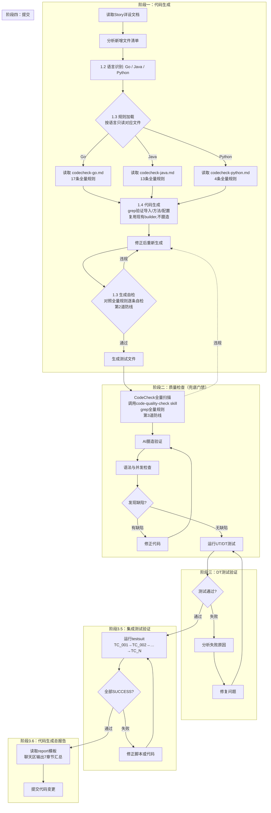

# 生成即CodeCheck流程图

## 三道防线

| 防线 | 位置 | 机制 | 规则范围 |
| --- | --- | --- | --- |
| 第1道：规则前置 | 1.3 规则加载 | 生成前读对应语言全量规则，作为生成硬约束 | 全量 |
| 第2道：生成自检 | 1.3 生成自检 | 写入前对照全量规则逐条自检，违规即修 | 全量 |
| 第3道：兜底扫描 | 阶段二 | 调用 code-quality-check skill，grep 全量规则扫描 | 全量 |

## 核心特点

- **语言隔离**：生成 Go 只加载 `codecheck-go.md`，Java/Python 规则不进 context
- **全量覆盖**：三道防线均用全量规则，无子集、无红线
- **闭环修复**：任何一道发现违规 → 修正 → 回到自检重来，不放过
