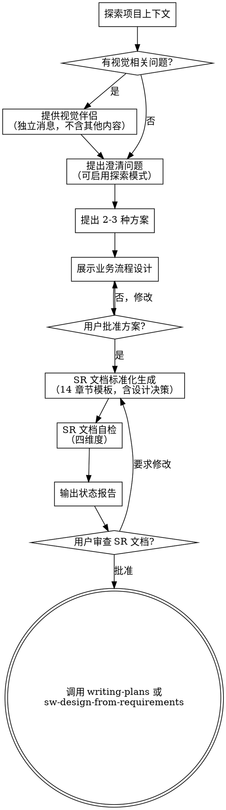

# SEHarness：需求分析到 SR 文档生成

通过自然的协作对话，帮助将想法转化为完整的 SR（Software Requirement）文档。

首先了解当前项目的上下文，然后逐一提问来完善想法。一旦你理解了要构建的内容，就展示业务流程设计方案并获得用户批准，然后生成标准化 SR 文档。

<HARD-GATE>
在你展示业务流程设计方案并获得用户批准之前，不要调用任何实现技能、编写任何代码、搭建任何项目或采取任何实现行动。这适用于所有项目，无论看起来多简单。
</HARD-GATE>

## 反模式："这个太简单了，不需要设计"

每个项目都要经过这个流程。一个待办事项列表、一个单函数工具、一个配置变更——全都需要。"简单"的项目恰恰是未经检验的假设造成最多浪费的地方。设计可以很简短（对于真正简单的项目几句话就够了），但你必须展示出来并获得批准。

## 检查清单

你必须为以下每个条目创建任务，并按顺序完成：

1. **探索项目上下文** — 检查文件、文档、最近的 commit
2. **提供视觉伴侣**（如果主题涉及视觉问题）— 这是一条独立的消息，不要与澄清问题合并。参见下方的"视觉伴侣"部分。
3. **提出澄清问题** — 每次一个，了解目的/约束/成功标准。需求模糊或场景复杂时可启用探索模式（详见下方"探索模式增强"）
4. **提出 2-3 种方案** — 附带权衡分析和你的推荐
5. **业务流程设计** — 分节展示总体架构与数据流 + 核心业务流程 + 关键决策点（L5 业务流程承载），获得用户批准后直接进入步骤 6 SR 文档生成。Story 划分、模块职责、数据结构概要等直接写进 SR 文档，不在对话中逐节确认。详见下方"业务流程设计"部分。
6. **SR 文档标准化生成** — 按下方"SR 文档模板结构"的 14 章节目录生成标准化 SR 文档（领域无关），设计决策汇总作为 SR 文档的 §1.4 特性场景分析的一部分
7. **SR 文档自检** — 执行四维度自检：规格覆盖度 / 占位符扫描 / 术语一致性 / 设计要素覆盖度（详见 reference/sr-template.md）
8. **输出标准状态报告** — DONE / DONE_WITH_CONCERNS / BLOCKED（详见下方"状态报告"）
9. **用户审查 SR 文档** — 在继续之前请用户审查
10. **过渡到实现** — 调用 writing-plans 或 sw-design-from-requirements 技能

## 流程图

**终止状态是调用 writing-plans 或 sw-design-from-requirements。** 不要调用 frontend-design、mcp-builder 或任何其他实现技能。SEHarness 之后你要调用的技能是 writing-plans（通用实现计划路径）或 sw-design-from-requirements（SEHarness 标准化 SR 文档 → 软件实现设计文档路径）。

## 流程详述

**理解想法：**

- 首先查看当前项目状态（文件、文档、最近的 commit）
- 在提出详细问题之前，先评估范围：如果需求描述了多个独立子系统（例如"构建一个包含聊天、文件存储、计费和分析的平台"），立即指出这一点。不要花时间用问题去细化一个需要先拆分的项目。
- 如果项目规模过大，单个规格说明无法覆盖，帮助用户分解为子项目：有哪些独立的部分，它们之间有什么关系，应该按什么顺序构建？然后通过正常的设计流程进行第一个子项目的需求分析。每个子项目都有自己的规格 → 计划 → 实现周期。
- 对于范围适当的项目，每次提一个问题来完善想法
- 尽量使用选择题，开放式问题也可以
- 每条消息只提一个问题——如果一个主题需要更多探索，拆分成多个问题
- 重点理解：目的、约束、成功标准

### 探索模式增强

当需求模糊或场景复杂时，交互澄清可使用探索模式。探索模式不是必经阶段，而是当常规问答难以收敛时的辅助手段：

- **可视化图表优先（交互阶段）：** 涉及流程图/架构图/状态机/数据流/依赖图等可视化内容时，交互澄清阶段应使用视觉伴侣（浏览器渲染的 HTML 图表）而非 mermaid 文本输出。交互场景下用户看到渲染好的图远比读到 mermaid 源码更容易理解。落到文档时才使用 mermaid 语法进行持久化。若用户未接受视觉伴侣，则退化为 ASCII 图表作为降级方案。
- **ASCII 图表降级：** 当视觉伴侣不可用时，用系统图 / 状态机 / 数据流 / 依赖图辅助理解，让用户看到结构而非仅听到描述
- **代码库实际探索：** 读取现有代码，grounded in reality，不空谈——基于真实模块、真实接口、真实数据流来澄清边界
- **多线程发散：** 一次可抛出多个相关方向，让用户选择跟随哪一条，而非强制线性收敛
- **不急于结论：** let the shape of the problem emerge，先收集足够上下文再做判断

探索阶段产出的是"思考记录"而非正式 artifact。用户确认后，探索结论才正式写入 SR 文档的对应章节（主要是 1.4 特性场景分析、1.6 需求场景威胁建模、1.7 业界实现方案分析）。

**探索方案：**

- 提出 2-3 种不同的方案及其权衡
- 以对话的方式展示选项，附上你的推荐和理由
- 先展示你推荐的方案并解释原因

**业务流程设计（不越界到实现细节）：**

- 一旦你认为理解了要构建的内容，就展示业务流程设计
- **业务流程设计只承载 L5 业务流程**——这是 SR 阶段在对话中确认的唯一设计维度。其他设计要素（L1/L2/L3 实体、R7 安全约束、D3 数据结构）直接写进 SR 文档对应章节，不在对话中逐节确认

  **展示内容限定为以下三类（全部为业务流程层面）：**
  1. **总体架构与数据流** — 系统角色、参与组件、数据流向。交互阶段用视觉伴侣（HTML 渲染图）展示，落文档时用 mermaid flowchart
  2. **核心业务流程** — 关键场景的时序图/流程图，标注角色与交互顺序。交互阶段用视觉伴侣展示，落文档时用 mermaid sequenceDiagram/flowchart
  3. **关键决策点** — 策略层面的业务决策（如逃生策略、鉴权语义、触发时机），以文字描述决策逻辑，不写代码

  **明确排除以下越界内容**（属于下游阶段，不在分节展示中呈现，否则会造成 SEHarness 越界到系统架构/服务实现/AR 详设阶段）：
  - DB DDL / SQL / 字段类型 / 索引 / 锁机制 → ② 系统实现架构设计阶段
  - 接口方法签名 / 结构体字段定义 / 入参出参类型 → ② 架构设计 + ④ AR 详设
  - 代码实现片段 / 伪代码 / 算法细节 → ④ AR 详设
  - 数据结构完整定义（SR §7 只写实体名+关键字段概要清单）→ ② 详细 DDL
  - 模块接口签名（SR §2.4 只写模块职责表+逻辑接口语义）→ ② 契约细化

- 每个部分的篇幅与其复杂度匹配：简单的几句话，复杂的最多 200-300 字
- 每节展示后询问是否正确，获得批准后直接进入 SR 文档生成
- Story 划分、模块职责表、数据结构概要清单等直接写进 SR 文档对应章节，不在对话中逐节确认
- 随时准备回头澄清不明确的地方

**面向隔离和清晰的设计：**

- 将系统拆分为更小的单元，每个单元有一个明确的职责，通过定义良好的接口通信，可以独立理解和测试
- 对于每个单元，你应该能回答：它做什么，如何使用，它依赖什么？
- 别人能否不看内部实现就理解一个单元的功能？你能否在不影响调用者的情况下修改内部实现？如果不能，边界需要调整。
- 更小、边界清晰的单元也更便于你工作——你对能一次放入上下文的代码推理得更好，文件越专注你的编辑越可靠。当文件变大时，这通常意味着它承担了过多职责。

**在现有代码库中工作：**

- 在提出更改之前先探索现有结构。遵循现有模式。
- 如果现有代码存在影响当前工作的问题（例如文件过大、边界不清、职责纠缠），在设计中包含有针对性的改进——就像一个优秀的开发者在工作中改进经手的代码一样。
- 不要提议无关的重构。专注于服务当前目标的事情。

**输入资产完整性检查**：

SR 输入必须包含 R3 接口约束（前置）和 D3 数据结构（前置）——即需求背景中的外部依赖接口规范和适配包配置规范。若缺失，在信息需求章节追踪，并在状态报告中标注 DONE_WITH_CONCERNS。

## SR 文档标准化生成

设计展示获得用户批准后，进入 SR（Software Requirement）文档标准化生成步骤。SR 文档按领域无关的 14 章节目录结构输出，适用于任何业务领域的特性需求。

**SR 文档模板**：参见 [reference/sr-template.md](reference/sr-template.md) 获取 14 章节标准模板、填写说明、设计要素标注、自检四维度和状态报告格式。

SR 文档 14 章节概览：

1. 概述（目的/范围/来源/场景分析/影响分析/威胁建模/业界方案）
2. 特性/功能实现原理（总体方案/功能设计/Story划分/模块设计/Story设计）
3. 外部接口设计
4. 可靠性/可用性/Function Safety 设计
5. 安全/隐私/韧性设计
6. 特性非功能性质量属性相关设计
7. 数据结构设计
8. 词汇表
9. 其它说明
10. 需求分解分配表
11. 信息需求
12. 附录
13. 参考资料清单
14. 基本信息

> SR 阶段承载设计要素：L1 实体识别 / L2 实体职责 / L3 实体关系 / L5 业务流程 / R7 安全约束 / D3 数据结构。详见 sr-template.md 中各章节的 `> **承载设计要素**` 标注。

SR 文档生成后执行四维度自检（规格覆盖度 / 占位符扫描 / 术语一致性 / 设计要素覆盖度），通过后输出状态报告（DONE / DONE_WITH_CONCERNS / BLOCKED）。自检维度和状态报告格式详见 sr-template.md。

## 业务流程设计之后（续）

**用户审查关卡：**
SR 文档自检完成并输出状态报告后，请用户在继续之前审查书面规格与 SR 文档：

> "规格与 SR 文档已编写并 commit 到 `<path>`。状态报告：<状态>。请审查一下，如果在我们开始编写实现计划之前你想做任何修改，请告诉我。"

等待用户回复。如果他们要求修改，做出修改并重新运行 SR 文档自检。只有在用户批准后才继续。

**实现：**

- 调用 writing-plans 技能创建详细的实现计划（通用路径）
- 或调用 sw-design-from-requirements 技能（SEHarness 路径：基于 SR 文档生成软件实现设计文档，再进入 Story 详设）
- 不要调用任何其他技能。writing-plans 或 sw-design-from-requirements 是下一步。

## 核心原则

- **每次一个问题** — 不要同时抛出多个问题
- **优先选择题** — 在可能的情况下比开放式问题更容易回答
- **严格遵循 YAGNI** — 从所有设计中移除不必要的功能
- **探索替代方案** — 在做决定之前始终提出 2-3 种方案
- **增量验证** — 展示业务流程设计，获得批准后再继续
- **保持灵活** — 有不明确的地方就回头澄清

## 视觉伴侣

一个基于浏览器的伴侣工具，用于在需求分析过程中展示原型、图表和视觉选项。它是一个工具——不是一种模式。接受伴侣意味着它可用于适合视觉呈现的问题；并不意味着每个问题都要通过浏览器。

**提供伴侣：** 当你预计后续问题会涉及视觉内容（原型、布局、图表）时，提供一次以获得同意：
> "我们接下来讨论的一些内容，如果能在浏览器中展示给你看可能会更直观。我可以在讨论过程中为你制作原型、图表、对比图和其他视觉材料。这个功能还比较新，可能会消耗较多 token。要试试吗？（需要打开一个本地 URL）"

**此提议必须是一条独立的消息。** 不要将它与澄清问题、上下文摘要或任何其他内容合并。消息中应该只包含上述提议，没有其他内容。等待用户回复后再继续。如果他们拒绝，继续纯文本的需求分析。

**逐问题决策：** 即使用户接受了，也要对每个问题单独决定是使用浏览器还是终端。判断标准：**用户看到它是否比读到它更容易理解？**

- **使用浏览器** 展示本身就是视觉的内容——原型、线框图、布局对比、架构图、并排视觉设计
- **使用终端** 展示文本内容——需求问题、概念选择、权衡列表、A/B/C/D 文字选项、范围决策

关于 UI 主题的问题不一定是视觉问题。"在这个上下文中个性化是什么意思？"是一个概念问题——使用终端。"哪种向导布局更好？"是一个视觉问题——使用浏览器。

如果他们同意使用伴侣，在继续之前阅读详细指南：
`skills/se-harness/visual-companion.md`
