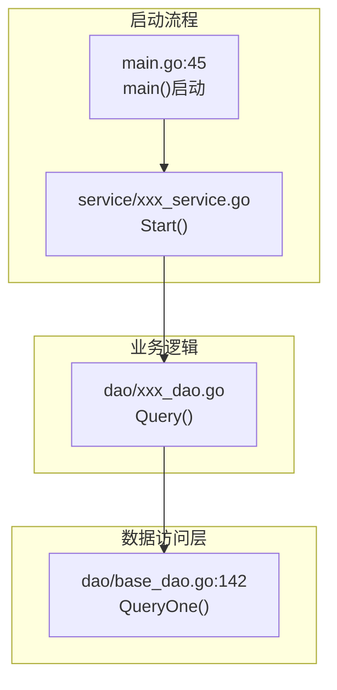

---
name: story-detail-design
description: 基于软件实现设计文档（主设计文档）生成Story详设文档。这是设计流程的第二步，输入为主设计文档中的Story章节，输出为独立的Story详设文档。
license: MIT
metadata:
  author: sbg
  version: "1.1"
---

# Story 详设文档生成 Skill

基于软件实现设计文档（主设计文档）中的Story章节，生成独立的Story详设文档。

## 与软件实现设计的关系

此skill是设计流程的第二步，接收sw-design-from-requirements的输出作为输入：
```
SE需求文档 + 接口文档 
   ↓ [sw-design-from-requirements] ← 前置skill
软件实现设计文档（主设计文档）
   ↓ [story-detail-design] ← 当前skill
Story详设文档（独立文件）
   ↓ [code-generation] ← 后续skill
代码实现
```

## 工作流程

> **reference 文件索引**：
> - 文档模板：[reference/story-template.md](reference/story-template.md)
> - 示例输出：[reference/examples.md](reference/examples.md)
> - 测试设计：[reference/test-design.md](reference/test-design.md)

| 步骤 | 目的 | 关键产出 |
| --- | --- | --- |
| 第一步：doc-loader 检索 | 精准加载规格文档 | 规格文档关键信息提取表 |
| 第二步：定位代码文件 | 基于规格文档精准定位代码 | 文件路径验证+关键代码读取 |
| 第三步：分析交互流程 | 梳理完整调用链 | mermaid flowchart + 复用点识别 |
| 第四步：创建详设文档 | 生成接口契约文档 | Story 详设文档（100-200行） |
| 第五步：更新主设计文档 | 添加引用链接 | 主设计文档引用更新 |

### 第一步：使用 doc-loader 精准检索规格文档（关键优化）

**目的**：避免全量扫描代码仓，通过文档精准检索减少上下文消耗。

#### 1.1 启动 doc-loader agent

使用 Task 工具启动 doc-loader agent，分析需求并返回需要加载的文档列表：

```
Task(subagent_type="doc-loader", prompt="用户需要实现 [主设计文档路径] 中的 Story-X（Story名称）。

请分析并返回需要加载的相关规格文档列表，包括：
1. Story-X 的详细设计章节（在主设计文档中的位置）
2. 相关的接口规范文档
3. 相关的架构设计文档（模块设计、系统架构）
4. 数据库设计文档（表结构、ORM模式）
5. 其他必要的支撑文档

请返回完整的文档路径列表和关键章节位置。")
```

#### 1.2 加载关键规格文档

根据 doc-loader 返回的文档列表，按优先级加载：

| 优先级 | 文档类型 | 加载方式 | 目的 |
| --- | --- | --- | --- |
| **P0** | 主设计文档 Story 章节 | `read(filePath, offset, limit)` | 理解 Story 需求、验收标准、关键机制 |
| **P0** | 接口规范文档 | `read(filePath)` | 获取 API 端点、请求/响应格式、错误码 |
| **P1** | 模块设计文档 | `read(filePath)` | 理解模块分层、Service/DAO 模式 |
| **P1** | 系统架构文档 | `read(filePath, offset, limit)` | 理解技术栈、框架、数据库类型 |
| **P2** | 数据库设计文档 | `read(filePath)` | 理解表结构设计规范、ORM 模型定义 |

**加载策略**：
- **优先加载章节**：使用 `offset` 和 `limit` 参数，仅加载相关章节，避免全文档加载
- **按需加载**：根据分析进展，逐步加载需要的文档
- **记录关键信息**：提取文档中的关键章节位置、文件路径引用、代码示例

#### 1.3 提取关键信息

从规格文档中提取以下关键信息：

| 信息类型 | 来源文档 | 提取内容 |
| --- | --- | --- |
| **需求描述** | 主设计文档 Story 章节 | Story 描述、验收标准、关键机制要点 |
| **接口契约** | 接口规范文档 | API 路径、请求参数、响应格式、错误码 |
| **数据模型** | 主设计文档 DB 章节 | 表结构定义、字段说明、并发分析、锁机制 |
| **代码文件路径** | 模块设计文档 | 现有 Service/DAO/Model 文件路径 |
| **技术栈** | 系统架构文档 | 语言、框架、ORM、数据库类型 |
| **配置项** | 主设计文档配置章节 | 配置键、默认值、环境变量 |
| **复用模块** | 模块设计文档 | 可复用的 Service 方法、DAO 方法、HTTP 客户端 |

**输出格式**：

```markdown
### 规格文档关键信息提取

**需求描述**：
- Story描述：[从主设计文档提取]
- 验收标准：[从主设计文档提取]
- 关键机制：[从主设计文档提取]

**接口契约**：
- FM订阅接口：POST /fmAlarmOpenApi/subscribe/v1（来源：27.0CSP告警接口文档.md:7-95）
- FM查询接口：POST /fmOperation/v1/alarms/get_alarms（来源：27.0CSP告警接口文档.md:150-273）

**数据模型**：
- 表名：t_gids_master（来源：27.0告警与话统软件实现设计.md:446-489）
- 字段定义：[从主设计文档提取]

**代码文件路径参考**：
- Service层：service/（来源：模块架构设计.md）
- DAO层：dao/（来源：模块架构设计.md）
- 实体层：models/db/（来源：模块架构设计.md）

**技术栈**：
- 语言：Go（来源：系统架构设计.md）
- ORM：Beego ORM（来源：系统架构设计.md）
- 数据库：GaussDB（来源：系统架构设计.md）

**配置项**：
- 选主刷新周期：gids.master.check-period = 5s（来源：27.0告警与话统软件实现设计.md:1294）

**复用模块**：
- BaseDao：dao/base_dao.go（来源：10-基础设施模块/模块设计.md）
- HTTP客户端：OSHttpsGetRequestByCSE（来源：11-外部SDK集成模块/模块设计.md）
```

---

### 第二步：基于规格文档精准定位代码文件

**目的**：基于第一步提取的文件路径引用，精准定位代码文件，避免全仓扫描。

#### 2.1 从规格文档提取文件路径引用

从模块设计文档中提取现有代码文件路径：

| 文档类型 | 提取内容 | 示例 |
| --- | --- | --- |
| **模块设计文档** | Service/DAO/Model 文件路径 | "Service层：service/alarm_service.go" |
| **主设计文档** | 开发任务中的文件引用 | "新增实体：models/db/gids_master.go" |
| **架构文档** | 启动文件路径 | "启动入口：main.go" |

#### 2.2 验证文件路径是否存在

使用 `glob` 验证提取的文件路径是否存在：

```markdown
示例：
- 提取路径：service/alarm_service.go
- 验证：glob(pattern="**/alarm_service.go")
- 如果存在：读取该文件
- 如果不存在：搜索相关关键词（如 "alarm"）
```

#### 2.3 读取关键代码文件

基于规格文档的指导，读取以下关键文件：

| 文件类型 | 读取目的 | 读取方式 |
| --- | --- | --- |
| **启动文件** | 理解启动集成方式 | `read("main.go")` 或 `read("main.go", offset, limit)` |
| **BaseDao** | 理解 DAO 继承模式 | `read("dao/base_dao.go")` |
| **现有 Service** | 理解 Service 定义模式 | `read("service/{相关service}.go")` |
| **现有 Model** | 理解 ORM 模型定义 | `read("models/db/{相关model}.go")` |
| **db_init** | 理解表结构追加方式 | `read("dao/db_init.go")` |

#### 2.4 搜索补充信息（仅在必要时）

如果规格文档未提供足够信息，使用 `grep` 精准搜索：

| 搜索目标 | grep 命令 | 目的 |
| --- | --- | --- |
| **HTTP调用方法** | `grep("OSHttpsGetRequestByCSE")` | 复用现有HTTP客户端 |
| **服务名定义** | `grep("FMService")` | 复用现有服务名 |
| **环境变量** | `grep("os.Getenv")` | 复用现有配置读取方式 |
| **ORM注册** | `grep("orm.RegisterModel")` | 理解模型注册方式 |

**注意**：
- 优先使用规格文档中的信息，减少代码搜索
- 仅在规格文档信息不足时，才进行代码搜索
- 搜索时限定范围（如 `include="*.go"`），避免全仓扫描

---

### 第三步：分析交互流程

#### 3.1 梳理完整交互链路

基于规格文档和代码文件，梳理从入口点到数据层的完整调用链：

| 链路节点 | 信息来源 | 标注内容 |
| --- | --- | --- |
| **启动入口** | main.go | 文件路径:行号 |
| **Service层** | Service 文件 | 文件路径:行号，核心方法名 |
| **DAO层** | DAO 文件 | 文件路径:行号，数据库操作方法 |
| **数据层** | BaseDao | 文件路径:行号，ORM 调用方法 |

#### 3.2 绘制 mermaid flowchart

使用 mermaid flowchart 绘制流程图，标注文件路径和行号：



#### 3.3 识别复用点

从规格文档和代码文件中识别可复用模块：

| 复用类型 | 来源 | 复用方式 |
| --- | --- | --- |
| **表结构** | db_init.go 的 initSql | 在现有字符串中追加新表 |
| **实体定义** | models/db/*.go | 复用 orm.RegisterModel 模式 |
| **DAO** | dao/*.go | 继承 BaseDao，复用 QueryOne/Exec 方法 |
| **Service** | service/*.go | 复用接口+实现类模式，定时器用法 |
| **启动集成** | main.go | 在现有启动流程中添加调用 |
| **服务地址** | 规格文档 | 通过CSE服务发现（`cse://{ServiceName}/{path}`） |
| **配置项** | 规格文档 | 复用现有环境变量、常量定义 |
| **HTTP调用** | 现有 Service 文件 | 复用 OSHttpsGetRequestByCSE 方法 |

---

### 第四步：创建详设文档（重要：不含完整代码实现）

#### 4.1 文档编写规范（关键约束）

> **设计要素承载总览**：Story 详设阶段承载代码模型（C3/C4）、通信模型（M1/M2/M4/M5）、运行模型（R1/R3/R5/R6）、数据处理模型（D1/D2/D3/D4/D5/D6）、测试模型（TM）共 18 项设计要素。核心要素为 C3 接口与实现映射 + M2 消息定义 + M4 通信图 + D3 数据结构(结构体) + D4 处理逻辑，缺一不可。标注 `> **承载设计要素**` 的章节必须填写实质内容。
>
> **设计要素填写要求（P0/P1/P2 强化）**：各设计要素的详细填写要求（回滚调用点、ID范围约束、配置键名+默认值、来源标注、失败回滚等）参见 [reference/story-template.md](reference/story-template.md) 的"设计要素填写要求"章节。生成文档后必须逐项自检。

**Story 详设文档是开发指导文档，不是代码实现文档。**

> **文档模板和编写规范**：参见 [reference/story-template.md](reference/story-template.md) 获取完整文档结构模板、必须包含/不应包含内容清单、代码示例规范和文档篇幅建议。

#### 4.2 文档结构模板

> 完整文档结构模板（含设计要素标注）参见 [reference/story-template.md](reference/story-template.md)。

#### 4.3 示例输出格式

> 示例（规格文档引用、流程图、接口契约等）参见 [reference/examples.md](reference/examples.md)。

---

### 第五步：更新主设计文档

1. **删除嵌入的详设内容**（如果有）
2. **添加引用链接**：
   ```markdown
   > **软件实现详设**：详见 [Story-X_{名称}软件详设.md](Story-X_{名称}软件详设.md)
   ```

---

## 文件路径规则

- **主设计文档**：`doc/{版本}/{模块}/{模块}软件实现设计.md`
- **Story详设文档**：`doc/{版本}/{模块}/storys/Story-{序号}_{名称}软件详设.md`

---

## 测试设计要求

> 测试设计要求（Mock方案、UT/DT测试、覆盖率要求）参见 [reference/test-design.md](reference/test-design.md)。

---

## 注意事项

### 文档检索优化（关键改进）

1. **优先使用 doc-loader**：第一步必须使用 doc-loader agent 分析需要加载的规格文档
2. **精准加载章节**：使用 `read(filePath, offset, limit)` 仅加载相关章节
3. **避免全仓扫描**：优先从规格文档提取文件路径引用，减少代码搜索
4. **按需搜索**：仅在规格文档信息不足时，使用 `grep` 精准搜索

### 文档编写规范（关键约束）

1. **不嵌入主设计文档**：详设内容独立文档，主设计文档仅引用
2. **标注文件路径和行号**：流程图中每个节点标注具体位置
3. **优先复用现有代码**：在现有文件中追加，而非新建
4. **测试设计包含UT和DT**：使用Mock方案，不依赖真实环境
5. **复用现有配置和调用方式**：
   - **服务地址**：通过CSE服务发现调用（如 `cse://FMService/path`），不硬编码IP/URL
   - **配置读取**：复用现有环境变量、常量定义，不新建配置文件
   - **HTTP方法**：复用现有HTTP调用方法（如 `OSHttpsGetRequestByCSE`），不新建HTTP客户端
   - **示例**：调用FM服务时，复用 `alarm_service.go:335 OSHttpsGetRequestByCSE()` 和 `FMService` 服务名
6. **设计要素覆盖度检查**：生成文档后，检查以下核心要素是否有实质内容：
   - C3 接口与实现映射（§五+§十）：每个新增文件是否标注了接口定义位置和实现位置？
   - M2 消息定义（§五）：接口的请求/响应消息字段是否完整定义？
   - M4 通信图（§三）：mermaid 流程图是否标注了文件路径和行号？
   - D3 数据结构（§五）：结构体字段是否完整（含 ORM/JSON 标签）？
   - D4 处理逻辑（§六）：关键逻辑是否有步骤/决策点/边界条件表格？
   - **R5 容错机制（§七，P0）**：每个容错场景是否写了回滚调用点（如 `SNMP失败→s.decrementCount(level)`），而非仅写"需要回滚"？
   - **TM 测试场景（§九，P0）**：每个测试场景是否写了ID范围约束（附告警ID清单/边界值清单），而非仅写测试用例编号？
   - **R1 配置项（§八，P1）**：每个配置项是否写了配置键名+默认值（如 `snmp::v3_username=empty`），而非仅写"需要配置"？
   - **L1/L3 实体表（§五，P1）**：每个实体字段是否标注了唯一来源/冗余来源？
   - **D4 失败回滚（§六，P2）**：每个处理步骤是否附了失败回滚调用点？

### 不包含完整代码实现（关键约束）

**Story 详设文档是接口契约文档，不是代码实现文档。**

> 详细的代码示例规范（正确/错误示例）和不应包含内容清单参见 [reference/story-template.md](reference/story-template.md)。

### 规格文档优先级

| 优先级 | 文档类型 | 必须加载 |
| --- | --- | --- |
| **P0** | 主设计文档 Story 章节 | ✅ 是 |
| **P0** | 接口规范文档 | ✅ 是 |
| **P1** | 模块设计文档 | ⚠️ 按需 |
| **P1** | 系统架构文档 | ⚠️ 按需 |
| **P2** | 数据库设计文档 | ⚠️ 按需 |

---
