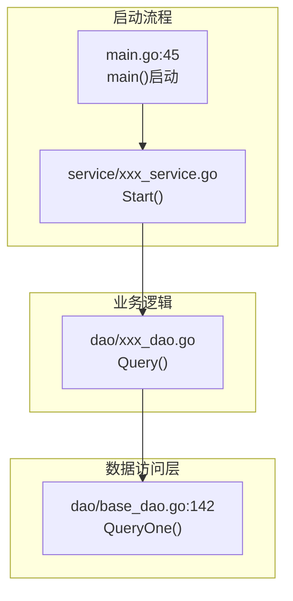

# 示例输出格式

> 本文件为 story-detail-design skill 的示例输出参考。SKILL.md 中通过引用链接加载本文件。

## 目录

- 规格文档引用示例
- 流程图示例
- 新增文件接口契约示例
- DAO接口契约示例
- Service接口契约示例

## 规格文档引用示例

```markdown
## 二、规格文档引用

**接口规范**：
- FM订阅接口：POST /fmAlarmOpenApi/subscribe/v1（来源：27.0CSP告警接口文档.md:7-95）
- FM查询接口：POST /fmOperation/v1/alarms/get_alarms（来源：27.0CSP告警接口文档.md:150-273）

**数据模型**：
- 表结构：t_gids_master（来源：27.0告警与话统软件实现设计.md:446-489）
- Upsert SQL：INSERT INTO ... ON CONFLICT (id)（来源：27.0告警与话统软件实现设计.md:477-483）

**架构设计**：
- 技术栈：Go + Beego ORM + GaussDB（来源：系统架构设计.md:266-380）
- 模块分层：Controller/Service/DAO/Model（来源：模块架构设计.md）
```

## 流程图示例



## 新增文件接口契约示例

```markdown
### 5.2 实体定义（新增文件）

**文件**：`src/models/db/gids_master.go`

**结构体字段定义**（仅字段，不含方法实现）：

| 字段 | 类型 | ORM标签 | 说明 |
| --- | --- | --- | --- |
| `Id` | int | `orm:"pk;default(1)"` | 固定主键，值为1 |
| `PodName` | string | `orm:"size(64)"` | 当前Master POD名称 |
| `Timestamp` | time.Time | `orm:"type(timestamp)"` | 最后刷新时间 |
| `IsRegistered` | bool | `orm:"default(false)"` | 是否已注册FM订阅 |

**方法签名**（不含实现体）：

```go
func (m *GidsMaster) TableName() string
```

**说明**：参考现有 `traffic_stats.go` 的 ORM 定义模式，实现代码在代码文件中编写。
```

## DAO接口契约示例

```markdown
### 5.3 DAO实现（新增文件）

**文件**：`src/dao/gids_master_dao.go`

**结构体定义**：

```go
type GidsMasterDao struct {
    BaseDao  // 继承BaseDao
}
```

**方法签名**（不含实现体）：

| 方法 | 签名 | 说明 |
| --- | --- | --- |
| `NewGidsMasterDao` | `func NewGidsMasterDao() *GidsMasterDao` | 创建DAO实例 |
| `Query` | `func (d *GidsMasterDao) Query() (*db.GidsMaster, error)` | 查询Master记录（id=1） |
| `Upsert` | `func (d *GidsMasterDao) Upsert(podName string, timestamp time.Time) error` | 抢主操作（ON CONFLICT） |
| `UpdateTimestamp` | `func (d *GidsMasterDao) UpdateTimestamp(podName string, timestamp time.Time) error` | Master刷新时间戳 |
| `UpdateIsRegistered` | `func (d *GidsMasterDao) UpdateIsRegistered(podName string, isRegistered bool) error` | 更新FM订阅状态 |

**关键SQL片段**（不超过10行）：

```sql
-- Upsert抢主SQL（核心片段）
INSERT INTO t_gids_master (id, pod_name, timestamp, is_registered)
VALUES (1, $1, $2, false)
ON CONFLICT (id) DO UPDATE SET pod_name = $1, timestamp = $2
```

**说明**：继承 `BaseDao`，复用 `QueryOne`、`Exec` 方法，完整实现代码在代码文件中编写。
```

## Service接口契约示例

```markdown
### 5.4 Service实现（新增文件）

**文件**：`src/service/master_election_service.go`

**接口定义**：

```go
type MasterElectionService interface {
    Start()      // 启动选主服务（5秒周期）
    Stop()       // 停止选主服务
    IsMaster() bool  // 判断是否为Master
}
```

**关键逻辑说明**（表格描述，不含完整代码）：

| 逻辑步骤 | 方法 | 决策点 | 说明 |
| --- | --- | --- | --- |
| **启动选主** | `Start()` | 使用 `time.NewTicker(5s)` | 启动定时器，5秒周期检查 |
| **检查选主状态** | `checkAndElection()` | 表为空？是否为当前POD？超时？ | 查询DB，判断抢主条件 |
| **抢主操作** | `tryBecomeMaster()` | Upsert成功后再次查询确认 | 防止多POD并发抢主冲突 |
| **刷新时间戳** | `UpdateTimestamp()` | 仅Master POD执行 | 每5秒刷新，防止超时 |

**核心逻辑片段**（不超过10行）：

```go
// checkAndElection核心逻辑片段
master, err := s.dao.Query()
if err != nil || master == nil {
    s.tryBecomeMaster(now)  // 核心调用：抢主
}
```

**说明**：参考 Stub 测试逻辑（`master_election_service_stub_test.go:88-136`），完整实现代码在代码文件中编写。
```
