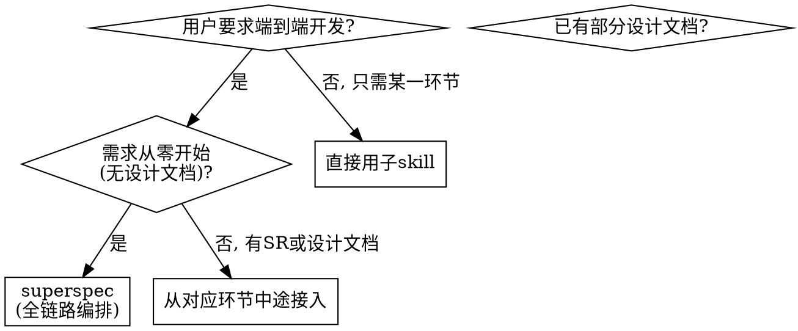
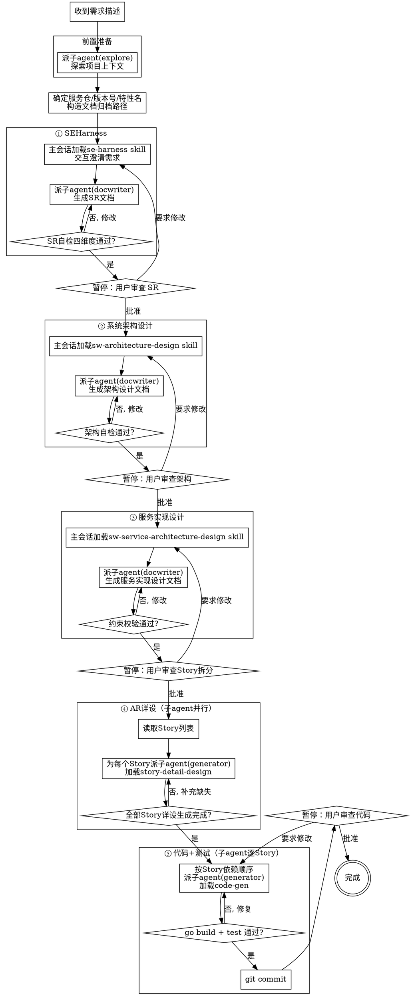

# superspec：超级工程师全链路编排

一个 skill 入口，串联 SPEC 工程化体系五步流程。各环节的实际指令由子 skill 承载，本 skill 只负责**环节调度、阶段间状态交接、人工检查点暂停、子 agent 分派**。

<HARD-GATE>
在进入代码生成（第⑤步）之前，必须完成前四步的全部设计文档并经用户审查通过。不允许跳过设计阶段直接写代码。
</HARD-GATE>

## 核心原则

1. **不内联子 skill 指令** — 本 skill 只写调度逻辑，各环节具体指令由对应子 skill 承载
2. **阶段间有人工检查点** — SR 审查、架构审查、Story 拆分审查、代码审查，每个检查点暂停等用户确认
3. **所有探索与独立任务必须派子 agent** — 上下文探索、文档生成、代码编写、质量校验等一切可独立执行的工作均派子 agent，主会话仅保留编排与用户交互
4. **主会话是薄编排层** — 主会话只做三件事：① 加载 skill 决定下一步 ② 暂停等用户确认 ③ 派子 agent 并收集结果。禁止在主会话中直接读文件、写文档、写代码
5. **设计要素不越界** — 每个环节只承载自己的设计要素，不越界到下游环节（详见 reference/design-element-matrix.md）
6. **验证铁律** — go build exit 0 / 测试 0 failures / 无伪断言 / 不允许"应该能"措辞

## 适用场景



## 五步流程总览

```
① se-harness              ② sw-architecture-       ③ sw-service-              ④ story-detail-design     ⑤ code-generation-
   (SR生成)                   design                  architecture-                                       quality-loop
   L1/L2/L3/L5/R7/D3          C1/C2/D2/D3/R1/R3        design                                          CM全落地+TM全执行
                                                        M5/C2/R5/R6
       ↓                       ↓                       ↓                          ↓                          ↓
   子agent                  子agent                  子agent                    子agent并行                子agent逐Story
   生成SR                    生成架构                 生成服务设计               生成Story详设              生成代码+测试
       ↓                       ↓                       ↓                          ↓                          ↓
     人工审查 ✓              人工审查 ✓               人工审查 ✓                 人工审查 ✓                 人工审查 ✓
```

## 流程图



## 检查清单

你必须为以下每个条目创建任务，并按顺序完成：

### 前置准备

1. **派子 agent(explore) 探索项目上下文** — 用 Task 工具分派 explore 子 agent，收集：项目文件结构、已有文档、最近 commit、技术栈、存量代码。子 agent 返回摘要报告，主会话据此决策
2. **确定文档归档路径** — 与用户确认服务仓名、版本号、特性名，构造路径：`{服务仓}/docs/{版本号}/{特性名}/`
3. **派子 agent(general) 创建目录结构** — 用 Task 工具分派 general 子 agent，创建归档目录及 `storys/` 子目录、初始化 git 分支

### ① SEHarness（SR 生成）

4. **主会话加载 `se-harness` skill** — 用 Skill 工具加载 se-harness，按其指令在主会话中与用户交互澄清需求（交互环节不可委派，必须主会话执行）
5. **派子 agent(docwriter) 生成 SR 文档** — 将交互澄清结果 + se-harness skill 指令 + 需求背景文档作为 prompt，用 Task 工具分派 docwriter 子 agent 生成 SR 文档到归档路径
6. **确认 SR 状态** — 子 agent 返回状态报告（DONE / DONE_WITH_CONCERNS / BLOCKED）
   - DONE → 继续
   - DONE_WITH_CONCERNS → 向用户展示疑虑，确认是否继续
   - BLOCKED → 停止，向用户报告阻塞原因
7. **人工检查点①** — 暂停，请用户审查 SR 文档。用户批准后方可继续

### ② 系统架构设计

8. **主会话加载 `sw-architecture-design` skill** — 用 Skill 工具加载，明确架构设计的上下文输入
9. **派子 agent(docwriter) 生成架构设计文档** — 将 SR 文档内容 + 架构设计 skill 指令 + 探索报告作为 prompt，用 Task 工具分派 docwriter 子 agent 生成架构设计文档
10. **确认架构状态** — 子 agent 返回自检结果（需求覆盖/存量复用/接口一致/DB锁机制/配置项）
11. **人工检查点②** — 暂停，请用户审查架构设计。用户批准后方可继续

### ③ 服务实现设计

12. **主会话加载 `sw-service-architecture-design` skill** — 用 Skill 工具加载，明确服务设计的上下文输入
13. **派子 agent(docwriter) 生成服务实现设计文档** — 将架构设计文档内容 + 服务设计 skill 指令作为 prompt，用 Task 工具分派 docwriter 子 agent 生成服务实现设计文档（约束先行→Story拆分→约束校验）
14. **确认约束校验状态** — 子 agent 返回校验结果（分层改造顺序/并发安全/事务边界/设计模式/线程池回收逐项校验通过）
15. **人工检查点③** — 暂停，请用户审查 Story 拆分方案和约束校验结果。用户批准后方可继续

### ④ AR 实现设计（Story 详设）

16. **读取 Story 列表** — 从服务实现设计文档中提取 Story 列表和依赖关系
17. **为每个 Story 派子 agent(generator)** — 用 Task 工具分派 generator 子 agent，每个子 agent：
    - 加载 `story-detail-design` skill
    - 接收该 Story 的完整上下文（SR 章节 + 架构章节 + 服务实现 Story 章节）
    - 生成独立的 Story 详设文档到 `{归档路径}/storys/Story-N_*.md`
    - 有依赖关系的 Story 串行分派，无依赖的可并行分派
18. **审查 Story 详设** — 检查每个子 agent 返回的 Story 详设：不含完整代码（>10行）/ 接口契约完整 / 时序图标注文件路径 / 验收标准明确

### ⑤ 代码生成+测试验证

19. **按 Story 依赖顺序逐个派子 agent(generator)** — 用 Task 工具分派，每个子 agent：
    - 加载 `code-generation-quality-loop` skill
    - 接收该 Story 详设文档作为输入
    - 按分层改造顺序①接口→②DAO→③Service→④Controller 生成代码
    - 执行 `go build`（或对应语言的编译命令）
    - 生成测试用例并执行，严禁伪断言
    - 输出状态报告
20. **验证铁律** — 必须 `go build` exit 0 / 测试 0 failures / 无伪断言。**不允许"应该能编译"措辞**
21. **git commit** — 每个 Story 代码+测试通过后，提交一个 commit
22. **人工检查点④** — 暂停，请用户审查代码。用户批准后方可继续

### 收尾

23. **派子 agent(general) 汇总交付清单** — 用 Task 工具分派 general 子 agent，遍历所有设计文档 + 代码文件 + 测试用例 + git commit 记录，生成交付清单
24. **列出遗留问题** — 从服务实现设计文档的遗留问题章节跟踪，标注哪些已解决、哪些待人工确认
25. **提示后续动作** — 分支推送 / CI/CD 触发 / 遗留问题跟进

## git 管理规范

SPEC 流程全程在 git 体系下进行，分支、提交、实验隔离须遵循以下规范：

### 分支管理

| 分支类型 | 命名规范 | 用途 | 创建时机 |
| --- | --- | --- | --- |
| 正式分支 | `main` / `release/{版本号}` | 集成、发版 | 项目初始化 / 版本冻结 |
| SPEC 开发分支 | `feature/{版本号}-{特性名}` | 承载 SR→架构→服务→Story→代码全链路 | 步骤 2 确定归档路径时 |
| 实验分支 | `experiment/{特性名}-{实验主题}` | 方案探索、原型验证、临时对比 | 需要试错时 |

- SPEC 开发分支从 `main` 切出，完成后合并回 `release/{版本号}`
- 实验分支从 SPEC 开发分支切出，验证后要么合并回 SPEC 分支（方案可用），要么直接删除（方案废弃）
- 禁止在 `main` 上直接开发

### 提交规范

每个环节完成后提交一个 commit，消息格式：

| 环节 | commit 消息格式 | 示例 |
| --- | --- | --- |
| ① SR | `docs(sr): {特性名} SR 文档生成` | `docs(sr): 终端鉴权 SR 文档生成` |
| ② 架构 | `docs(arch): {特性名} 系统架构设计` | `docs(arch): 终端鉴权系统架构设计` |
| ③ 服务 | `docs(svc): {特性名} 服务实现设计` | `docs(svc): 终端鉴权服务实现设计` |
| ④ Story 详设 | `docs(ar): Story-{N} {Story名} 详设` | `docs(ar): Story-1 终端注册详设` |
| ⑤ 代码+测试 | `feat({模块}): Story-{N} {Story名} 实现` | `feat(auth): Story-1 终端注册实现` |

- 每个环节的 commit 必须在该环节自检通过后、人工检查点前提交
- Story 详设和代码生成按 Story 粒度提交，不混提
- commit 消息不附 `Co-Authored-By` 等署名行，保持简洁

### 实验隔离

当需要试错方案（技术选型对比、原型验证）时，使用实验隔离避免污染 SPEC 开发分支：

1. **worktree 隔离**（推荐）：
   ```
   git worktree add ../{特性名}-exp experiment/{特性名}-{实验主题}
   ```
   实验完成后合并或删除 worktree：`git worktree remove ../{特性名}-exp`
2. **stash 隔离**（轻量试错）：`git stash` 暂存当前改动，实验后 `git stash pop` 恢复
3. **实验清理**：实验分支用完后立即删除，避免残留：`git branch -D experiment/{特性名}-{实验主题}`

> 实验产出的有效结论必须回写到 SR 或架构设计文档中，不能只留在实验分支里。

## SPEC 质量检查清单

在代码生成（第⑤步）完成、人工检查点④之前，逐项核对以下清单。任何一项不满足则补全后重新提交：

| 检查项 | 检查内容 | 不通过的后果 |
| --- | --- | --- |
| 关键常量值清单 | SR§12.1 是否有完整常量表？所有 OID/汇总 ID/阈值/重试次数/端口/超时是否都有具体数值？ | 下游臆造常量值，各环节不一致 |
| 安全实现方案 | SR§5 每个安全约束是否附具体实现方案（不只写"需要校验"）？ | 下游臆造鉴权/加密逻辑，产生漏洞 |
| 容错调用点 | 架构§容错设计 + 服务§容错 + AR§处理逻辑是否标注所有容错调用点（重试/降级/熔断/兜底）？ | 容错断链，异常时无降级 |
| 配置键名 | 架构§配置项是否列出所有配置键名及取值范围？代码中是否与之一致？ | 配置键名臆造，运行时读不到配置 |
| ID 范围 | SR/架构是否定义所有 ID（OID/租户 ID/汇总 ID）的范围与生成规则？ | ID 冲突或越界 |
| 字段长度 | SR§7 + 架构§DB 设计中所有字段是否含类型+长度（如 VARCHAR(32)）？ | 字段截断或 DDL 不一致 |

## 信息冗余度检查

每个关键信息至少有 1 个可追溯来源。在第⑤步收尾前执行：

1. **派子 agent(general) 执行冗余度检查** — 用 Task 工具分派 general 子 agent，子 agent 从 SR/架构/服务/AR 详设中提取所有关键常量值、安全约束、字段定义、接口契约、容错策略
2. **追溯来源** — 子 agent 为每条信息标注其定义所在的环节和章节（如"鉴权方式→SR§5"）
3. **冗余度判定** — 子 agent 输出判定结果：
   - 来源集合 = 0 → 缺失，必须补全
   - 来源集合 = 1 → 强必要，确保唯一来源可用
   - 来源集合 > 1 → 冗余来源，核对一致性，不一致时以更接近需求源头的环节为准（SR > 架构 > 服务 > AR）
4. **冲突修复** — 发现冗余来源间冲突时，以权威源为准修正其余来源，并在遗留问题表中记录

## 文档归档路径规范

同一特性的所有文档归档到同一目录：

```
{服务仓}/docs/{版本号}/{特性名}/
├── {特性名}SR文档.md                    — ① SR（se-harness 生成）
├── {版本号}{特性名}系统实现架构设计.md       — ② 架构设计（sw-architecture-design 生成）
├── {版本号}{特性名}服务实现设计.md          — ③ 服务实现（sw-service-architecture-design 生成）
└── storys/
    └── Story-N_XXX软件详设.md             — ④ Story 详设（story-detail-design 生成）
```

路径在步骤 2 确定，后续所有环节的文档输出路径都基于此路径构造。

## 阶段间状态交接协议

每个环节完成后，必须输出标准状态报告，下游环节据此判断是否可继续：

| 状态 | 含义 | 本 skill 动作 |
| --- | --- | --- |
| **DONE** | 完成且自审通过 | 进入人工检查点，通过后继续下一环节 |
| **DONE_WITH_CONCERNS** | 完成但有疑虑 | 向用户展示疑虑，用户判断是否影响下游 |
| **BLOCKED** | 无法完成 | 停止链路，向用户报告阻塞原因 |
| **NEEDS_CONTEXT** | 需要额外信息 | 暂停，请用户补充上下文后重跑该环节 |

## 子 agent 分派总策略

<HARD-GATE>
主会话禁止直接执行探索、读文件、写文档、写代码等具体工作。所有可独立执行的任务必须派子 agent。主会话只做编排、加载 skill、暂停等用户确认、派子 agent 并收集结果。
</HARD-GATE>

### 主会话 vs 子 agent 职责边界

| 职责 | 执行方 | 说明 |
| --- | --- | --- |
| 加载 skill、决定下一步 | 主会话 | 编排决策，不可委派 |
| 与用户交互澄清需求 | 主会话 | 需要实时对话，不可委派 |
| 暂停等用户审查确认 | 主会话 | 检查点是流程门控，不可委派 |
| 判断状态（DONE/BLOCKED） | 主会话 | 编排决策，不可委派 |
| 汇报进度、提示后续动作 | 主会话 | 用户可见的交互 |
| 探索项目上下文 | 子 agent(explore) | 纯探索任务 |
| 创建目录/初始化分支 | 子 agent(general) | 独立执行任务 |
| 生成 SR 文档 | 子 agent(docwriter) | 文档生成 |
| 生成架构设计文档 | 子 agent(docwriter) | 文档生成 |
| 生成服务实现设计文档 | 子 agent(docwriter) | 文档生成 |
| 生成 Story 详设文档 | 子 agent(docwriter) | 文档生成 |
| 生成代码+测试 | 子 agent(generator) | 代码生成+验证 |
| 汇总交付清单 | 子 agent(general) | 独立执行任务 |
| 信息冗余度检查 | 子 agent(general) | 独立分析任务 |

### 子 agent 类型选择规则

| 任务类型 | subagent_type | 说明 |
| --- | --- | --- |
| 项目上下文探索 | `explore` | 快速搜索文件、代码模式、技术栈，设定 thoroughness="medium" |
| 文档生成（SR/架构/服务/Story） | `docwriter` | 专用于从设计输入生成标准化文档 |
| 代码生成+测试验证 | `generator` | 专用于从 Story 详设生成代码并验证 |
| 通用独立任务（创建目录/汇总/检查） | `general` | 通用多步骤任务 |

### 子 agent prompt 构造规则

<HARD-GATE>
子 agent **不继承**主会话上下文。你必须在 prompt 中提供它所需的全部信息，否则子 agent 将无法完成任务。
</HARD-GATE>

每个子 agent 的 prompt 必须包含：

1. **任务目标** — 明确的输出要求（文档路径、文件列表、状态报告格式）
2. **上下文输入** — 该任务依赖的所有文档内容（SR 章节、架构章节等），以纯文本形式内联提供
3. **skill 指令** — 如果子 agent 需要加载 skill，在 prompt 中明确指出 skill 名称
4. **输出格式** — 子 agent 最终必须返回的信息清单（如：生成的文档路径、自检结果、修改的文件列表）
5. **约束条件** — 禁止项（如：不写完整代码、不臆造常量值）

### 各步骤子 agent 分派细则

#### 前置准备：上下文探索（explore）

```
subagent_type: explore
prompt 内容:
  - 任务：探索 {服务仓} 的项目结构、技术栈、存量代码、已有文档
  - thoroughness: "medium"
  - 输出要求：
    1. 项目文件结构概览
    2. 技术栈（语言、框架、DB）
    3. 与本次特性相关的存量代码清单（文件路径+职责简述）
    4. 已有设计文档清单
    5. 最近 5 条 git commit 摘要
```

#### ① SEHarness：SR 生成（docwriter）

```
主会话先执行: 加载 se-harness skill → 与用户交互澄清需求 → 收集澄清结果

subagent_type: docwriter
prompt 内容:
  - 任务：按 se-harness skill 指令生成 SR 文档
  - 上下文：交互澄清结果（纯文本）+ 需求背景文档内容（内联）
  - skill 指令：加载 se-harness skill
  - 输出要求：SR 文档路径 + 四维度自检结果（DONE/DONE_WITH_CONCERNS/BLOCKED）
  - 输出路径：{归档路径}/{特性名}SR文档.md
```

#### ② 系统架构设计：架构文档生成（docwriter）

```
subagent_type: docwriter
prompt 内容:
  - 任务：按 sw-architecture-design skill 指令生成架构设计文档
  - 上下文：SR 文档内容（内联）+ 探索报告（存量代码清单）
  - skill 指令：加载 sw-architecture-design skill
  - 输出要求：架构文档路径 + 自检结果
  - 输出路径：{归档路径}/{版本号}{特性名}系统实现架构设计.md
```

#### ③ 服务实现设计：服务文档生成（docwriter）

```
subagent_type: docwriter
prompt 内容:
  - 任务：按 sw-service-architecture-design skill 指令生成服务实现设计文档
  - 上下文：架构设计文档内容（内联）
  - skill 指令：加载 sw-service-architecture-design skill
  - 输出要求：服务设计文档路径 + 约束校验结果
  - 输出路径：{归档路径}/{版本号}{特性名}服务实现设计.md
```

#### ④ Story 详设（docwriter 或 generator）

- 用 Task 工具分派，`subagent_type` 选 `generator`
- 每个子 agent 获得完整任务文本：该 Story 对应的 SR 章节 + 架构章节 + 服务实现 Story 章节 + story-detail-design skill 指令
- 有依赖关系的 Story 串行分派（如 Story-2 依赖 Story-1 的接口定义）
- 无依赖关系的 Story 可并行分派

#### ⑤ 代码生成+测试（generator）

- 用 Task 工具分派，`subagent_type` 选 `generator`
- 每个子 agent 获得该 Story 的详设文档路径 + code-generation-quality-loop skill 指令
- **必须按 Story 依赖顺序逐个分派**，前一个 Story 编译通过后再分派下一个
- 子 agent 完成后必须输出：修改的文件列表 / 测试通过数 / go build 结果
- 如果子 agent 失败（编译错误/测试失败），修复后重新分派，不 amend

## 设计要素不越界规则

每个环节只承载自己的设计要素，禁止越界到下游环节：

| 环节 | 承载要素 | 禁止承载 |
| --- | --- | --- |
| ① SR | L1/L2/L3/L5/R7/D3(概要) | DB DDL、接口签名、代码、模块接口签名 |
| ② 架构 | C1/C2/C4/C5/L4/M2/R3/D2/D3(DB)/R1/R2/R4/R5(0层)/R6(0层)/D6 | Story 拆分、分层改造顺序校验、锁方案 |
| ③ 服务 | C2(校验)/M5/R5(1层)/R6(1层)/PM2/PM5/TM1/TM3/TM5 | 结构体字段、方法签名、处理逻辑 |
| ④ AR 详设 | C3/M2/D3(结构体)/D4/D5/M1/M3/M4/R5/R6/PM5/TM4/TM6 | 完整代码实现（>10 行） |
| ⑤ 代码 | CM1~CM6 全落地 + TM1~TM6 全执行 | — |

> 详见 reference/design-element-matrix.md

## 从中途接入

如果用户已有部分设计文档，可从对应环节中途接入：

| 已有文档 | 接入点 | 动作 |
| --- | --- | --- |
| 需求背景（非标准化 SR） | 从①开始 | 用 se-harness 生成标准化 SR |
| 已有标准化 SR | 从②开始 | 用 sw-architecture-design 生成架构设计 |
| 已有架构设计 | 从③开始 | 用 sw-service-architecture-design 生成服务实现 |
| 已有服务实现（含 Story 拆分） | 从④开始 | 直接派子 agent 生成 Story 详设 |
| 已有 Story 详设 | 从⑤开始 | 直接派子 agent 生成代码 |

接入时跳过已完成环节的人工检查点，但仍需执行当前环节的自检和检查点。

## 与子 skill 的关系

本 skill 是**编排层**，不替代任何子 skill 的具体指令：

| 子 skill | 职责 | 本 skill 何时调用 | 执行方 |
| --- | --- | --- | --- |
| `se-harness` | SR 交互澄清 + 14 章节生成 + 四维度自检 | 第①步 | 主会话交互澄清 → 子 agent(docwriter)生成文档 |
| `sw-architecture-design` | 存量分析 + 架构总览 + 接口设计 + DB 设计 + 配置项 | 第②步 | 子 agent(docwriter) |
| `sw-service-architecture-design` | 约束先行 + Story 拆分 + 约束校验 + DT 测试设计 + 风险/遗留 | 第③步 | 子 agent(docwriter) |
| `story-detail-design` | 接口契约 + 结构体 + 方法签名 + 流程图 + 处理逻辑 + 锁机制 + 测试要点 | 第④步 | 子 agent(generator) |
| `code-generation-quality-loop` | 代码生成 + 质量检查 + 编译验证 | 第⑤步 | 子 agent(generator) |
| `verification-before-completion` | 最终验证 | 第⑤步收尾 | 子 agent(general) |

各子 skill 仍可独立使用——用户只需某一环节时，直接调用对应子 skill 即可，不必经过 superspec。
