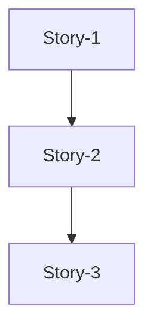
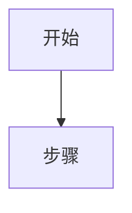

# 完整文档模板（一次性输出模式）

> 本文件为 sw-architecture-design skill 的一次性输出完整文档模板。分阶段输出时使用 stage2-template.md 和 stage3-template.md。

## 文档模板

````markdown
# [功能名称] 软件实现设计

## 一、需求背景 【系统架构设计】

[描述版本演进背景：上一版本已实现什么、存在什么不足，本版本需要补齐什么，为什么需要这个特性。]

**方案选择**：采用 **方案X — [方案名称]** — [简要描述核心机制]。方案A（[方案名称]）因[排除原因]已排除；方案B（[方案名称]）规划于后续版本。

### 1.1 文档信息

| 项目 | 内容 |
| --- | --- | --- |
| 版本 | v1.0 |
| 作者 | [作者] |
| 日期 | [日期] |

### 1.2 目标

[一句话说明本次设计的目标]

### 1.3 范围

**包含**：
- [功能点1]
- [功能点2]

**不包含**：
- [明确排除的范围]

### 1.4 存量代码分析

> **承载设计要素**：C1 目录结构, C4 命名规则

**可复用模块**：
- [模块名]：[文件路径]，可复用于 [功能]

**技术栈确认**：
- 语言：[语言]
- 框架：[框架]

**代码约定**：
- 命名风格：[风格说明]

## 二、整体设计 【系统架构设计】

### 2.1 架构总览

> **承载设计要素**：R1 运行形态, C2 分层规则, M1 对象角色

[架构图或组件关系图]

### 2.2 数据流图

> **承载设计要素**：D1 数据来源, D2 数据流图, M4 通信图, L5 业务流程

[数据从源头到终点的完整流程]

### 2.3 组件职责

> **承载设计要素**：L2 实体职责（细化）, M1 对象角色

| 组件 | 职责 | 技术栈 |
| --- | --- | --- |
| [组件A] | [职责] | [语言/框架] |

### 2.4 关键设计决策

> **承载设计要素**：C5 扩展思路, M3 交互方式, R2 实例策略, R4 消息处理能力

| 决策 | 选择 | 原因 |
| --- | --- | --- |
| [决策点] | [选择] | [依据] |

## 三、接口设计 【系统架构设计】

> **承载设计要素**：L4 逻辑接口, M2 消息定义, R3 接口约束, R7 安全约束

### 3.1 [外部系统名称] 接口

| 项 | 值 |
| --- | --- |
| API | [路径] |
| 方法 | [HTTP方法] |
| 协议 | [协议] |

**请求参数**：

| 参数名称 | 必选 | 域 | 说明 |
| --- | --- | --- | --- |
| [参数] | 是/否 | Header/Body | [说明] |

**响应格式**：

```json
{
  "field": "value"
}
```

## 四、DB 表结构设计 【系统架构设计】

> **承载设计要素**：D3 数据结构(DB), D6 并发访问分析

### 4.1 [表名]

```sql
CREATE TABLE IF NOT EXISTS [table_name] (
    id SERIAL PRIMARY KEY,
    -- 字段定义
);
```

**用途**：[表的作用]

**字段说明**：

| 字段 | 类型 | 说明 |
| --- | --- | --- |
| [字段] | [类型] | [说明] |

**并发访问分析**：

| 操作 | 执行者 | 频率 | 并发情况 |
| --- | --- | --- | --- |
| [操作] | [执行者] | [频率] | [并发情况] |

**锁机制设计**：

| 层面 | 是否需要锁 | 方案 |
| --- | --- | --- |
| DB 层 | 是/否 | [方案] |
| 应用层 | 是/否 | [方案] |

## 五、Story 拆分 【服务架构设计】

### 5.1 Story 依赖关系

> **承载设计要素**：M5 链（对象间连接关系/依赖关系）



### 5.2 Story 列表

| Story ID | 名称 | 优先级 | 预估工时 | 依赖 |
| --- | --- | --- | --- | --- |
| Story-1 | [名称] | P0 | [工时] | - |

## 六、Story 详细设计 【服务架构设计】

### 6.0 Story 文档规范

**Story 文档是开发指导文档，不是代码实现文档。**

#### 必须包含的内容

| 章节 | 内容 | 说明 |
| --- | --- | --- |
| **需求概述** | 目标、验收标准、关键机制 | 明确要做什么 |
| **交互流程** | mermaid 流程图 | 展示核心流程 |
| **复用现有代码** | 表格列出可复用模块 | 避免重复开发 |
| **新增文件清单** | 表格列出文件名、说明 | 明确改动范围 |
| **关键结构体** | 仅字段定义（不含方法实现） | 接口契约 |
| **关键接口** | 仅方法签名（不含实现体） | 接口契约 |
| **配置项** | 表格列出配置来源、默认值 | 配置说明 |
| **锁机制** | 并发场景、锁方案表格 | 并发安全说明 |
| **测试要点** | 测试类型、场景、验证点表格 | 测试指导 |
| **开发任务清单** | 表格列出任务、文件、改动类型 | 任务拆分 |
| **依赖说明** | 前置/后续依赖 | 依赖关系 |

#### 不应包含的内容

| 内容 | 原因 |
| --- | --- |
| **完整方法实现代码** | 代码应在代码文件中，文档只定义接口契约 |
| **完整测试用例代码** | 测试代码应在测试文件中，文档只列测试要点 |
| **import语句等实现细节** | 属于代码实现，不属于设计文档 |
| **重复的结构体定义** | 结构体定义一次即可，不要在多处重复 |

#### 代码示例规范

**关键代码示例**应该：
- 简洁：仅展示核心逻辑片段，不超过10行
- 示例：展示关键调用方式，而非完整实现

```go
// 正确示例：展示核心调用
func onBecomeMaster() {
    fmService := NewFmSubscribeService()
    fmService.Subscribe()  // 核心调用
}

// 错误示例：完整实现体（不应在文档中）
func (s *fmSubscribeServiceImpl) Subscribe() error {
    subscribeReq := req.NewFmSubscribeRequest(...)
    bodyBytes, err := json.Marshal(subscribeReq)
    // ... 30行实现代码 ...
}
```

#### 文档篇幅建议

| 文档类型 | 建议篇幅 |
| --- | --- |
| Story 详设文档 | 100-200行 |
| 主设计文档 | 300-500行 |

> **原则**：文档聚焦"做什么、怎么做"，代码文件聚焦"具体实现"

### 6.1 Story-1: [名称]

**目标**：[一句话说明]

**开发任务**：

| 任务 | 文件 | 改动内容 |
| --- | --- | --- |
| [任务1] | [文件路径] | [改动说明] |

**流程图**：



**关键结构体**（仅字段定义）：

```go
type XxxRequest struct {
    Field1 string `json:"field1"`
}
```

**关键接口**（仅方法签名）：

```go
type XxxService interface {
    DoSomething() error
}
```

**测试要点**：

| 测试类型 | 测试场景 | 验证点 |
| --- | --- | --- |
| UT | [场景] | [验证点] |

## 七、配置项 【系统架构设计】

| 配置键 | 默认值 | 说明 |
| --- | --- | --- |
| [配置项] | [默认值] | [说明] |

## 八、DT 测试设计 【服务架构设计】

### 8.0 测试框架

| 外部依赖 | Mock 方案 | 工具 |
| --- | --- | --- |
| [依赖] | [Mock方案] | [工具] |

### 8.1 测试用例

| 用例ID | 场景 | 输入 | 预期输出 |
| --- | --- | --- | --- |
| [ID] | [场景] | [输入] | [预期] |

## 九、风险评估 【服务架构设计】

| 风险 | 影响 | 概率 | 缓解措施 |
| --- | --- | --- | --- |
| [风险] | [影响] | [概率] | [措施] |

## 十、遗留问题 【服务架构设计】

| 问题 | 说明 | 状态 |
| --- | --- | --- |
| [问题] | [说明] | ❌ 待确认 / ✅ 已解决 |

## 十一、修订记录 【服务架构设计】

| 版本 | 日期 | 说明 |
| --- | --- | --- |
| 1.0 | [日期] | 首版
````
