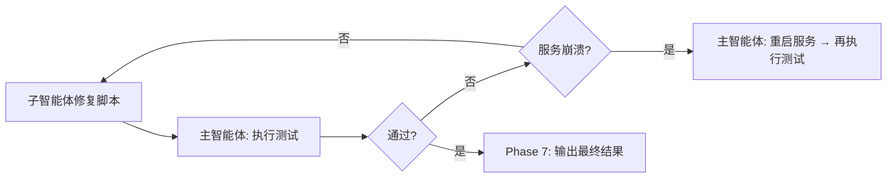

# 测试代码生成闭环 Skill (v2.0 — 子智能体驱动)

基于测试设计文档，生成 Python pytest 测试用例，一键启动全部服务执行验证，通过伪断言检查和测试结果分析实现自闭环修复。

**v2.0 核心变更**：将代码生成、伪断言检查、失败修复等独立任务分派给子智能体并行执行，主智能体仅负责编排和环境操作（服务启停、端口检查），大幅提升效率。

## 何时使用

- 有测试设计文档或功能场景描述，需要生成可执行的测试脚本
- 需要对 GIDS / BrowserGateway 等服务进行集成测试验证
- 已有测试脚本但怀疑存在伪断言，需要检查和修正
- 测试执行失败后需要定位原因并修复后重新验证

---

## 工作流程概览

```mermaid
flowchart TB
    A[输入: 测试设计文档] --> B[Phase 1: 主智能体分析测试场景]
    B --> C[Phase 2: 子智能体并行生成测试代码]
    C --> D[Phase 3: 子智能体并行伪断言检查]
    D --> E{发现伪断言?}
    E -->|有| F[子智能体修正断言]
    F --> D
    E -->|无| G[Phase 4: 主智能体启动全部服务(仅一次)]
    G --> H[Phase 5: 主智能体执行测试]
    H --> I{测试通过?}
    I -->|失败| J[Phase 6: 子智能体并行分析+修复]
    J --> K{服务崩溃?}
    K -->|是| G
    K -->|否| H
    I -->|通过| L[Phase 7: 输出最终结果]
```

---

## 子智能体分工模型

### 角色定义

| 角色 | 子智能体类型 | 职责 | 适用场景 |
|------|------------|------|---------|
| **编排者** | 主智能体（当前会话） | 场景分析、环境操作、服务启停、测试执行、进度汇总 | Phase 1/4/5/7 + 全局协调 |
| **生成者** | `general` | 根据场景规格生成测试代码文件 | Phase 2：每个测试文件一个子智能体，可并行 |
| **审查者** | `general` | 伪断言检查 + 修正报告 | Phase 3：每个测试文件一个子智能体，可并行 |
| **修复者** | `general` | 分析失败原因 + 修复测试脚本 | Phase 6：每个独立失败文件一个子智能体，可并行 |

### 并行化原则

1. **按测试文件为单位分派**：每个测试文件是独立的工作单元，可并行生成/检查/修复
2. **环境操作由主智能体独占**：服务启停、端口检查、pytest 执行必须由主智能体完成（子智能体无法访问本地环境）
3. **子智能体上下文隔离**：每个子智能体获得聚焦的任务描述 + 必要的参考材料，不继承主智能体会话历史
4. **多文件场景可并行**：当有 ≥2 个测试文件时，Phase 2/3/6 均可并行分派子智能体

---

## 输入

- **必需**：测试设计文档路径，或直接提供功能场景描述
- **可选**：目标服务地址（默认 GIDS Mock: 127.0.0.1:9090）
- **可选**：测试脚本输出目录路径（由用户指定，skill 内记录为 `OUTPUT_DIR` 变量，后续 Phase 引用此值）

## 输出目录规范

- 测试脚本文件：用户指定目录下，文件名格式 `{功能名}_test.py`
- 执行日志：pytest 输出由 pytest 自动生成，无需额外存放
- 所有路径由用户在调用 skill 时指定，skill 内不硬编码绝对路径

---

## Phase 1：分析测试场景（主智能体）

### 1.1 读取测试设计文档

主智能体读取用户提供的测试设计文档或功能场景描述，提取：

- **被测接口**：API 路径、方法（GET/POST/PUT/DELETE）、请求参数
- **测试场景**：正常流程、异常流程、边界条件
- **预期结果**：状态码、响应体结构、特定字段值
- **前置条件**：需要哪些服务就绪、数据准备

### 1.2 场景分类与文件拆分

将测试场景按以下维度分类，并决定是否拆分为多个测试文件：

| 类型 | 说明 | 示例 |
|------|------|------|
| **正向验证** | 正常参数请求，验证正确响应 | POST /api/device，返回200 + deviceId |
| **异常验证** | 非法参数/缺失参数，验证错误响应 | POST /api/device 缺少必填字段，返回400 |
| **边界验证** | 参数边界值，验证边界行为 | deviceId 超长字符串 |
| **状态验证** | 验证服务状态/健康检查 | GET /health 返回200 |
| **并发验证**（可选） | 同一请求并发执行，验证竞态行为 | 多线程同时请求同一 deviceId |
| **幂等性验证**（可选） | 同一请求重复执行，验证幂等性 | 两次相同 POST 结果一致 |

**拆分规则**：
- 单接口测试 → 1个文件 `{接口名}_test.py`
- 多接口测试 → 每个接口独立文件，可并行生成
- E2E 链路测试 → 单个文件 `{链路名}_test.py`（链路内场景有依赖，不适合拆分）

### 1.3 输出场景分析表

```markdown
## 测试场景分析

| # | 场景名称 | 类型 | 被测接口 | 测试文件 | 请求参数 | 预期状态码 | 预期响应关键字段 |
|---|---------|------|---------|---------|---------|-----------|---------------|
```

### 1.4 构建子智能体任务清单

基于场景分析，为每个测试文件构建一个生成任务描述（供 Phase 2 使用）：

```
任务清单示例:
├── Task-2a: 生成 grid_login_auth_test.py（6个场景: 正向1+异常3+边界1+状态1）
├── Task-2b: 生成 device_register_test.py（4个场景: 正向1+异常2+边界1）
└── Task-2c: 生成 keyboard_e2e_test.py（1个场景: 完整链路E2E）
```

---

## Phase 2：生成测试用例代码（子智能体并行）

### 2.1 分派策略

| 文件数 | 分派方式 | 说明 |
|--------|---------|------|
| 1个文件 | 单个 `general` 子智能体 | 无并行收益，但仍隔离上下文 |
| ≥2个文件 | **并行分派**多个 `general` 子智能体 | 每个文件一个子智能体，同时生成 |

### 2.2 子智能体提示词模板

每个生成者子智能体接收以下信息：

```markdown
## 任务: 生成测试文件 {filename}

### 场景规格
{从 Phase 1.4 提取的该文件专属场景表}

### 生成规则
- 语言: Python（pytest + requests）
- 框架: pytest 测试运行器 + requests HTTP 客户端
- 结构: 每个测试函数对应一个场景，类名 Test{FeatureName}
- 命名: 文件名 {filename}, 函数名 test_{scenario}
- BASE_URL: 从环境变量 GIDS_ADDR 读取，默认 http://127.0.0.1:9090

### 断言规范（强制）
- 必须断言状态码 == 预期值（如 assert resp.status_code == 200）
- 正向场景必须同时断言状态码 + 响应体至少一个关键字段的**具体值**
- 异常场景必须断言错误码 + 错误信息字段
- 禁止伪断言: assert True / assert data / assert resp == resp / assert resp.status_code != 500 等

### Docstring 规范（强制）
每个测试函数 docstring 必须包含:
  测试场景: {类型} — {描述}
  测试步骤: 1. ... 2. ...
  断言条件: - resp.status_code == X ... - data.field == Y ...

### 参考样例
{附上 sample_a 或 sample_b 的完整代码内容，根据文件类型选择}

### 输出要求
1. 将完整测试代码写入: {OUTPUT_DIR}/{filename}
2. 返回生成摘要: 文件路径 + 场景列表 + 断言数量
```

> **重要**：子智能体提示词中必须包含完整的参考样例代码（而非仅引用路径），因为子智能体无法访问 skill 的 reference 目录。

### 2.3 参考样例选择

- 纯 HTTP 接口测试文件 → 附上 `sample_a_http_interface_test.py` 全文
- E2E 链路测试文件 → 附上 `sample_b_e2e_full_chain_test.py` 全文
- 混合场景 → 同时附上两个样例

### 2.4 生成规则

- **语言**：Python（pytest + requests）
- **框架**：pytest 作为测试运行器，requests 作为 HTTP 客户端
- **结构**：每个测试文件对应一个功能模块，每个测试函数对应一个场景
- **命名**：文件名 `{功能名}_test.py`，函数名 `test_{场景名}`

### 2.5 测试文件结构模板

```python
import os
import pytest
import requests

BASE_URL = os.environ.get("GIDS_ADDR", "http://127.0.0.1:9090")

class Test<<FeatureName>>:
    """<<功能描述>>"""

    def test_<<scenario>>_success(self):
        """<<正向场景描述>>"""
        resp = requests.post(
            f"{BASE_URL}/api/<<path>>",
            json=<<request_body>>
        )
        assert resp.status_code == 200
        data = resp.json()
        assert "<<key_field>>" in data
        assert data["<<key_field>>"] == <<expected_value>>

    def test_<<scenario>>_missing_param(self):
        """<<异常场景: 缺少必填参数>>"""
        resp = requests.post(
            f"{BASE_URL}/api/<<path>>",
            json=<<partial_body>>
        )
        assert resp.status_code == 400
        data = resp.json()
        assert "error" in data or "message" in data
```

> `<<...>>` 为 skill 生成时的替换占位符，非 Python 语法。生成实际代码时替换为具体值。

### 2.6 断言编写规范（强制）

每个断言必须遵循以下规则：

| 规则 | 说明 | 正确示例 | 错误示例 |
|------|------|---------|---------|
| **断言响应状态码** | 必须断言实际状态码等于预期值 | `assert resp.status_code == 200` | `assert resp.status_code` （只检查非零） |
| **断言响应体内容** | 必须验证响应体的关键字段 | `assert data["id"] == expected_id` | `assert data` （只检查非空） |
| **断言字段存在性** | 需要验证字段存在时必须明确 | `assert "id" in data` | `assert data` |
| **断言字段值匹配** | 有预期值时必须断言具体值 | `assert data["status"] == "success"` | `assert data["status"]` |
| **异常场景断言** | 验证错误码和错误信息 | `assert resp.status_code == 400; assert "message" in data` | `assert resp.status_code != 200` |

### 2.7 测试函数文档规范（强制）

每个测试函数的 docstring **必须**包含以下三部分，使读者无需看代码即可理解用例意图：

```python
def test_valid_params_success(self):
    """
    测试场景: 正向验证 — 正确参数登录成功
    测试步骤:
      1. 使用正确IMEI+IMSI发送POST请求到gridLoginAuthOpenBrowser
      2. 解析响应JSON
    断言条件:
      - resp.status_code == 200 (HTTP状态码)
      - data.code == 200 (业务状态码)
      - data.data.token 非空 (返回有效token)
      - data.data.tcpAddr 非空 (返回控制通道地址)
    """
```

对于 E2E 完整链路测试，docstring 中应列出阶段化流程和各阶段断言：

```python
def test_keyboard_grid_login_auth():
    """
    测试场景: 功能机按键 - 宫格登录认证验证(完整链路)

    测试步骤:
      阶段1: GIDS三步登录鉴权 → token + tcpAddr
      阶段2: TCP连接控制端口 → TLV LOGIN → mediaAddr
      阶段3: TCP连接媒体端口 → 视频帧到达
      阶段4: proxy查找browser+context → 截图相似度验证
      阶段5: 清理 + 报告

    断言条件:
      阶段1: 三步登录成功 [fatal]
      阶段2: TCP连接成功 [fatal], LOGIN成功 [fatal], mediaAddr非空 [fatal]
      阶段3: 媒体LOGIN成功 [fatal], 视频帧到达
      阶段4: browser+context找到 [fatal], 截图相似度>=85%
    """
```

### 2.8 辅助函数规范

- 如需重复使用的请求逻辑，封装为类方法或模块级函数
- 辅助函数必须有明确返回值，禁止辅助函数内部做空断言
- `conftest.py` 中可定义 fixture（如 session 复用、base_url 配置）

### 2.9 子智能体结果收集

所有生成者子智能体返回后，主智能体：

1. 检查每个子智能体的输出摘要（文件路径 + 场景列表）
2. 验证文件是否实际写入 `OUTPUT_DIR`（用 `ls` 或 `glob` 检查）
3. 如有子智能体失败（BLOCKED/NEEDS_CONTEXT），处理异常后重新分派
4. 确认全部文件就绪后，进入 Phase 3

---

## Phase 3：伪断言检查（子智能体并行）

### 3.1 分派策略

| 文件数 | 分派方式 | 说明 |
|--------|---------|------|
| 1个文件 | 单个 `general` 子智能体 | 审查者角色 |
| ≥2个文件 | **并行分派**多个 `general` 子智能体 | 每个文件一个审查者，同时检查 |

### 3.2 伪断言定义（严禁）

以下模式均属于伪断言，**必须修正**：

| 类型 | 模式 | 说明 | 判定 |
|------|------|------|------|
| **恒真断言** | `assert True` / `assert 1 == 1` / `assert "x" == "x"` | 无论输入如何都为真 | 🔴 阻塞 |
| **无验证断言** | `assert resp` / `assert data` / `assert result` | 仅检查对象非None/非空，不验证内容 | 🔴 阻塞 |
| **自身比较** | `assert resp == resp` / `assert x == x` | 变量与自身比较，恒真 | 🔴 阻塞 |
| **只断言状态码** | `assert resp.status_code == 200` 无后续断言 | 正向场景必须同时验证状态码和响应体关键字段值，否则为伪断言 | 🔴 阻塞 |
| **宽泛否定** | `assert resp.status_code != 500` | 用否定式代替精确断言，无法确认正确行为 | 🟡 建议 |
| **忽略错误体** | 异常场景只断言状态码不检查错误信息 | 缺少对错误响应的验证 | 🟡 建议 |
| **空 pass** | 测试函数体只有 `pass` 或无断言 | 完全没有验证逻辑 | 🔴 阻塞 |

### 3.3 子智能体提示词模板

```markdown
## 任务: 伪断言检查 {filename}

### 检查目标
读取文件 {OUTPUT_DIR}/{filename}，扫描所有 assert 语句，按伪断言定义逐条判定。

### 伪断言定义表
{附上 3.2 的完整伪断言定义表}

### 检查方法
1. 扫描所有 assert 语句: 使用 grep 或 ast 解析提取断言
2. 逐条判定: 按伪断言定义表匹配
3. 正向场景特检: 正向场景必须同时断言状态码 + 响应体至少一个关键字段**具体值**

### 修正规则
- 🔴 阻塞级: 必须修正，直接修改文件中的断言
- 🟡 议级: 推荐修正，在报告中标注

### 输出要求
1. 如果发现 🔴 阻塞级伪断言，直接修改文件修正后返回修正报告
2. 如果无伪断言，返回"通过"确认
3. 返回格式: 伪断言检查报告表（文件/函数/断言语句/伪断言类型/严重程度/修正建议）
```

### 3.4 伪断言检查报告格式

```markdown
## 伪断言检查报告

| # | 文件 | 函数 | 断言语句 | 伪断言类型 | 严重程度 | 修正建议 |
|---|------|------|---------|-----------|---------|---------|
```

### 3.5 修正规则

- 🔴 阻塞级：**必须修正**，不修正不进入执行阶段
- 🟡 建议级：**推荐修正**，可由用户决定是否跳过

### 3.6 子智能体结果收集

所有审查者子智能体返回后，主智能体：

1. 检查每个审查者的检查报告
2. 如有 🔴 阻塞级伪断言已由子智能体修正，验证修改是否生效（重新读取文件确认）
3. 如子智能体报告修正但未实际修改文件，主智能体手动修正或重新分派
4. 全部文件伪断言清零后，进入 Phase 4

---

## Phase 4：重启全部服务（主智能体）

**此阶段必须由主智能体执行**，子智能体无法操作本地服务环境。

### 4.1 服务启动方式

使用 `Start-Process` 在独立窗口运行 `start-all.bat`，避免阻塞当前终端：

```powershell
$script_path = if ($env:START_ALL_SCRIPT) { $env:START_ALL_SCRIPT } else { "D:\Code\SBG\start-all.bat" }
$script_dir = if ($env:SBG_ROOT) { $env:SBG_ROOT } else { "D:\Code\SBG" }
Start-Process -FilePath $script_path -WorkingDirectory $script_dir
```

> 默认路径为示例，可通过环境变量 `$START_ALL_SCRIPT` 和 `$SBG_ROOT` 覆盖。

### 4.2 端口就绪检查

启动后轮询检查以下端口是否处于 LISTENING 状态：

| 服务 | 端口 | 最大等待时间 |
|------|------|------------|
| GIDS Mock | 9090 | 15秒 |
| Browser Proxy | 8000 | 15秒 |
| Browser Gateway | 8090 | 30秒 |
| Mobile | 8088 | 30秒 |

检查命令：

```powershell
$ports = @(9090, 8000, 8090, 8088)
foreach ($port in $ports) {
    $ready = $false
    $elapsed = 0
    $maxWait = if ($port -in @(8090, 8088)) { 30 } else { 15 }
    while (-not $ready -and $elapsed -lt $maxWait) {
        $listening = netstat -ano | Select-String "LISTENING" | Select-String ":$port "
        if ($listening) {
            $ready = $true
            Write-Output "Port $port READY"
        } else {
            Start-Sleep -Seconds 1
            $elapsed++
        }
    }
    if (-not $ready) {
        Write-Output "Port $port NOT READY after $maxWait seconds"
    }
}
```

### 4.3 启动失败处理

- 如有端口未就绪，输出失败信息并暂停
- 向用户报告哪些服务未启动，由用户决定是否继续或手动排查

---

## Phase 5：执行测试（主智能体）

**此阶段必须由主智能体执行**，需要控制本地环境和读取 pytest 输出。

### 5.1 执行命令

```powershell
cd <OUTPUT_DIR>
python -m pytest <测试文件> -v --tb=short --timeout=60
```

### 5.2 执行结果判定

| 退出码 | 含义 | 处理 |
|--------|------|------|
| 0 | 全部通过 | 进入 Phase 7（输出最终结果） |
| 1 | 有测试失败 | 进入 Phase 6（子智能体并行修复） |
| 2 | pytest 使用错误 | 检查命令/参数 |
| 其他 | 未知错误 | 查看输出日志 |

### 5.3 服务重启策略

**IMEI 隔离原则**：每个测试用例使用不同的 IMEI，GIDS/BGW 据此创建隔离的 browser context，因此：
- **首轮执行**：必须先完成 Phase 4 启动全部服务
- **后续重执行**（修复后重跑同一用例、或跑不同用例）：**不需要重启服务**，IMEI 隔离保证环境干净
- **仅在服务崩溃时重启**：如果测试失败原因是 ConnectionError/Timeout（服务进程已退出或端口无响应），才需要重新执行 Phase 4

---

## Phase 6：失败分析与闭环修复（子智能体并行）

### 6.1 分派策略

**关键优化**：当多个测试文件因不同根因独立失败时，按文件并行分派修复者子智能体。

| 失败模式 | 分派方式 | 说明 |
|---------|---------|------|
| 单文件失败 | 单个 `general` 子智能体 | 专注修复一个文件 |
| 多文件独立失败 | **并行分派**多个 `general` 子智能体 | 每个文件一个修复者，同时分析+修复 |
| 多文件关联失败 | 单个子智能体处理全部 | 失败有因果关系，不宜拆分 |

**判定关联性**：
- 语法错误、断言值不匹配 → 各文件独立，可并行
- 服务未响应 → 所有文件共享同一原因，不宜拆分（主智能体重启服务即可）
- 接口路径错误/请求参数错误 → 各文件独立，可并行

### 6.2 子智能体提示词模板

```markdown
## 任务: 修复测试文件 {filename} 的失败用例

### pytest 失败输出
{附上该文件的 pytest -v 输出中与该文件相关的失败详情}

### 失败原因分类参考
| 原因类型 | 特征 | 修复方向 |
|---------|------|---------|
| 语法错误 | CollectionError / ImportError / SyntaxError | 修复语法、补import |
| 断言值不匹配 | assert X == Y 失败，值不同 | 检查预期值或确认接口变更 |
| 接口路径错误 | 404 Not Found | 修正URL路径 |
| 请求参数错误 | 400 Bad Request | 修正请求体格式/字段 |
| 服务内部错误 | 500 Internal Server Error | 检查前置数据 |

### 修复约束
- 仅修改测试脚本（不修改服务端代码）
- 修复后断言必须符合断言编写规范（严禁伪断言）
- 修复后 docstring 必须更新以反映新的断言条件

### 输出要求
1. 修改文件 {OUTPUT_DIR}/{filename} 中的失败用例
2. 返回修复摘要: 失败原因 + 修改内容 + 新断言条件列表
```

### 6.3 闭环流程



**闭环规则**：
1. 子智能体修复完成后，主智能体直接执行 Phase 5（无需重启服务，IMEI 隔离保证环境干净）
2. 仅当失败原因是服务崩溃（ConnectionError/Timeout/端口无响应）时，才需要重新执行 Phase 4
3. 如仍有失败，根据失败范围决定：单文件 → 单个子智能体；多文件独立 → 并行子智能体
4. 最大修复轮次：5 次（超过后暂停，向用户报告）

### 6.4 子智能体结果收集

所有修复者子智能体返回后，主智能体：

1. 读取每个修复者的修复摘要
2. 检查修改是否实际写入文件（用 `ls` 或读取关键行确认）
3. 检查修复之间是否冲突（如两个子智能体修改了同一文件 → 需合并或重新分派）
4. 全部修复确认后，直接进入 Phase 5 重新执行测试（无需重启服务）；仅当上次执行出现服务崩溃时才需重新执行 Phase 4

---

## Phase 7：输出最终结果（主智能体）

### 7.1 输出内容

- 所有通过验证的测试脚本文件（已写入用户指定目录）
- 测试执行结果摘要：

```markdown
## 测试结果摘要

| 测试文件 | 用例数 | 通过 | 失败 | 跳过 |
|---------|-------|------|------|------|
```

### 7.2 不生成的内容

- 不生成验收报告等额外文档
- 不修改服务端代码（仅修改测试脚本）

---

## 子智能体分派操作指南

### 单文件场景（无并行收益）

```
Phase 2: task(subagent_type="general", prompt="生成 {file_a} 的测试代码...")
Phase 3: task(subagent_type="general", prompt="检查 {file_a} 的伪断言...")
Phase 6: task(subagent_type="general", prompt="修复 {file_a} 的失败用例...")
```

### 多文件并行场景

```
Phase 2: 并行分派
  task(subagent_type="general", prompt="生成 {file_a} 的测试代码...")
  task(subagent_type="general", prompt="生成 {file_b} 的测试代码...")
  task(subagent_type="general", prompt="生成 {file_c} 的测试代码...")

Phase 3: 并行分派
  task(subagent_type="general", prompt="检查 {file_a} 的伪断言...")
  task(subagent_type="general", prompt="检查 {file_b} 的伪断言...")
  task(subagent_type="general", prompt="检查 {file_c} 的伪断言...")

Phase 4: 主智能体执行（环境操作）

Phase 5: 主智能体执行（pytest）

Phase 6: 并行分派（仅独立失败）
  task(subagent_type="general", prompt="修复 {file_a} 的失败用例...")
  task(subagent_type="general", prompt="修复 {file_b} 的失败用例...")
```

### 子智能体提示词设计原则

1. **自包含**：包含完整上下文（场景规格、参考样例代码全文、失败输出），不依赖文件路径引用
2. **聚焦**：一个文件一个任务，范围窄
3. **明确输出**：指定返回格式（摘要表、修复报告等）
4. **约束清晰**：严禁伪断言、仅修改测试脚本、docstring 规范等

---

## 全局约束

### 严禁伪断言（最高优先级）

伪断言是本 skill 的核心红线，任何情况下不得出现以下断言模式：

- ❌ `assert True` — 恒真断言
- ❌ `assert 1 == 1` — 恒真断言
- ❌ `assert resp` — 无验证断言（仅检查非None）
- ❌ `assert data` — 无验证断言（仅检查非空）
- ❌ `assert resp == resp` — 自身比较
- ❌ `assert resp.status_code != 500` — 宽泛否定（应使用精确值）
- ❌ 正向场景只有 `assert resp.status_code == 200` — 缺少响应体验证
- ❌ 测试函数只有 `pass` — 空测试

### 子智能体相关约束

- **环境操作独占**：服务启停、端口检查、pytest 执行只能由主智能体完成，子智能体无本地环境访问权限
- **提示词自包含**：子智能体提示词必须包含所有必要上下文（参考样例全文、失败输出等），不使用文件路径引用
- **结果验证**：主智能体必须验证子智能体的文件修改是否实际生效（读取文件确认）
- **冲突检测**：并行修复者如修改同一文件，主智能体需合并或重新分派
- **失败处理**：子智能体 BLOCKED/NEEDS_CONTEXT 时，主智能体提供额外上下文重新分派

### 其他约束

- **不擅自假设接口行为**：不确定的接口参数/返回值，通过查阅实际 API 文档或调用验证，不猜测
- **IMEI 隔离免重启**：每个用例使用不同 IMEI，服务状态天然隔离，首轮启动后无需每轮重启（仅在服务崩溃时才重启）
- **服务启动用 Start-Process**：禁止直接调用 bat 脚本（可能阻塞终端），必须用 Start-Process 在独立窗口运行
- **仅修复测试脚本**：测试失败时只修改测试脚本中的断言预期值、请求参数、URL等，不修改服务端代码
- **最多修复 5 轮**：超过后暂停并报告用户，避免无限循环
- **渐进式输出**：每个 Phase 完成后暂停等待用户确认
- **服务地址可配置**：BASE_URL 默认 127.0.0.1:9090，但用户可通过 GIDS_ADDR 环境变量覆盖
