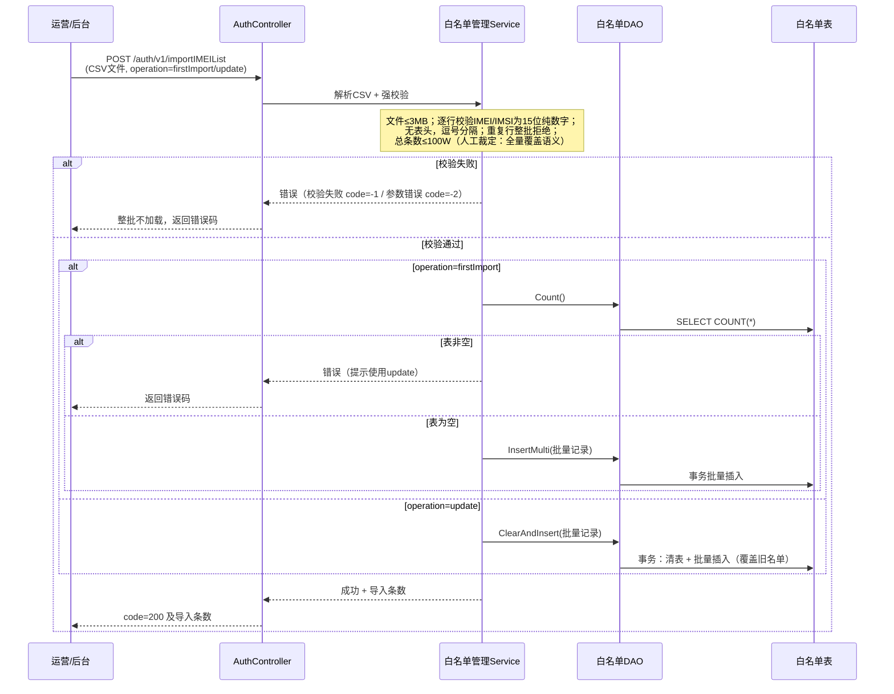
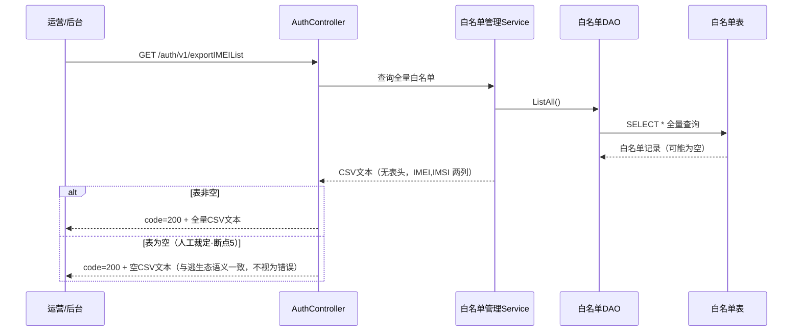
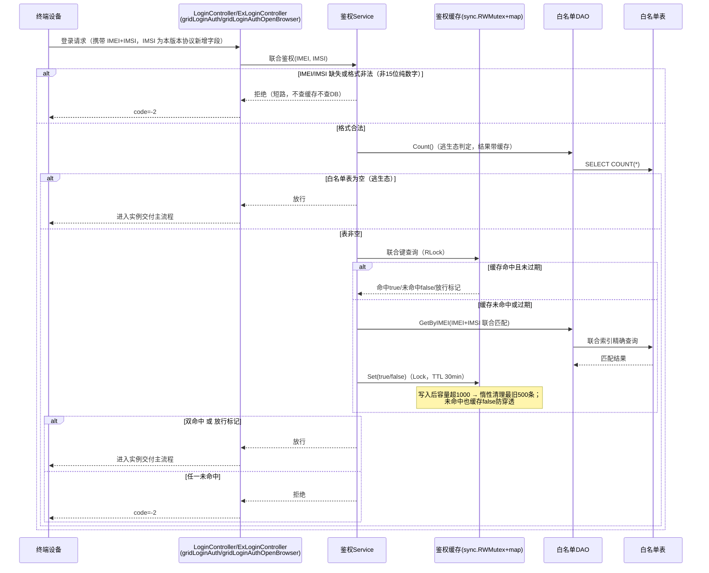
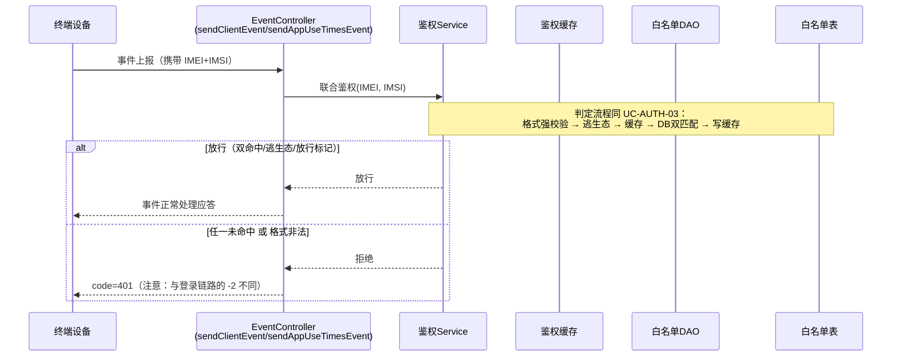
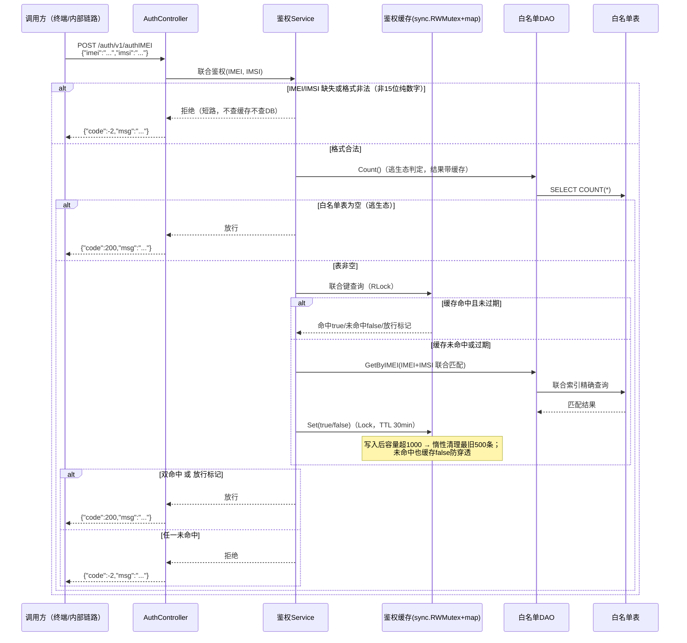

# 功能实现设计：27.0 终端鉴权（新增）

> 本文档由《27.0 终端鉴权需求设计文档》经多彩建模逻辑审核后生成，内容来源 = 原文档 + 审核人工裁定（8 处断点，见《27.0终端鉴权-多彩建模审核报告.html》）。标注「人工裁定」的内容为审核补齐，标注「待确认」的内容禁止脑补、需评审确认。

## 1 功能概述

云手机平台当前无终端准入校验，任何终端均可登录接入云手机实例，导致商业流失、资源滥用、缺乏管控手段。27.0 首商用版本落地终端鉴权功能：运营通过 GIDS REST 接口以 CSV 批量导入/导出白名单（IMEI+IMSI 两列），登录链路与事件上报链路注入 IMEI+IMSI 联合鉴权，两者同时精确命中白名单才放通；白名单表为空时进入逃生态一律放行，避免线上阻断。JWT 校验为后续版本规划，本期不涉及。

## 2 SR设计

| 系统需求编号 | 系统需求 | 系统需求描述 | 承载 Story |
| --- | --- | --- | --- |
| SR-27.0-AUTH-01 | 白名单数据模型与持久化 | 白名单表建模（IMEI+IMSI+创建时间）+ DAO（Count/GetByIMEI/InsertMulti/ClearAndInsert/ListAll） | Story-1 |
| SR-27.0-AUTH-02 | 白名单管理（CSV 导入/导出） | 管理 Service + Controller，支持 firstImport/update 两种模式，全量覆盖语义 | Story-2 |
| SR-27.0-AUTH-03 | IMEI+IMSI 联合鉴权核心服务 | 鉴权 Service + 内存缓存 + 逃生态 | Story-3 |
| SR-27.0-AUTH-04 | 登录链路鉴权注入 | LoginController + ExLoginController（gridLoginAuth / gridLoginAuthOpenBrowser） | Story-4 |
| SR-27.0-AUTH-05 | 事件上报链路鉴权注入 | EventController（sendClientEvent / sendAppUseTimesEvent） | Story-5 |

**跨服务依赖（人工裁定·断点2）**：现有登录/事件协议已携带 IMEI，但无 IMSI。本版本需终端侧/协议在登录与事件上报请求中新增 IMSI 字段，属跨服务联合改动，需与终端侧对齐排期（**待确认**：终端侧改动是否纳入 27.0 排期）。

## 3 实现设计

### 3.1 白名单导入用例设计-时序图

用例编号：UC-AUTH-01

**并发分支（人工裁定·断点8）**：导入接口加互斥锁，并发到达的导入请求直接返回「导入进行中」错误，不进入解析与写库。（**待确认**：该错误的错误码取值——复用 -1/-2 还是新增，详设阶段明确）

### 3.2 白名单导出用例设计-时序图

用例编号：UC-AUTH-02

### 3.3 登录链路联合鉴权用例设计-时序图

用例编号：UC-AUTH-03

### 3.4 事件上报链路鉴权用例设计-时序图

用例编号：UC-AUTH-04

### 3.5 authIMEI 接口联合鉴权用例设计-时序图

用例编号：UC-AUTH-05（承载 SR-27.0-AUTH-03，鉴权核心服务独立对外入口）

说明：UC-AUTH-05 与 UC-AUTH-03 的鉴权判定子流程一致（鉴权 Service 为同一系统元素），差异仅在入口（独立 REST 接口 vs 登录链路注入）与响应结构（JSON code/msg vs 登录链路 code=-2）。

### 3.6 功能验收用例

| 用例编号 | 前置条件 | 操作步骤 | 预期结果 |
| --- | --- | --- | --- |
| TC-AUTH-01 首次导入成功 | 白名单表为空 | POST /auth/v1/importIMEIList，operation=firstImport，CSV 含合法 IMEI+IMSI 记录 | 返回 code=200 及导入条数；DB 中记录与 CSV 一致 |
| TC-AUTH-02 firstImport 表非空拒绝 | 白名单表已有数据 | POST importIMEIList，operation=firstImport | 返回错误码并提示使用 update；白名单数据不变 |
| TC-AUTH-03 update 覆盖导入 | 白名单表已有数据 | POST importIMEIList，operation=update，新 CSV | 返回 code=200；旧名单被全量替换为新名单 |
| TC-AUTH-04 非法格式整批拒绝 | 任意 | CSV 中某行 IMEI 或 IMSI 非 15 位纯数字 | 返回 code=-1；本次 CSV 全部不加载，DB 无变化 |
| TC-AUTH-05 CSV 重复行整批拒绝（人工裁定·断点4） | 任意 | CSV 文件内存在重复 IMEI+IMSI 行 | 返回 code=-1；整批不加载 |
| TC-AUTH-06 文件超限拒绝 | 任意 | CSV 超过 3MB 或条数超 100W | 返回错误码；整批不加载 |
| TC-AUTH-07 导出非空 | 白名单表有 N 条记录 | GET /auth/v1/exportIMEIList | 返回 code=200 + N 行 CSV（无表头，IMEI,IMSI 两列） |
| TC-AUTH-08 导出空表（人工裁定·断点5） | 白名单表为空 | GET /auth/v1/exportIMEIList | 返回 code=200 + 空 CSV 文本 |
| TC-AUTH-09 登录鉴权放行 | 白名单表含目标 IMEI+IMSI 组合 | 终端登录请求携带该组合 | 鉴权放行，进入实例交付主流程 |
| TC-AUTH-10 登录鉴权拒绝 | 白名单表非空且不含该组合（IMEI 或 IMSI 任一未命中） | 终端登录请求 | 返回 code=-2，不进入主流程 |
| TC-AUTH-11 格式非法短路拒绝 | 白名单表非空 | 登录请求 IMEI/IMSI 缺失或非 15 位纯数字 | 返回 code=-2，无 DB 查询 |
| TC-AUTH-12 逃生态放行 | 白名单表为空 | 终端登录/事件上报请求 | 一律放行，主流程不阻断 |
| TC-AUTH-13 事件链路拒绝返回 401 | 白名单表非空且未命中 | 终端事件上报请求 | 返回 code=401 |
| TC-AUTH-14 缓存生效 | 白名单表非空，首次鉴权后 | 相同 IMEI+IMSI 组合 30min 内再次请求 | 直接返回缓存结果，无 DB 调用 |
| TC-AUTH-15 并发导入拒绝（人工裁定·断点8） | 一个导入请求处理中 | 第二个导入请求并发到达 | 返回「导入进行中」错误，不交错写库（错误码取值待确认） |
| TC-AUTH-16 authIMEI 接口鉴权 | 白名单表非空 | POST /auth/v1/authIMEI，分别携带命中组合、未命中组合、非法格式 | 命中返回 {"code":200}；未命中/非法格式返回 {"code":-2}；非法格式无 DB 查询 |

## 4 用户接口设计

对外接口共 3 个（REST，GIDS 服务 IP:9090），另在 4 个现有接口中注入鉴权（非新增接口）。

### 4.1 终端联合鉴权

| | |
| --- | --- |
| 接口名称 | /auth/v1/authIMEI |
| 接口描述 | 校验 IMEI+IMSI 是否同时命中白名单 |
| 接口类型 | REST，POST |
| Input | JSON 请求体 `{"imei":"<15位数字>","imsi":"<15位数字>"}`（人工裁定·断点1） |
| Output | JSON `{"code":200,"msg":"..."}` 放行；`{"code":-2,"msg":"..."}` 拒绝（人工裁定·断点1） |
| 约束 | 格式非法即短路拒绝；逃生态（表为空）直接放行 |

### 4.2 白名单导入

| | |
| --- | --- |
| 接口名称 | /auth/v1/importIMEIList |
| 接口描述 | 上传 CSV 批量导入白名单 |
| 接口类型 | REST，POST |
| Input | CSV 文件（无表头，逗号分隔 IMEI,IMSI 两列；≤3MB；≤100W 条）+ 参数 operation=firstImport/update |
| Output | 成功 code=200 及导入条数；校验失败 code=-1；参数错误 code=-2；并发冲突返回「导入进行中」（错误码待确认） |
| 约束 | firstImport 要求表为空；update 为事务清表+插入全量覆盖；互斥锁防并发 |

### 4.3 白名单导出

| | |
| --- | --- |
| 接口名称 | /auth/v1/exportIMEIList |
| 接口描述 | 下载全量白名单 CSV |
| 接口类型 | REST，GET |
| Input | 无 |
| Output | code=200 + CSV 文本（无表头，IMEI,IMSI 两列）；空表返回空 CSV + code=200（人工裁定·断点5） |

### 4.4 鉴权注入点（现有接口，非新增）

`gridLoginAuth`、`gridLoginAuthOpenBrowser`、`sendClientEvent`、`sendAppUseTimesEvent`：在现有处理前注入联合鉴权；登录链路拒绝返回 code=-2，事件链路拒绝返回 code=401。请求中 IMEI 字段已有，IMSI 字段为本版本协议新增（人工裁定·断点2）。

接口权限设计：原文档未涉及权限模型（运营接口直接暴露于 GIDS 服务 IP），**待确认**是否需要访问控制。

## 5 实现接口设计

| 接口名称 | 接口职责 | 所属系统元素 | Input | Output |
| --- | --- | --- | --- | --- |
| 联合鉴权 | 逃生态判定 + 缓存查询 + 双精确匹配决策 | 鉴权 Service | imei, imsi | 放行/拒绝 |
| 缓存查询/写入/清理 | 联合键结果缓存（TTL 30min、容量 1000、惰性清 500） | 缓存组件 | 联合键 / cacheEntry | 命中结果 |
| 导入 | CSV 解析 + 强校验 + 批量入库（firstImport/update） | 管理 Service | CSV 文件, operation | 导入条数/错误码 |
| 导出 | 全量查询 + CSV 生成 | 管理 Service | 无 | CSV 文本 |
| Count | 白名单记录数（逃生态判定用） | DAO | 无 | 记录数 |
| GetByIMEI | IMEI+IMSI 联合精确查询 | DAO | imei, imsi | 记录/无 |
| InsertMulti | 事务批量插入 | DAO | 记录列表 | 错误 |
| ClearAndInsert | 事务清表 + 批量插入 | DAO | 记录列表 | 错误 |
| ListAll | 全量查询 | DAO | 无 | 记录列表 |

---

**待确认清单**（原文与人工裁定均未覆盖，禁止脑补）：

1. 并发导入「导入进行中」的错误码取值（复用 -1/-2 还是新增）。
2. 100W 条白名单的 DB 规格实测结果（原文已标注需实测）。
3. 终端侧 IMSI 字段协议改动是否纳入 27.0 排期。
4. 运营接口（导入/导出）是否需要访问控制。
5. CSV 空行/尾部换行的解析处理。
