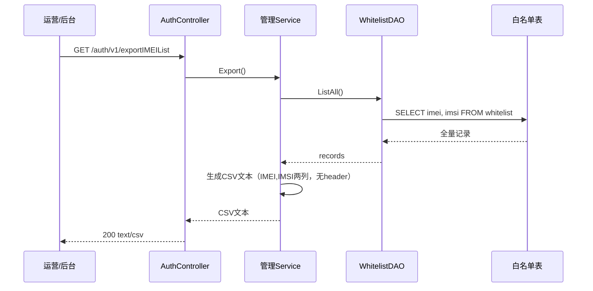
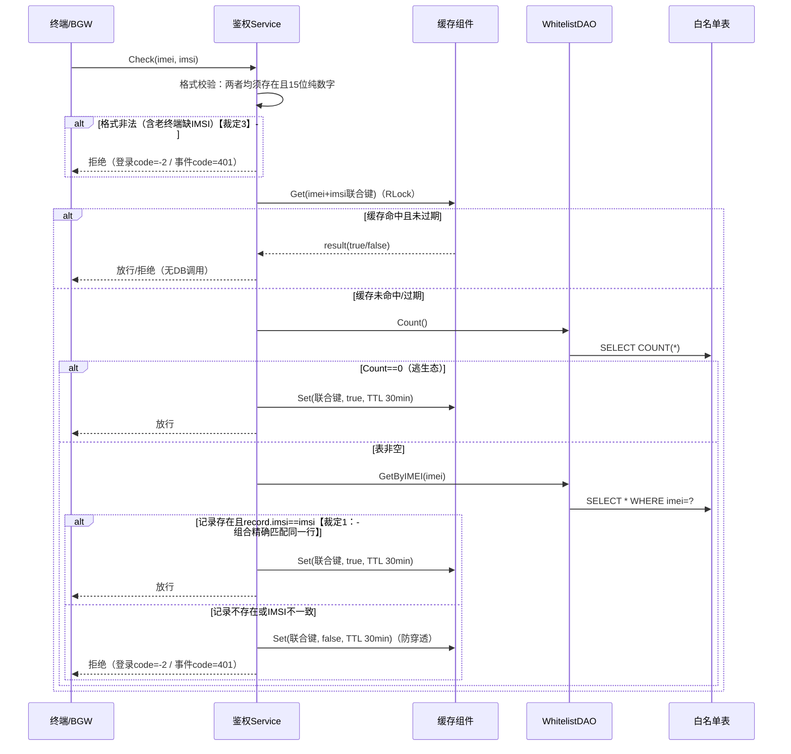

# 功能实现设计

> 本文档由《27.0终端鉴权需求设计文档》经多彩建模完备性审核（8 处断点人工裁定，见《27.0终端鉴权-多彩建模审核.html》）后按规范模板生成。裁定内容标注【裁定N】。

## 1 功能编号：27.0 终端鉴权功能实现（新增）

### 1.1 功能概述

SBG 26.1 已完成基本功能开发和 POC 测试，27.0 进行商用补齐。当前云手机平台无准入校验，任何终端均可接入，导致商业流失、资源滥用、缺乏管控手段。本功能采用**白名单 CSV 导入 + IMEI/IMSI 联合鉴权 + 逃生态**方案：白名单同时存储 IMEI 与 IMSI，鉴权时两者组合精确命中同一条记录才放通【裁定1】；白名单表为空时一律放行（逃生态），避免线上阻断。

价值：杜绝白嫖、资源保供、运营按合同批次精准管控、双因子防伪。

### 1.2 SR设计

| 系统需求编号 | 系统需求 | 系统需求描述 |
| --- | --- | --- |
| SR-27.0-AUTH-01 | 白名单数据模型与持久化 | 白名单表存储 IMEI+IMSI+创建时间，IMEI/IMSI 联合索引，支持 100W 条 |
| SR-27.0-AUTH-02 | 白名单管理（CSV 导入/导出） | REST 接口批量导入（firstImport/update）与全量导出，CSV 含 IMEI、IMSI 两列 |
| SR-27.0-AUTH-03 | IMEI+IMSI 联合鉴权核心服务 | 逃生态判定 + 内存缓存 + 组合精确匹配；命中放行，否则拒绝 |
| SR-27.0-AUTH-04 | 登录链路鉴权注入 | gridLoginAuth、gridLoginAuthOpenBrowser 注入联合鉴权，拒绝返回 code=-2 |
| SR-27.0-AUTH-05 | 事件上报链路鉴权注入 | sendClientEvent、sendAppUseTimesEvent 注入联合鉴权，拒绝返回 code=401 |

安全实例化设计：

| 系统需求编号 | 系统需求 | SPEI实例描述 | 实例化设计 |
| --- | --- | --- | --- |
| SR-27.0-AUTH-02 | 白名单管理接口 | 管理接口防未授权访问 | 网络隔离：导入/导出接口仅监听 127.0.0.1:9090 或运维内网段，外部不可达，代码不加认证【裁定4】 |
| SR-27.0-AUTH-03 | 联合鉴权 | 双因子防伪 | IMEI 标识设备、IMSI 标识用户身份，组合精确匹配同一行，防单一标识伪造/交叉冒用【裁定1】 |

### 1.3 实现思路

备选方案对比（详见需求文档 §1.4）：

1. **方案1 Radius 信令抄送**：需引入 EPSN-C，成本与工作量高（云浏览器侧 8.5 人月），与 MKT/架构对齐后不采用。
2. **方案2 白名单 CSV 导入 + IMEI/IMSI 联合鉴权**：GIDS 直接提供 REST 接口，无需额外平台适配；带逃生态。**本版本选定**。
3. **方案3 JWT 校验**：长期方案，需沐恩公有云侧联合开发，后续版本规划。

关键实现决策：

- 联合命中语义：**按 IMEI 查询记录后比对 IMSI 是否一致（组合精确匹配同一行）**，防止 IMEI 与 IMSI 交叉冒用【裁定1】。
- 白名单生效即时性：导入事务提交成功后**同步调用鉴权服务 ClearCache() 清空内存缓存**，消除逃生态→鉴权切换的最长 30min 裸露窗口【裁定6】。
- 终端配套：27.0 沐恩终端版本升级，登录与事件请求新增 IMSI 字段；服务端对缺 IMSI 的请求按格式非法拒绝，升级过渡期由逃生态兜底【裁定3】。

### 1.4 实现设计

系统元素：AuthController（HTTP 入口）、管理 Service（CSV 解析/批量入库/导出）、鉴权 Service（逃生态+缓存+匹配决策）、缓存组件（sync.RWMutex+map）、WhitelistDAO、白名单表（GaussDB/SQLite 双 DDL）。

#### 1.4.1 白名单导入用例设计-时序图

用例编号：UC-AUTH-01

```mermaid
sequenceDiagram
    participant OP as 运营/后台
    participant CTRL as AuthController
    participant MGMT as 管理Service
    participant DAO as WhitelistDAO
    participant DB as 白名单表
    participant AUTH as 鉴权Service

    OP->>CTRL: POST /auth/v1/importIMEIList?operation=firstImport|update<br/>(multipart/form-data CSV)
    CTRL->>MGMT: Import(file, operation)
    MGMT->>MGMT: 校验文件大小≤3MB
    alt 文件超限
        MGMT-->>CTRL: code=-1
        CTRL-->>OP: {"code":-1}
    end
    MGMT->>MGMT: 解析CSV（无header，所有行当数据）【裁定5】<br/>逐行强校验IMEI/IMSI为15位纯数字<br/>总行数≤20W；文件内重复组合即失败【裁定5】
    alt 校验失败
        MGMT-->>CTRL: code=-1（整批不加载）
        CTRL-->>OP: {"code":-1}
    end
    alt operation=firstImport
        MGMT->>DAO: Count()
        DAO->>DB: SELECT COUNT(*)
        alt 表非空
            MGMT-->>CTRL: code=-1（提示使用update）
            CTRL-->>OP: {"code":-1}
        end
    end
    MGMT->>DAO: ClearAndInsert(records)（update：事务清表+批量插入）
    DAO->>DB: BEGIN; [DELETE ALL;] INSERT ...; COMMIT
    alt 事务失败
        DAO->>DB: ROLLBACK
        MGMT-->>CTRL: code=-1
        CTRL-->>OP: {"code":-1}
    end
    MGMT->>AUTH: ClearCache()【裁定6：立即生效，无裸露窗口】
    MGMT-->>CTRL: code=200 + 导入条数
    CTRL-->>OP: {"code":200,"count":N}
```

说明：参数非法（operation 缺失/取值错误）返回 code=-2；CSV 文件名不校验、"最多 5 个文件（100W）"为运营约束，系统不强制【裁定5】。

#### 1.4.2 白名单导出用例设计-时序图

用例编号：UC-AUTH-02



#### 1.4.3 IMEI+IMSI 联合鉴权用例设计-时序图

用例编号：UC-AUTH-03（适用于 authIMEI 接口与 4 个链路注入点）



缓存维护（子流程，写入后同一 Lock 内执行）：写入后检查容量>1000，按 expireAt 升序删除最旧 500 条；无独立 goroutine。

#### 1.4.4 登录/事件链路鉴权注入用例-自然语言描述

用例编号：UC-AUTH-04

前置条件：白名单服务已启动；终端为 27.0 版本（请求携带 IMEI+IMSI）【裁定3】。

触发事件：终端调用 gridLoginAuth / gridLoginAuthOpenBrowser / sendClientEvent / sendAppUseTimesEvent。

主流程：

- 步骤1：Controller 解析请求中的 IMEI 与 IMSI；
- 步骤2：调用鉴权 Service Check(imei, imsi)（见 UC-AUTH-03）；
- 步骤3：放行→继续原业务逻辑；拒绝→登录链路返回 code=-2，事件链路返回 code=401，不进入后续业务。

后置条件：鉴权结果写入内存缓存（TTL 30min）。

### 1.5 用户接口设计

对外接口均监听 127.0.0.1:9090 / 运维内网段，外部不可达【裁定4】；调用前提：无认证，依赖网络隔离部署。

| 接口 | 方法 | 路径 | 请求 | 响应 |
| --- | --- | --- | --- | --- |
| 终端联合鉴权 | POST | /auth/v1/authIMEI | JSON `{"imei":"15位数字","imsi":"15位数字"}`【裁定2】 | `{"code":200}` 命中放行；`{"code":-1}` 未命中/格式非法 |
| 白名单导入 | POST | /auth/v1/importIMEIList?operation=firstImport\|update | multipart/form-data 上传 CSV（纯数据无 header，IMEI,IMSI 两列）【裁定2/5】 | `{"code":200,"count":N}`；`{"code":-1}` 校验失败；`{"code":-2}` 参数错误 |
| 白名单导出 | GET | /auth/v1/exportIMEIList | 无 | 200 text/csv，全量白名单（IMEI,IMSI 两列） |

约束与限制：

- authIMEI 由 BrowserGW 在会话建立等场景反调 GIDS【裁定2】；4 个链路注入点（gridLoginAuth、gridLoginAuthOpenBrowser、sendClientEvent、sendAppUseTimesEvent）在 GIDS 内部鉴权，不经 authIMEI。
- 导入单文件 ≤3MB、≤20W 条；文件内重复 IMEI+IMSI 组合整批拒绝【裁定5】；文件名不校验。
- 终端须为 27.0 版本（请求携带 IMSI），否则按格式非法拒绝【裁定3】。

### 1.6 实现接口设计

#### 1.6.1 接口设计

| | |
| --- | --- |
| 接口名称 | AuthService.Check |
| 接口描述 | 联合鉴权决策：格式校验→缓存查询→逃生态判定→GetByIMEI+IMSI比对→写缓存 |
| 接口类型 | Go 接口（内部） |
| 所属系统元素 | 鉴权 Service |
| Input要求/参数 | imei, imsi string（15位纯数字） |
| Output要求/参数 | bool（true 放行 / false 拒绝） |
| 规格、约束和注意事项 | 组合精确匹配同一行【裁定1】；缓存 TTL 30min；逃生态 Count==0 放行 |
| 版本变化 | 27.0 新增 |

| | |
| --- | --- |
| 接口名称 | AuthService.ClearCache |
| 接口描述 | 清空鉴权内存缓存，导入成功后由管理 Service 同步调用，白名单立即生效【裁定6】 |
| 接口类型 | Go 接口（内部） |
| 所属系统元素 | 鉴权 Service |
| Input要求/参数 | 无 |
| Output要求/参数 | 无 |
| 版本变化 | 27.0 新增 |

| | |
| --- | --- |
| 接口名称 | WhitelistMgmtService.Import / Export |
| 接口描述 | CSV 解析校验+批量入库（firstImport/update，事务）/ 全量导出生成 CSV |
| 接口类型 | Go 接口（内部） |
| 所属系统元素 | 管理 Service |
| Input要求/参数 | Import：io.Reader、operation；Export：无 |
| Output要求/参数 | Import：count、errCode；Export：CSV 文本 |
| 规格、约束和注意事项 | 校验失败整批不加载；update 事务清表+插入；Import 提交成功后调用 AuthService.ClearCache()【裁定6】 |
| 版本变化 | 27.0 新增 |

| | |
| --- | --- |
| 接口名称 | WhitelistDAO（Count / GetByIMEI / InsertMulti / ClearAndInsert / ListAll） |
| 接口描述 | 白名单表读写；GetByIMEI 返回整行（含 IMSI）供组合比对 |
| 接口类型 | Go 接口（内部，继承 BaseInterface） |
| 所属系统元素 | DAO |
| 版本变化 | 27.0 新增 |

#### 1.6.2 接口权限设计

| 提供接口 | 可见性范围 | 可用性范围 | 管控方式 | 涉及（打√） |
| --- | --- | --- | --- | --- |
| /auth/v1/importIMEIList、/auth/v1/exportIMEIList | 仅运维内网 | 仅 127.0.0.1/内网段可达 | 网络隔离（部署约束）【裁定4】 | √ |
| /auth/v1/authIMEI | 仅内部服务（BGW） | 内网可达 | 网络隔离 | √ |

### 1.7 安全配置设计

#### 1.7.1 识别安全配置项

| 功能域/功能 | 是否有安全配置项 | OM对象/外部接口 | 安全配置项说明 |
| --- | --- | --- | --- |
| 白名单管理 | 是 | /auth/v1/importIMEIList、/auth/v1/exportIMEIList | 管理接口可覆盖/导出全量白名单，须保证仅内网监听，存在误暴露风险 |
| 终端鉴权 | 否 | /auth/v1/authIMEI | 只读校验，无配置项 |

#### 1.7.2 安全配置规则定义

| 项目 | 安全配置规则1 |
| --- | --- |
| 所属功能/功能域 | 白名单管理 |
| 规则名称 | 确保 GIDS 管理接口仅监听内网/本地地址 |
| 风险等级 | 高 |
| 规则描述 | 导入/导出接口无认证，依赖网络隔离；若监听地址暴露到非受信网络，白名单可被任意覆盖或泄露 |
| 风险描述 | 攻击者调用 update 清空白名单导致全量终端被拒（可用性），或导入伪造白名单盗用云手机资源（商业损失） |
| 检查方式 | 部署后检查监听地址是否为 127.0.0.1:9090 或内网段；从非受信网络探测端口不可达 |
| 安全推荐值 | 127.0.0.1 / 运维内网段 |
| 缺省值 | 127.0.0.1:9090 |
| 是否必选项 | 是 |
| 是否默认安全 | 是 |

### 1.8 功能规格变更与设计

| 规格名称 | 规格描述 |
| --- | --- |
| 白名单容量 | 支持 100W 静态用户（每条为 IMEI+IMSI 精确匹配组合）；单文件 ≤20W 条、≤3MB；最多 5 个文件为运营约束【裁定5】 |
| 鉴权性能 | 白名单有数据时单次联合鉴权满足现有登录链路时延要求；缓存命中时无 DB 访问 |
| 缓存规格 | 容量上限 1000，超限惰性清理最旧 500 条，TTL 30min；导入成功后立即全量失效【裁定6】 |

功能规格分解：

| 功能规格名称 | 实现元素名称 | 规格分解描述 |
| --- | --- | --- |
| 白名单容量 100W | 白名单表（GaussDB/SQLite） | IMEI char(15)、IMSI char(15)、创建时间；IMEI+IMSI 联合索引；100W 支撑能力需实测 |
| 白名单容量 100W | WhitelistDAO | InsertMulti 批量插入；ClearAndInsert 事务化 |
| 鉴权性能 | 缓存组件 | 命中时零 DB 调用；容量 1000/清 500/TTL 30min |
| 鉴权性能 | 鉴权 Service | 格式非法短路，不产生 DB 查询 |

### 1.9 DFX分析

#### 1.9.1 可靠性分析（FMEA）

| 故障模式 | 影响 | 严酷度 | 故障原因 | 改进措施 | 是否已支持 |
| --- | --- | --- | --- | --- | --- |
| 白名单未配置导致全量阻断 | 所有终端无法登录 | 高 | 运营未导入白名单 | 逃生态：Count==0 一律放行 | 是 |
| DB 短时不可用 | 鉴权失败 | 中 | GaussDB 主备切换/网络闪断 | 内存缓存降级，TTL 内依赖缓存结果 | 是 |
| 导入部分失败导致白名单残缺 | 部分合法终端被拒 | 高 | 批量插入中途 DB 错误 | 事务化写入，失败整批回滚 | 是 |
| 逃生态→鉴权切换窗口内未授权终端放行 | 最长 30min 裸露 | 中 | 已缓存的放行标记未失效 | 导入成功后 ClearCache() 立即失效【裁定6】 | 是（本次新增，修正原文"不提供主动刷新"） |
| 无效请求冲刷 DB | DB 负载升高 | 低 | 恶意/异常终端反复请求 | 格式非法短路 + 未命中结果缓存 false 防穿透 | 是 |

#### 1.9.3 安全检查

##### 1.9.3.1 安全设计确认

受影响架构元素：AuthController、鉴权 Service、管理 Service、WhitelistDAO。处置措施：输入强校验（15位纯数字）、管理接口网络隔离【裁定4】、双因子组合匹配防伪造【裁定1】——均已落入设计。

##### 1.9.3.2 敏感操作检查

机密数据清单：

| 数据字段 | Data Field | 数据字段敏感度 | 关联架构元素 | 强制的操作 | 禁止的操作 |
| --- | --- | --- | --- | --- | --- |
| IMEI+IMSI 白名单 | Device/User Identity | 中（设备与用户标识，不含个人敏感信息） | 白名单表、导出接口 | 导出接口仅内网可达 | 明文日志全量打印、外部网络暴露 |

高风险操作检查：IMEI/IMSI 会在鉴权日志中出现（定位需要），属可接受；导出接口已限定内网；无硬编码凭据引入。

### 1.10 分配需求

| 系统需求编号 | 系统需求 | 分配需求编号 | 分配需求描述 | 系统元素 |
| --- | --- | --- | --- | --- |
| SR-27.0-AUTH-01 | 白名单数据模型与持久化 | AR-AUTH-01 | 白名单表建模（IMEI pk、IMSI 联合索引、创建时间）+ 双 DDL | Model、db/ |
| SR-27.0-AUTH-01 | 白名单数据模型与持久化 | AR-AUTH-02 | Count/GetByIMEI/InsertMulti/ClearAndInsert/ListAll | WhitelistDAO |
| SR-27.0-AUTH-02 | 白名单管理 | AR-AUTH-03 | CSV 解析（无header/15位强校验/≤20W/重复即拒）+ firstImport/update 事务入库 + 导出 | 管理 Service |
| SR-27.0-AUTH-02 | 白名单管理 | AR-AUTH-04 | 导入提交成功后调用 AuthService.ClearCache()【裁定6】 | 管理 Service |
| SR-27.0-AUTH-03 | 联合鉴权核心服务 | AR-AUTH-05 | 格式短路+逃生态+缓存+GetByIMEI后IMSI比对【裁定1】 | 鉴权 Service |
| SR-27.0-AUTH-03 | 联合鉴权核心服务 | AR-AUTH-06 | 联合键缓存，容量1000/清500/TTL30min，读写锁并发安全 | 缓存组件 |
| SR-27.0-AUTH-04 | 登录链路鉴权注入 | AR-AUTH-07 | gridLoginAuth/gridLoginAuthOpenBrowser 注入 Check，拒绝 code=-2 | LoginController、ExLoginController |
| SR-27.0-AUTH-05 | 事件链路鉴权注入 | AR-AUTH-08 | sendClientEvent/sendAppUseTimesEvent 注入 Check，拒绝 code=401 | EventController |
| SR-27.0-AUTH-02/03 | 管理接口与鉴权接口 | AR-AUTH-09 | importIMEIList/exportIMEIList/authIMEI 路由注册与报文处理【裁定2】 | AuthController、routers |

---

**验收用例**：以 testsuit 集成测试作为功能验收用例【裁定7】：

| 用例编号 | 覆盖验收点 |
| --- | --- |
| TC_SBG_Func_GIDS_Auth_001 | 白名单导入/导出（firstImport/update、校验失败整批拒绝、导出格式） |
| TC_SBG_Func_GIDS_Auth_002 | 鉴权正常命中/未命中拒绝/逃生态全放行 |
| TC_SBG_Func_GIDS_Auth_003 | 登录链路鉴权注入（放行、拒绝 code=-2、格式非法） |
| TC_SBG_Func_GIDS_Auth_004 | 事件链路鉴权注入（放行、拒绝 code=401） |
| TC_SBG_Func_GIDS_Auth_005 | 边界与缓存覆盖（15位边界、缓存命中/过期/清理） |

**时序图维护说明**：本规范版已补充 UC-AUTH-01/02/03 时序图；Story-1~5 详设阶段（story-detail-design）需在此基础上细化到实现元素级交互【裁定8】。
