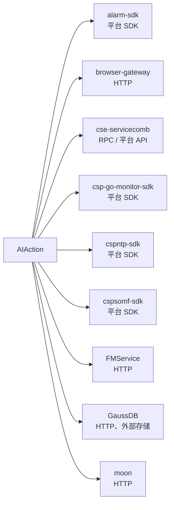

# AIAction 文档资产总索引

> 生成时间：2026-08-11（终端鉴权变更刷新）
> 生成工具：all-index（自动聚合产物，同名覆盖更新；资产变更后重跑 all-index 刷新，请勿手改）
> 布局规范：specgo HELP.MD v1.1——每类资产一个单独目录（docs/{域}/{资产}/）

## 四域导航

| 域 | 治理问题 | 已建资产 | 域索引 |
| --- | --- | --- | --- |
| arch（架构要素） | 定结构：代码往哪放 | structure-model、interaction-model | [arch/README.md](arch/README.md) |
| biz（业务要素） | 定业务：对象怎么建、数据存什么 | interface、rules、object-model、data-model、lexicon | [biz/README.md](biz/README.md) |
| tech（技术要素） | 定用法：机制怎么用、调用怎么跑 | usage、comm-guidelines、concurrency-guidelines、data-access-guidelines、resilience-guidelines、foundation-guidelines | [tech/README.md](tech/README.md) |
| qual（工程要素） | 定规矩：写到什么程度才算合格 | code-standards、dt-guidelines、branch-guidelines | [qual/README.md](qual/README.md) |

## 服务依赖全景图

依赖详情见各服务通信规范文档：[docs/tech/comm-guidelines/](tech/comm-guidelines/)。

## 附注

- docs/27.0/（终端鉴权需求设计文档）不在 specgo v1.1 taxonomy 内，未索引；如需治理请运行 all-init 迁移
