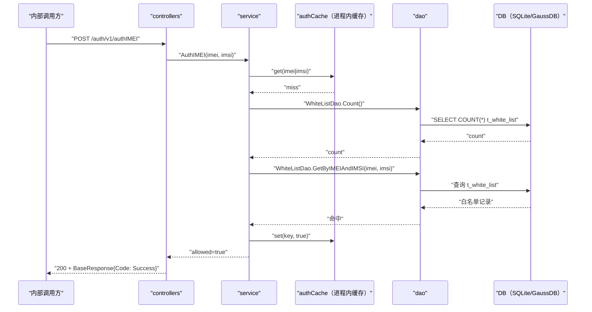

# 终端联合鉴权（AuthIMEI） 交互模型

> 生成时间：2026-08-11
> 流程入口：`POST /auth/v1/authIMEI` → controllers.AuthController.AuthIMEI（仅内部 HTTP 服务 127.0.0.1:9090 注册）

## 概述

内部管理面对终端 IMEI+IMSI 做联合鉴权：先 15 位纯数字格式校验短路，再查进程内鉴权缓存，缓存未命中回源 DB——白名单为空（逃生态）放行，否则 IMEI+IMSI 联合精确匹配判定，结果回写缓存；统一 HTTP 200 + body code 标识结果。

## 主链路时序图

## 参与方说明

| 参与方 | 类型 | 代码位置 | 本流程中的职责 |
| --- | --- | --- | --- |
| 内部调用方 | 外部触发者 | -（仓外） | 内网发起终端联合鉴权查询 |
| controllers | 模块 | src/controllers/auth_controller.go | 解析 AuthIMEIRequest，统一 200 + body code 响应 |
| service | 模块 | src/service/auth_service.go、src/service/auth_cache.go | 格式校验、缓存查询、逃生态判定、联合匹配编排 |
| authCache（进程内缓存） | 模块 | src/service/auth_cache.go | RWMutex+map 鉴权结果缓存（TTL 30min/容量 1000） |
| dao | 模块 | src/dao/white_list.go | t_white_list 计数与联合精确匹配查询 |
| DB（SQLite/GaussDB） | 中间件 | src/dao/db_local_sqlite.go、src/dao/db_init.go | 持久化白名单数据 |

## 补充说明

主链路为缓存未命中且白名单命中的路径；格式非法时格式校验短路直接拒绝（不入缓存），白名单表为空时按逃生态放行并缓存 true，DB 查询异常时安全优先拒绝且不缓存。回源 DB 段持 authImportLock 读锁，与白名单导入写锁互斥，杜绝清表窗口期误放行。

分支与异常逻辑：归业务规则资产承载（docs/biz/rules/rules-auth.md）。
