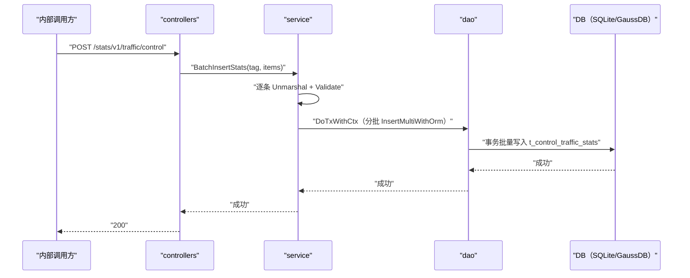

# 控制流量统计批量上报（ControlTrafficStats） 交互模型

> 生成时间：2026-08-11
> 流程入口：`POST /stats/v1/traffic/control` → controllers.TrafficStatsController.ControlTrafficStats（内部 HTTP 服务）

## 概述

内部调用方批量上报控制流量统计数据，service 逐条反序列化校验后，在事务中按每批 1000 条分批写入控制流量统计表。

## 主链路时序图

## 参与方说明

| 参与方 | 类型 | 代码位置 | 本流程中的职责 |
| --- | --- | --- | --- |
| 内部调用方 | 外部触发者 | -（仓外） | 批量上报控制流量统计 |
| controllers | 模块 | src/controllers/traffic_stats_controller.go | 解析 MultiTableRequest，回写响应 |
| service | 模块 | src/service/traffic_stats_service.go | 反序列化校验，泛型分批事务插入 |
| dao | 模块 | src/dao/traffic_stats_dao.go | t_control_traffic_stats 批量写入 |
| DB（SQLite/GaussDB） | 中间件 | src/dao/db_local_sqlite.go、src/dao/db_init.go | 控制流量统计持久化 |

## 补充说明

与 MediaTrafficStats 共用同一泛型批量插入链路（batchInsertStats），差异仅在目标表。关键实体状态变更：t_control_traffic_stats 批量新增记录。

分支与异常逻辑：归业务规则资产承载（docs/biz/rules/，待补）。
