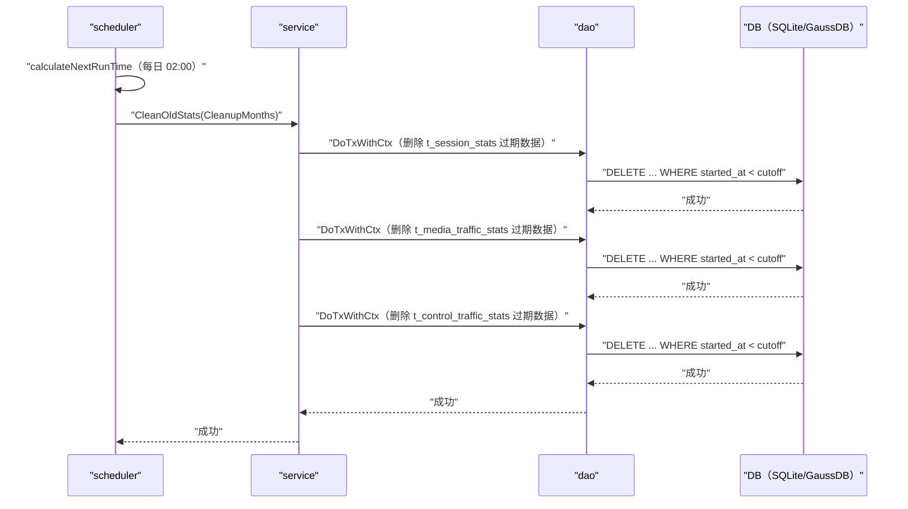

# 过期统计数据定时清理（DataCleanupScheduler） 交互模型

> 生成时间：2026-08-11
> 流程入口：定时任务 → scheduler.DataCleanupScheduler.run（每日凌晨 2 点触发，src/main.go 中 StartDataCleanupScheduler 启动）

## 概述

定时任务每日凌晨 2 点触发，scheduler 调用 service 在事务中删除三张统计表中早于保留月数截止点的历史数据。

## 主链路时序图

## 参与方说明

| 参与方 | 类型 | 代码位置 | 本流程中的职责 |
| --- | --- | --- | --- |
| scheduler | 模块 | src/scheduler/task_scheduler.go | 定时触发清理，失败重试（最多 3 次、间隔 10 分钟） |
| service | 模块 | src/service/traffic_stats_service.go | 计算截止时间，逐表事务删除过期数据 |
| dao | 模块 | src/dao/traffic_stats_dao.go | 三表条件删除 |
| DB（SQLite/GaussDB） | 中间件 | src/dao/db_local_sqlite.go、src/dao/db_init.go | 统计数据持久化 |

## 补充说明

保留月数取 constants.CleanupMonths，截止点为当前时间向前推对应月数。关键实体状态变更：t_session_stats / t_media_traffic_stats / t_control_traffic_stats 中过期记录被物理删除。重试与停止控制属分支逻辑不画入图。

分支与异常逻辑：归业务规则资产承载（docs/biz/rules/，待补）。
