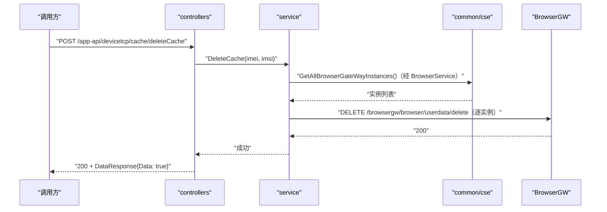

# 删除用户缓存（DeleteCache） 交互模型

> 生成时间：2026-08-11
> 流程入口：`POST /app-api/devicetcp/cache/deleteCache` → controllers.CacheController.DeleteCache（外部与内部服务均注册）

## 概述

外部/内部调用方按 IMEI+IMSI 请求删除终端用户在浏览器侧的数据缓存，service 遍历全部就绪 BrowserGW 实例逐个下发 userdata/delete 删除请求，并记录操作审计日志。

## 主链路时序图

## 参与方说明

| 参与方 | 类型 | 代码位置 | 本流程中的职责 |
| --- | --- | --- | --- |
| 调用方 | 外部触发者 | -（仓外） | 发起删除用户数据缓存请求 |
| controllers | 模块 | src/controllers/cache_controller.go | 解析请求，失败时写审计日志（logger.AuditsLog），回写响应 |
| service | 模块 | src/service/cache_service.go | 校验参数，遍历就绪实例逐个调用 BrowserGW 删除接口 |
| common/cse | 模块 | src/common/cse/cse.go | 服务发现获取 BrowserGW 实例 |
| BrowserGW | 下游服务 | 调用点：src/service/cache_service.go | 删除该用户（IMEI+IMSI）的对象存储缓存 |

## 补充说明

对多个 BrowserGW 实例的删除为串行逐个调用，单实例失败仅记日志不影响整体返回（运行时方差）。删除请求使用带 5 秒超时的 http.Client。无出站调用文档，待核实（docs/tech/comm-guidelines/ 为空）。

分支与异常逻辑：归业务规则资产承载（docs/biz/rules/，待补）。
