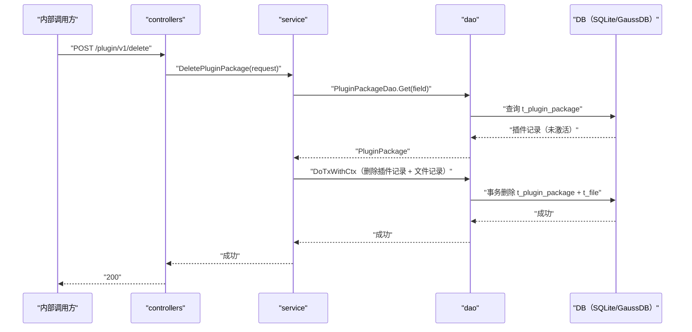

# 删除插件包（DeletePluginPackage） 交互模型

> 生成时间：2026-08-11
> 流程入口：`POST /plugin/v1/delete` → controllers.PluginController.DeletePluginPackage（内部 HTTP 服务）

## 概述

内部调用方按名称+类型+版本删除插件包，service 校验插件未处于激活状态后，在事务中删除插件包记录与对应文件记录。

## 主链路时序图

## 参与方说明

| 参与方 | 类型 | 代码位置 | 本流程中的职责 |
| --- | --- | --- | --- |
| 内部调用方 | 外部触发者 | -（仓外） | 请求删除插件包 |
| controllers | 模块 | src/controllers/plugin_controller.go | 解析 PluginPackageReq，回写响应 |
| service | 模块 | src/service/plugin_service.go | 查存在性与激活态校验，事务删除 |
| dao | 模块 | src/dao/plugin.go、src/dao/file.go | t_plugin_package / t_file 删除 |
| DB（SQLite/GaussDB） | 中间件 | src/dao/db_local_sqlite.go、src/dao/db_init.go | 插件与文件持久化 |

## 补充说明

关键实体状态变更：t_plugin_package 与对应 t_file 记录在同一事务中被删除。记录不存在时按"已删除"幂等返回成功；IfActive=true 时拒绝删除（均为分支逻辑不画入图）。

分支与异常逻辑：归业务规则资产承载（docs/biz/rules/，待补）。
