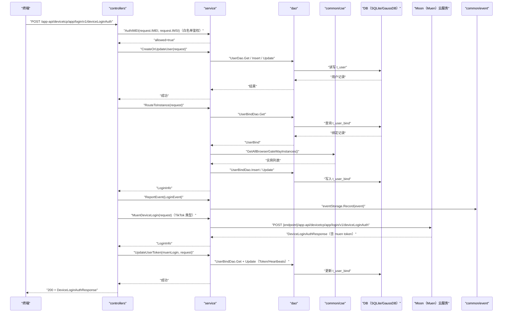

# 设备登录鉴权（DeviceLoginAuth） 交互模型

> 生成时间：2026-08-11
> 流程入口：`POST /app-api/devicetcp/app/login/v1/deviceLoginAuth` → controllers.ExLoginController.DeviceLoginAuth（外部）；同逻辑亦注册于 controllers.LoginController.DeviceLoginAuth（内部）

## 概述

终端发起设备登录鉴权，完成用户建档与实例分配后返回完整登录信息（含内网地址以外的字段）；TikTok 应用类型还需向 Moon（Muen）云服务发起二次登录换取 token 并回写 UserBind。

## 主链路时序图

## 参与方说明

| 参与方 | 类型 | 代码位置 | 本流程中的职责 |
| --- | --- | --- | --- |
| 终端 | 外部触发者 | -（仓外） | 发起设备登录鉴权请求 |
| controllers | 模块 | src/controllers/exlogin_controller.go、src/controllers/login_controller.go | 入口解析，白名单鉴权注入，TikTok 类型时编排 Muen 二次登录与 token 更新 |
| service | 模块 | src/service/user_service.go、src/service/browser_service.go、src/service/remote_service.go、src/service/event_service.go、src/service/auth_service.go | 终端白名单联合鉴权、用户建档、实例分配、Muen 远端登录、token 回写 |
| dao | 模块 | src/dao/user.go | t_user / t_user_bind 读写 |
| common/cse | 模块 | src/common/cse/cse.go | 服务发现获取 BrowserGW 实例 |
| DB（SQLite/GaussDB） | 中间件 | src/dao/db_local_sqlite.go、src/dao/db_init.go | 持久化用户与绑定数据 |
| Moon（Muen）云服务 | 下游服务 | 调用点：src/service/remote_service.go | TikTok 场景二次登录，签发 muen token |
| common/event | 模块 | src/common/event | 登录事件落本地审计文件 |

## 补充说明

登录前新增终端白名单联合鉴权环节（AuthService.AuthIMEI），鉴权拒绝返回 retcode.ClientFailed(-2)，主链路为鉴权通过路径。Muen 登录的 endpoint 取自配置中心（moon::titokEndpoint / httpsTitokEndpoint / enableHttps），由 ConfigCenterService 缓存提供。仅当 AppType 为 TikTokAppType 时才走 Muen 分支并以其返回的 LoginInfo 覆盖响应 Data。登录事件上报失败不影响登录结果。无出站调用文档，待核实（docs/tech/comm-guidelines/ 为空）。

分支与异常逻辑：归业务规则资产承载（docs/biz/rules/，待补）。
