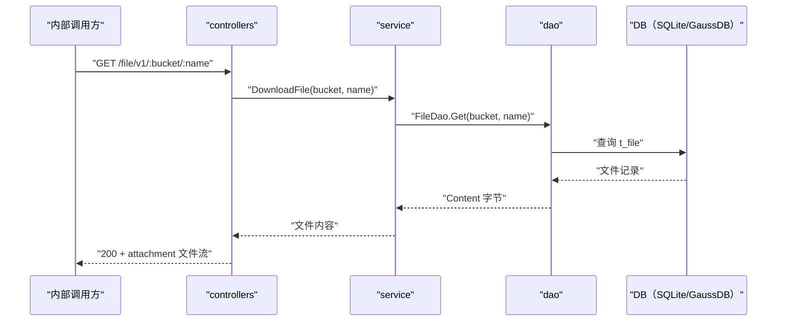

# 通用文件下载（Download） 交互模型

> 生成时间：2026-08-11
> 流程入口：`GET /file/v1/:bucket/:name` → controllers.FileController.Download（内部 HTTP 服务）

## 概述

内部调用方按 bucket+name 下载文件，service 从文件存储表读出内容字节，controllers 以附件流形式写回响应。

## 主链路时序图

## 参与方说明

| 参与方 | 类型 | 代码位置 | 本流程中的职责 |
| --- | --- | --- | --- |
| 内部调用方 | 外部触发者 | -（仓外） | 按 bucket+name 下载文件 |
| controllers | 模块 | src/controllers/file_controller.go | 提取路径参数，写文件流响应 |
| service | 模块 | src/service/file_service.go | 文件名清洗，读取文件内容 |
| dao | 模块 | src/dao/file.go | t_file 读取 |
| DB（SQLite/GaussDB） | 中间件 | src/dao/db_local_sqlite.go、src/dao/db_init.go | 文件内容持久化存储 |

## 补充说明

与 HandleDownload 的差异仅在 bucket 由路径参数指定。本流程只读，无实体状态变更。

分支与异常逻辑：归业务规则资产承载（docs/biz/rules/，待补）。
