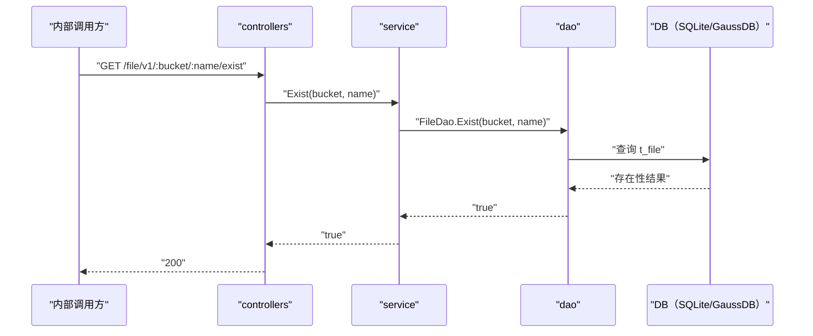

# 文件存在性检查（Exist） 交互模型

> 生成时间：2026-08-11
> 流程入口：`GET /file/v1/:bucket/:name/exist` → controllers.FileController.Exist（内部 HTTP 服务）

## 概述

内部调用方检查指定 bucket+name 的文件是否存在，controllers 经 service 到 dao 查询，存在返回 200，不存在返回 404。

## 主链路时序图

## 参与方说明

| 参与方 | 类型 | 代码位置 | 本流程中的职责 |
| --- | --- | --- | --- |
| 内部调用方 | 外部触发者 | -（仓外） | 检查文件存在性 |
| controllers | 模块 | src/controllers/file_controller.go | 提取路径参数，按存在性返回 200/404 |
| service | 模块 | src/service/file_service.go | 透传存在性查询 |
| dao | 模块 | src/dao/file.go | t_file 存在性查询 |
| DB（SQLite/GaussDB） | 中间件 | src/dao/db_local_sqlite.go、src/dao/db_init.go | 文件记录存储 |

## 补充说明

主链路画存在路径；不存在时返回 404 属分支逻辑不画入图。本流程只读，无实体状态变更。

分支与异常逻辑：归业务规则资产承载（docs/biz/rules/，待补）。
