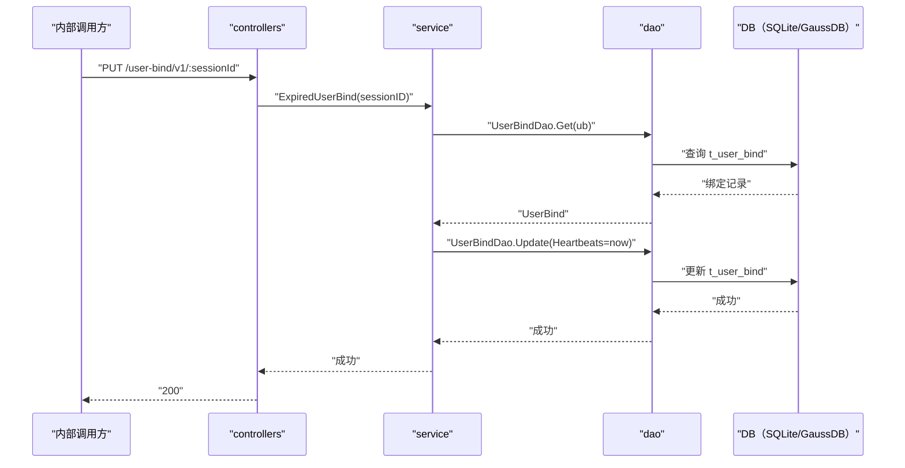

# 用户绑定过期（ExpiredUserBind） 交互模型

> 生成时间：2026-08-11
> 流程入口：`PUT /user-bind/v1/:sessionId` → controllers.LoginController.ExpiredUserBind（内部 HTTP 服务）

## 概述

内部调用方请求将指定 sessionID 的绑定标记过期（通过刷新 Heartbeats 字段时间实现状态更新），controllers 经 service 到 dao 更新 t_user_bind 记录。

## 主链路时序图

## 参与方说明

| 参与方 | 类型 | 代码位置 | 本流程中的职责 |
| --- | --- | --- | --- |
| 内部调用方 | 外部触发者 | -（仓外） | 请求过期指定绑定 |
| controllers | 模块 | src/controllers/login_controller.go | 提取路径参数，回写响应 |
| service | 模块 | src/service/user_service.go | 查询绑定并刷新 Heartbeats 字段 |
| dao | 模块 | src/dao/user.go | t_user_bind 读写 |
| DB（SQLite/GaussDB） | 中间件 | src/dao/db_local_sqlite.go、src/dao/db_init.go | 持久化绑定数据 |

## 补充说明

关键实体状态变更：t_user_bind.Heartbeats 被更新为当前时间（代码未体现独立的"过期"标记字段，过期语义由心跳时间判定，代码未体现，待确认）。记录不存在时返回 404，属分支逻辑不画入图。

分支与异常逻辑：归业务规则资产承载（docs/biz/rules/，待补）。
