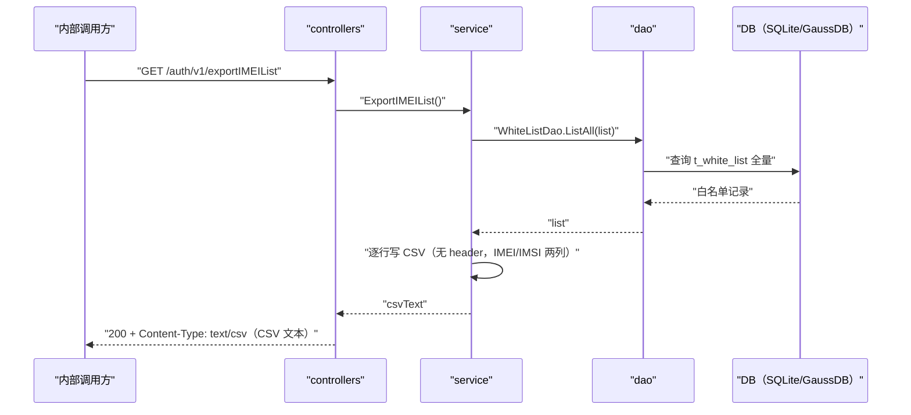

# 白名单导出（ExportIMEIList） 交互模型

> 生成时间：2026-08-11
> 流程入口：`GET /auth/v1/exportIMEIList` → controllers.AuthController.ExportIMEIList（仅内部 HTTP 服务注册）

## 概述

内部管理面导出全量终端白名单为无 header 的 IMEI/IMSI 两列 CSV 文本：service 全量查询 t_white_list 后逐行写 CSV，controllers 以 text/csv 直接回写响应体。

## 主链路时序图

## 参与方说明

| 参与方 | 类型 | 代码位置 | 本流程中的职责 |
| --- | --- | --- | --- |
| 内部调用方 | 外部触发者 | -（仓外） | 内网发起白名单导出 |
| controllers | 模块 | src/controllers/auth_controller.go | 设置 text/csv 响应头并回写 CSV 文本 |
| service | 模块 | src/service/whitelist_manage_service.go | 全量查询并序列化为 CSV |
| dao | 模块 | src/dao/white_list.go | t_white_list 全量查询 |
| DB（SQLite/GaussDB） | 中间件 | src/dao/db_local_sqlite.go、src/dao/db_init.go | 持久化白名单数据 |

## 补充说明

导出为全量拉取无分页（白名单量级受导入上限 200000 约束）；导出路径不经鉴权缓存与 authImportLock。查询失败返回 500（InternalServiceError）。

分支与异常逻辑：归业务规则资产承载（docs/biz/rules/rules-auth.md）。
