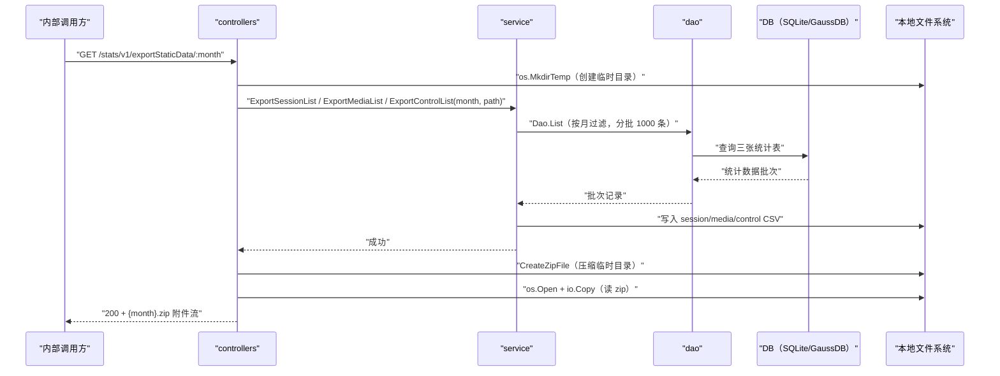

# 统计数据导出（ExportStaticData） 交互模型

> 生成时间：2026-08-11
> 流程入口：`GET /stats/v1/exportStaticData/:month` → controllers.TrafficStatsController.ExportStaticData（内部 HTTP 服务）

## 概述

内部调用方按月份导出统计数据，controllers 经 service 分批查询三张统计表写成本地 CSV，压缩为 zip 后以附件流返回。

## 主链路时序图

## 参与方说明

| 参与方 | 类型 | 代码位置 | 本流程中的职责 |
| --- | --- | --- | --- |
| 内部调用方 | 外部触发者 | -（仓外） | 按月份请求导出统计数据 |
| controllers | 模块 | src/controllers/traffic_stats_controller.go | 校验月份参数，编排导出、压缩与响应回写 |
| service | 模块 | src/service/traffic_stats_service.go | 分批查询并写 CSV（QueryStatsDataAndWriteCSV） |
| dao | 模块 | src/dao/traffic_stats_dao.go | 三张统计表分页读取 |
| DB（SQLite/GaussDB） | 中间件 | src/dao/db_local_sqlite.go、src/dao/db_init.go | 统计数据持久化 |
| 本地文件系统 | 中间件 | 访问点：src/controllers/traffic_stats_controller.go、src/utils/fileutil | 临时目录、CSV 与 zip 文件读写 |

## 补充说明

按 started_at 前缀匹配月份过滤，每批 1000 条分页遍历；导出结束经 defer 清理临时目录。本流程只读 DB，无实体状态变更。

分支与异常逻辑：归业务规则资产承载（docs/biz/rules/，待补）。
