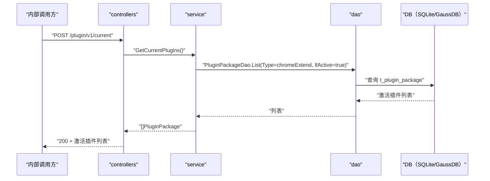

# 查询当前激活插件（GetCurrentPlugins） 交互模型

> 生成时间：2026-08-11
> 流程入口：`POST /plugin/v1/current` → controllers.PluginController.GetCurrentPlugins（内部 HTTP 服务）

## 概述

内部调用方查询当前激活（IfActive=true）的 Chrome 扩展插件，controllers 经 service 到 dao 按类型+激活标记过滤查询并返回。

## 主链路时序图

## 参与方说明

| 参与方 | 类型 | 代码位置 | 本流程中的职责 |
| --- | --- | --- | --- |
| 内部调用方 | 外部触发者 | -（仓外） | 查询当前激活插件 |
| controllers | 模块 | src/controllers/plugin_controller.go | 入口与响应回写 |
| service | 模块 | src/service/plugin_service.go | 按类型与激活标记过滤查询 |
| dao | 模块 | src/dao/plugin.go | t_plugin_package 读取 |
| DB（SQLite/GaussDB） | 中间件 | src/dao/db_local_sqlite.go、src/dao/db_init.go | 插件包持久化 |

## 补充说明

本流程只读，无实体状态变更。

分支与异常逻辑：归业务规则资产承载（docs/biz/rules/，待补）。
