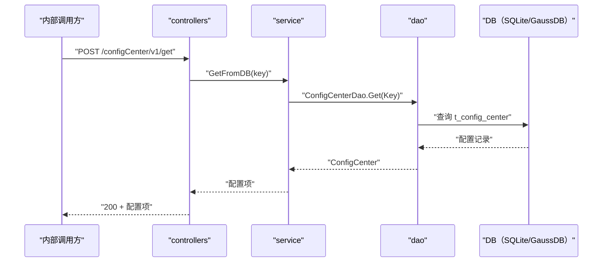

# 配置中心查询（GetFromDB） 交互模型

> 生成时间：2026-08-11
> 流程入口：`POST /configCenter/v1/get` → controllers.ConfigCenterController.GetFromDB（内部 HTTP 服务）

## 概述

内部调用方按键查询配置项，controllers 经 service 到 dao 直接读取配置中心表并返回（不走内存缓存）。

## 主链路时序图

## 参与方说明

| 参与方 | 类型 | 代码位置 | 本流程中的职责 |
| --- | --- | --- | --- |
| 内部调用方 | 外部触发者 | -（仓外） | 按键查询配置项 |
| controllers | 模块 | src/controllers/config_center_controller.go | 解析并校验 key 非空，回写响应 |
| service | 模块 | src/service/config_center_service.go | 按键直查 DB |
| dao | 模块 | src/dao/config_center.go | t_config_center 读取 |
| DB（SQLite/GaussDB） | 中间件 | src/dao/db_local_sqlite.go、src/dao/db_init.go | 配置项持久化 |

## 补充说明

未命中时返回空 ConfigCenter（代码中错误被忽略，直接 c.OK(fromDB)）。本流程只读，无实体状态变更。

分支与异常逻辑：归业务规则资产承载（docs/biz/rules/，待补）。
