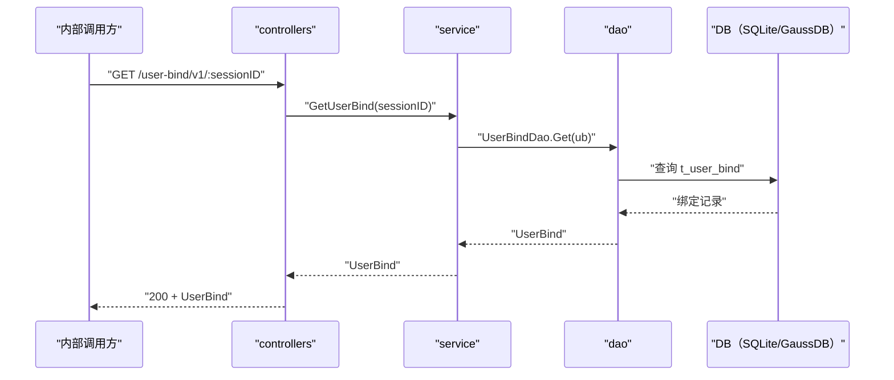

# 查询用户绑定（GetUserBind） 交互模型

> 生成时间：2026-08-11
> 流程入口：`GET /user-bind/v1/:sessionID` → controllers.LoginController.GetUserBind（内部 HTTP 服务）

## 概述

内部调用方按 sessionID 查询用户与浏览器实例的绑定关系，controllers 经 service 到 dao 读取 t_user_bind 记录并返回。

## 主链路时序图

## 参与方说明

| 参与方 | 类型 | 代码位置 | 本流程中的职责 |
| --- | --- | --- | --- |
| 内部调用方 | 外部触发者 | -（仓外） | 按 sessionID 查询绑定信息 |
| controllers | 模块 | src/controllers/login_controller.go | 提取路径参数，回写响应（含 404/500 处理） |
| service | 模块 | src/service/user_service.go | 按键查询 UserBind |
| dao | 模块 | src/dao/user.go | t_user_bind 读取 |
| DB（SQLite/GaussDB） | 中间件 | src/dao/db_local_sqlite.go、src/dao/db_init.go | 持久化绑定数据 |

## 补充说明

记录不存在（orm.ErrNoRows）时返回 404，属分支逻辑不画入图。本流程只读，无实体状态变更。

分支与异常逻辑：归业务规则资产承载（docs/biz/rules/，待补）。
