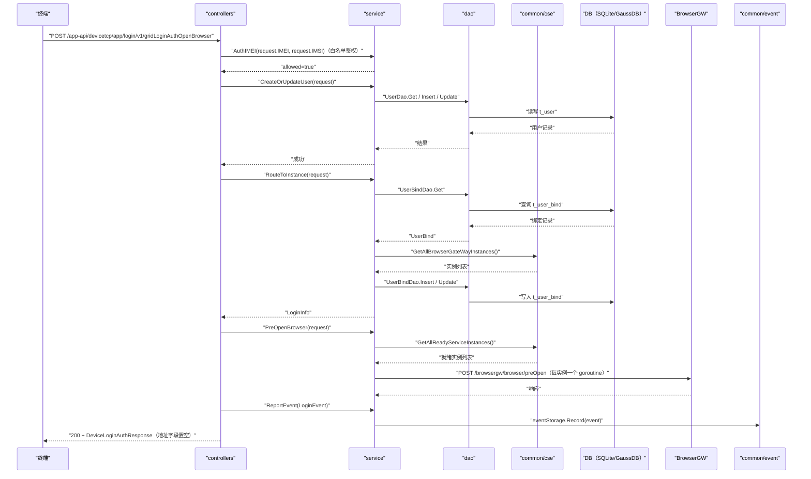

# 网格登录鉴权并预开浏览器（GridLoginAuthOpenBrowser） 交互模型

> 生成时间：2026-08-11
> 流程入口：`POST /app-api/devicetcp/app/login/v1/gridLoginAuthOpenBrowser` → controllers.ExLoginController.GridLoginAuthOpenBrowser（外部）；同逻辑亦注册于 controllers.LoginController.GridLoginAuthOpenBrowser（内部）

## 概述

终端发起登录鉴权并要求预开浏览器，在完成用户建档与实例分配后，service 异步向全部就绪 BrowserGW 实例发送 preOpen 请求预热浏览器，随后返回登录信息并记录登录事件。

## 主链路时序图

## 参与方说明

| 参与方 | 类型 | 代码位置 | 本流程中的职责 |
| --- | --- | --- | --- |
| 终端 | 外部触发者 | -（仓外） | 发起登录鉴权并请求预开浏览器 |
| controllers | 模块 | src/controllers/exlogin_controller.go、src/controllers/login_controller.go | 入口解析与响应组装，preOpenBrowser=true 触发预热 |
| service | 模块 | src/service/browser_service.go、src/service/user_service.go、src/service/event_service.go、src/service/auth_service.go | 终端白名单联合鉴权、用户建档、实例分配、向各 BrowserGW 异步预开浏览器 |
| dao | 模块 | src/dao/user.go | t_user / t_user_bind 读写 |
| common/cse | 模块 | src/common/cse/cse.go | 服务发现，筛选就绪 BrowserGW 实例 |
| DB（SQLite/GaussDB） | 中间件 | src/dao/db_local_sqlite.go、src/dao/db_init.go | 持久化用户与绑定数据 |
| BrowserGW | 下游服务 | 调用点：src/service/browser_service.go | 接收 preOpen 请求预热浏览器实例 |
| common/event | 模块 | src/common/event | 登录事件落本地审计文件 |

## 补充说明

登录前新增终端白名单联合鉴权环节（AuthService.AuthIMEI），鉴权拒绝返回 retcode.ClientFailed(-2)，主链路为鉴权通过路径。PreOpenBrowser 对每个就绪实例（PluginStatus=Complete、Cap>0、IsHealthy）各起一个 goroutine 发送 POST /browsergw/browser/preOpen，结果为 fire-and-forget，不阻塞登录响应。登录主链路与 GridLoginAuth 相同，差异仅在本预热步骤。无出站调用文档，待核实（docs/tech/comm-guidelines/ 为空）。

分支与异常逻辑：归业务规则资产承载（docs/biz/rules/，待补）。
