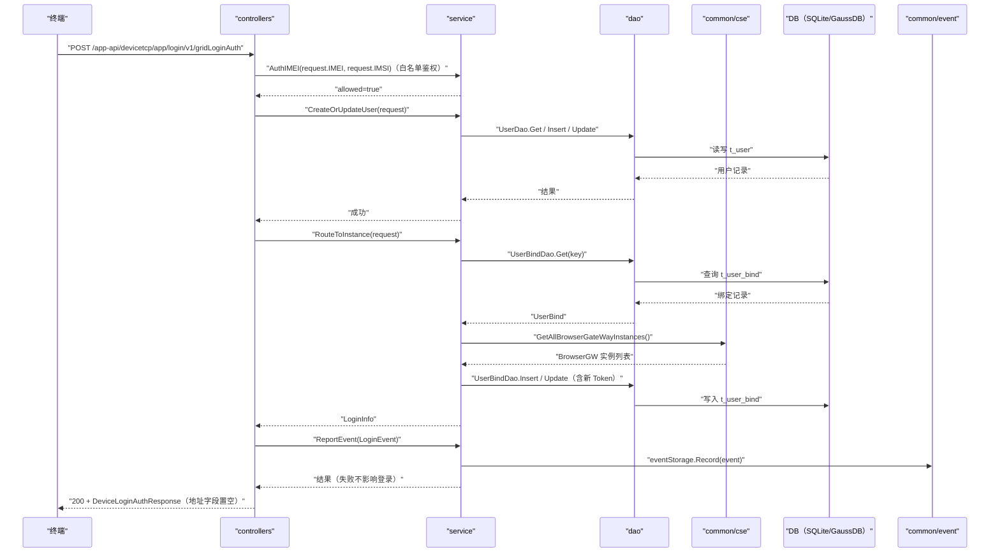

# 网格登录鉴权（GridLoginAuth） 交互模型

> 生成时间：2026-08-11
> 流程入口：`POST /app-api/devicetcp/app/login/v1/gridLoginAuth` → controllers.ExLoginController.GridLoginAuth（外部 HTTPS 服务）；同路径同逻辑亦注册于 controllers.LoginController.GridLoginAuth（内部 HTTP 服务）

## 概述

终端发起网格登录鉴权请求，controllers 解析请求后由 service 完成用户建档/更新与浏览器实例分配，返回登录信息（外部侧对地址类字段做脱敏置空），并异步记录登录事件。

## 主链路时序图

## 参与方说明

| 参与方 | 类型 | 代码位置 | 本流程中的职责 |
| --- | --- | --- | --- |
| 终端 | 外部触发者 | -（仓外） | 发起网格登录鉴权请求 |
| controllers | 模块 | src/controllers/exlogin_controller.go、src/controllers/login_controller.go | 解析请求体，编排登录主链路，脱敏置空地址字段，回写响应 |
| service | 模块 | src/service/user_service.go、src/service/browser_service.go、src/service/event_service.go、src/service/auth_service.go | 终端白名单联合鉴权、用户建档/更新、实例分配与 UserBind 落库、事件上报 |
| dao | 模块 | src/dao/user.go | t_user / t_user_bind 数据读写 |
| common/cse | 模块 | src/common/cse/cse.go | 服务发现，获取全部 BrowserGW 实例 |
| DB（SQLite/GaussDB） | 中间件 | src/dao/db_local_sqlite.go、src/dao/db_init.go | 持久化用户与绑定数据 |
| common/event | 模块 | src/common/event（本地事件文件存储） | 登录事件落本地审计文件 |

## 补充说明

登录前新增终端白名单联合鉴权环节（AuthService.AuthIMEI），鉴权拒绝返回 retcode.ClientFailed(-2)，主链路为鉴权通过路径。主链路中 UserBind 不存在或失效（实例不健康/心跳过期）时走 reRouteToInstance 重新分配实例并生成 UUID Token 落库；存在且有效则直接复用返回（运行时方差，图中画完整重新分配路径）。RouteToInstance 失败时登录仍算通过，返回空实例信息。外部与内部入口 handler 逻辑完全一致，仅外部侧额外将 TcpAddr/TlsTcpAddr/ShortAddr 等字段置空。无出站调用文档，待核实（docs/tech/comm-guidelines/ 为空）。

分支与异常逻辑：归业务规则资产承载（docs/biz/rules/，待补）。
