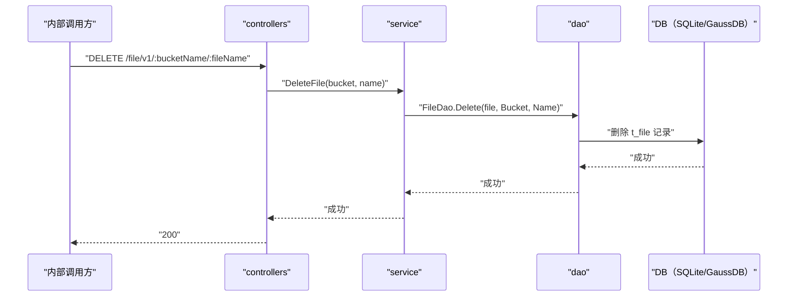

# 文件删除（HandleDelete） 交互模型

> 生成时间：2026-08-11
> 流程入口：`DELETE /file/v1/:bucketName/:fileName` → controllers.FileController.HandleDelete（内部 HTTP 服务）

## 概述

内部调用方删除指定 bucket+name 的文件，controllers 经 service 到 dao 删除 t_file 对应记录。

## 主链路时序图

## 参与方说明

| 参与方 | 类型 | 代码位置 | 本流程中的职责 |
| --- | --- | --- | --- |
| 内部调用方 | 外部触发者 | -（仓外） | 删除指定文件 |
| controllers | 模块 | src/controllers/file_controller.go | 提取路径参数，回写响应 |
| service | 模块 | src/service/file_service.go | 文件名清洗（防路径遍历），删除记录 |
| dao | 模块 | src/dao/file.go | t_file 删除 |
| DB（SQLite/GaussDB） | 中间件 | src/dao/db_local_sqlite.go、src/dao/db_init.go | 文件记录存储 |

## 补充说明

关键实体状态变更：t_file 中对应 bucket+name 记录被物理删除。文件名经 cleanFileName 清洗。

分支与异常逻辑：归业务规则资产承载（docs/biz/rules/，待补）。
