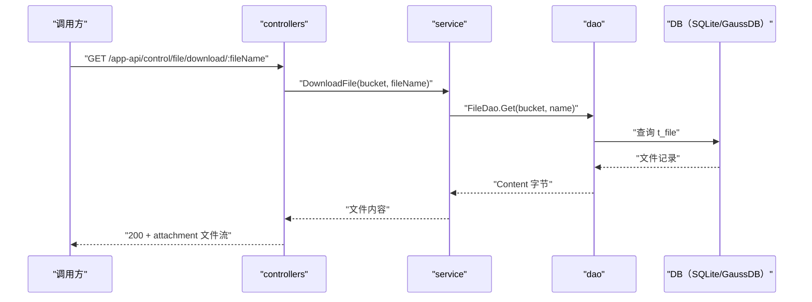

# 应用文件下载（HandleDownload） 交互模型

> 生成时间：2026-08-11
> 流程入口：`GET /app-api/control/file/download/:fileName` → controllers.ExFileController.HandleDownload（外部 HTTPS 服务）；同路径同逻辑亦注册于 controllers.FileController.HandleDownload（内部 HTTP 服务）

## 概述

调用方按文件名下载应用文件，service 从文件存储表读出内容字节，controllers 以 octet-stream 附件形式写回响应体。

## 主链路时序图

## 参与方说明

| 参与方 | 类型 | 代码位置 | 本流程中的职责 |
| --- | --- | --- | --- |
| 调用方 | 外部触发者 | -（仓外） | 按文件名下载文件 |
| controllers | 模块 | src/controllers/exfile_controller.go、src/controllers/file_controller.go | 提取路径参数，设置 Content-Disposition 头并写文件流 |
| service | 模块 | src/service/file_service.go | 文件名清洗，读取文件内容 |
| dao | 模块 | src/dao/file.go | t_file 读取 |
| DB（SQLite/GaussDB） | 中间件 | src/dao/db_local_sqlite.go、src/dao/db_init.go | 文件内容持久化存储 |

## 补充说明

bucket 固定为 constants.UploadBucket；文件名经 cleanFileName 清洗防路径遍历。外部与内部入口 handler 逻辑一致。

分支与异常逻辑：归业务规则资产承载（docs/biz/rules/，待补）。
