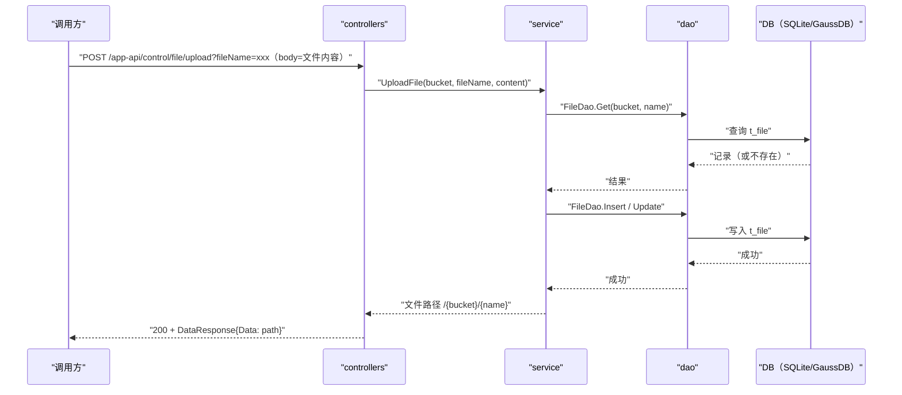

# 应用文件上传（HandleUpload） 交互模型

> 生成时间：2026-08-11
> 流程入口：`POST /app-api/control/file/upload` → controllers.ExFileController.HandleUpload（外部 HTTPS 服务）；同路径同逻辑亦注册于 controllers.FileController.HandleUpload（内部 HTTP 服务）

## 概述

调用方以 fileName 查询参数加请求体原始字节上传文件，service 校验文件名后按 bucket+name 幂等写入文件存储表，返回文件访问路径。

## 主链路时序图

## 参与方说明

| 参与方 | 类型 | 代码位置 | 本流程中的职责 |
| --- | --- | --- | --- |
| 调用方 | 外部触发者 | -（仓外） | 上传文件到固定 UploadBucket |
| controllers | 模块 | src/controllers/exfile_controller.go、src/controllers/file_controller.go | 读取查询参数与请求体字节流，回写响应 |
| service | 模块 | src/service/file_service.go | 文件名清洗（防路径遍历），insertOrUpdate 幂等写入 |
| dao | 模块 | src/dao/file.go | t_file 读写 |
| DB（SQLite/GaussDB） | 中间件 | src/dao/db_local_sqlite.go、src/dao/db_init.go | 文件内容以记录形式持久化 |

## 补充说明

关键实体状态变更：t_file 中同 bucket+name 记录存在则覆盖 Content/Size，不存在则新建；bucket 固定为 constants.UploadBucket。外部与内部入口 handler 逻辑一致。

分支与异常逻辑：归业务规则资产承载（docs/biz/rules/，待补）。
