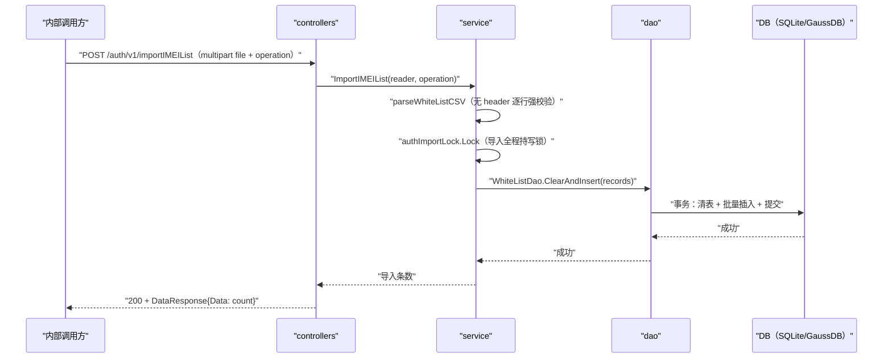

# 白名单导入（ImportIMEIList） 交互模型

> 生成时间：2026-08-11
> 流程入口：`POST /auth/v1/importIMEIList` → controllers.AuthController.ImportIMEIList（仅内部 HTTP 服务注册）

## 概述

内部管理面导入终端白名单 CSV（无 header、IMEI/IMSI 两列）：controllers 校验文件大小与 operation 参数后，service 全量解析强校验，再按模式入库——firstImport 要求表为空后分片批量插入，update 事务内清表并批量插入；导入全程持 authImportLock 写锁。

## 主链路时序图

## 参与方说明

| 参与方 | 类型 | 代码位置 | 本流程中的职责 |
| --- | --- | --- | --- |
| 内部调用方 | 外部触发者 | -（仓外） | 内网上传白名单 CSV 文件 |
| controllers | 模块 | src/controllers/auth_controller.go | 文件大小硬限（3MB）与 operation 参数校验 |
| service | 模块 | src/service/whitelist_manage_service.go | CSV 解析强校验、导入模式编排、持写锁 |
| dao | 模块 | src/dao/white_list.go | firstImport 分片 InsertMulti（1000 条/批）；update 事务 ClearAndInsert |
| DB（SQLite/GaussDB） | 中间件 | src/dao/db_local_sqlite.go、src/dao/db_init.go | 持久化白名单数据 |

## 补充说明

图中画 update 模式主链路（事务清表+批量插入）；firstImport 模式差异为前置 Count=0 校验后走 insertInBatches 分片插入（无清表）。CSV 任一记录格式非法（非 15 位纯数字）即整体拒绝，不落任何数据；条数上限 200000。

分支与异常逻辑：归业务规则资产承载（docs/biz/rules/rules-auth.md）。
