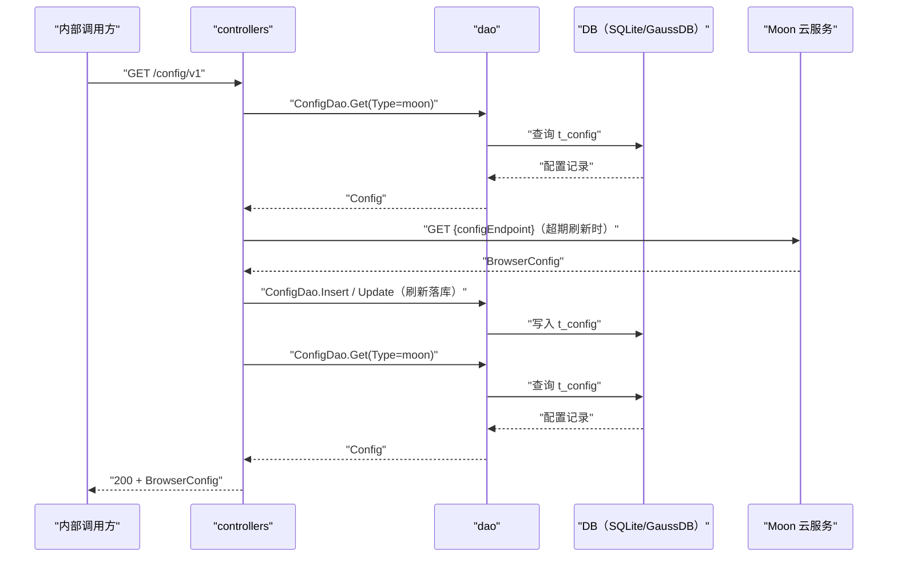

# 查询浏览器配置（ListConfig） 交互模型

> 生成时间：2026-08-11
> 流程入口：`GET /config/v1` → controllers.ManagementController.ListConfig（内部 HTTP 服务）

## 概述

内部调用方查询浏览器配置，controllers 先按更新时间判断是否需要向 Moon 云服务同步刷新，再从本地配置表读取并解析返回。

## 主链路时序图

## 参与方说明

| 参与方 | 类型 | 代码位置 | 本流程中的职责 |
| --- | --- | --- | --- |
| 内部调用方 | 外部触发者 | -（仓外） | 查询浏览器配置 |
| controllers | 模块 | src/controllers/management_controller.go | 判断是否超期需同步，读取并解析配置返回 |
| dao | 模块 | src/dao/browser_config.go | t_config 读写 |
| DB（SQLite/GaussDB） | 中间件 | src/dao/db_local_sqlite.go、src/dao/db_init.go | 配置持久化 |
| Moon 云服务 | 下游服务 | 调用点：src/controllers/management_controller.go | 超期时提供最新配置 |

## 补充说明

配置超过 24 小时未更新或读取/解析失败时会先走 syncBrowserConfig 向 Moon 拉取刷新（运行时方差：未超期则跳过该步，直接读库返回）。返回体为 Config.Content 反序列化后的 BrowserConfig。无出站调用文档，待核实（docs/tech/comm-guidelines/ 为空）。

分支与异常逻辑：归业务规则资产承载（docs/biz/rules/，待补）。
