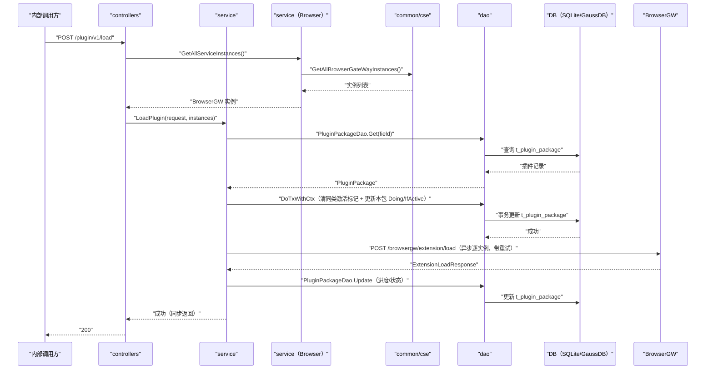

# 加载插件（LoadPlugin） 交互模型

> 生成时间：2026-08-11
> 流程入口：`POST /plugin/v1/load` → controllers.PluginController.LoadPlugin（内部 HTTP 服务）

## 概述

内部调用方请求将指定插件包加载到全部 BrowserGW 实例，service 先在事务中切换激活插件，随后异步逐实例下发加载请求并回写加载进度，接口同步返回。

## 主链路时序图

## 参与方说明

| 参与方 | 类型 | 代码位置 | 本流程中的职责 |
| --- | --- | --- | --- |
| 内部调用方 | 外部触发者 | -（仓外） | 请求加载指定插件 |
| controllers | 模块 | src/controllers/plugin_controller.go | 解析请求，收集 BrowserGW 实例，回写响应 |
| service | 模块 | src/service/plugin_service.go | 切换激活插件、异步分发加载、回写进度 |
| service（Browser） | 模块 | src/service/browser_service.go | 提供全部 BrowserGW 实例 |
| common/cse | 模块 | src/common/cse/cse.go | 服务发现获取实例 |
| dao | 模块 | src/dao/plugin.go | t_plugin_package 读写 |
| DB（SQLite/GaussDB） | 中间件 | src/dao/db_local_sqlite.go、src/dao/db_init.go | 插件状态持久化 |
| BrowserGW | 下游服务 | 调用点：src/service/plugin_service.go | 接收 extension/load 请求完成插件加载 |

## 补充说明

加载分发与进度回写在独立 goroutine（loadPlugin / recordLoadPluginProgress，经 channel 传递进度）中异步执行，接口在激活切换成功后即返回。关键实体状态变更：t_plugin_package 同类型其他记录 IfActive 置 false，本记录 Status=Doing→Complete/Failed、Progress 递增。无出站调用文档，待核实（docs/tech/comm-guidelines/ 为空）。

分支与异常逻辑：归业务规则资产承载（docs/biz/rules/，待补）。
