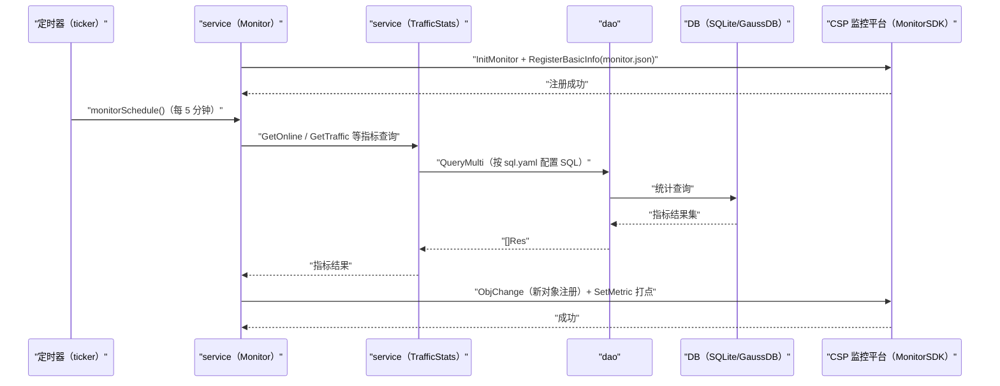

# CSP 话统监控上报（MonitorSchedule） 交互模型

> 生成时间：2026-08-11
> 流程入口：定时任务 → service.MonitorServiceImpl.InitMonitorSchedule / startCspMonitor（每 5 分钟打点，src/main.go 中以 goroutine 启动）

## 概述

服务启动后先向 CSP 监控平台注册指标模型，随后每 5 分钟按 sql.yaml 配置的 SQL 统计在线用户/流量等指标，经 MonitorSDK 打点上报运营指标。

## 主链路时序图

## 参与方说明

| 参与方 | 类型 | 代码位置 | 本流程中的职责 |
| --- | --- | --- | --- |
| 定时器（ticker） | 外部触发者 | src/service/monitor_service.go（startCspMonitor） | 每 5 分钟触发打点 |
| service（Monitor） | 模块 | src/service/monitor_service.go | 注册监控模型，编排指标采集与上报 |
| service（TrafficStats） | 模块 | src/service/traffic_stats_service.go | 按 sql.yaml 配置执行指标统计查询 |
| dao | 模块 | src/dao/traffic_stats_dao.go | 统计 SQL 执行 |
| DB（SQLite/GaussDB） | 中间件 | src/dao/db_local_sqlite.go、src/dao/db_init.go | 统计数据持久化 |
| CSP 监控平台（MonitorSDK） | 下游服务 | 调用点：src/service/monitor_service.go | 指标模型注册与打点数据接收 |

## 补充说明

注册未成功前按 10 秒间隔重试直到成功才进入打点循环（分支不画入图）；指标 SQL 来自外部配置文件 sql.yaml，未加载时查询返回空。对 DB 只读，无实体状态变更。无出站调用文档，待核实（docs/tech/comm-guidelines/ 为空）。

分支与异常逻辑：归业务规则资产承载（docs/biz/rules/，待补）。
