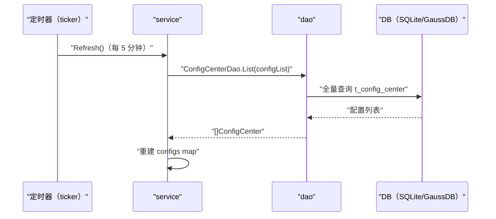

# 配置中心缓存定时刷新（RefreshConfigTask） 交互模型

> 生成时间：2026-08-11
> 流程入口：定时任务 → service.StartRefreshConfigTask（每 5 分钟触发，src/main.go 中启动）

## 概述

定时任务每 5 分钟全量读取配置中心表，重建 service 内存中的配置缓存 map，供 GetConfig 等读取路径使用。

## 主链路时序图

## 参与方说明

| 参与方 | 类型 | 代码位置 | 本流程中的职责 |
| --- | --- | --- | --- |
| 定时器（ticker） | 外部触发者 | src/service/config_center_service.go（StartRefreshConfigTask） | 每 5 分钟触发刷新 |
| service | 模块 | src/service/config_center_service.go | 全量读取并重建内存配置缓存 |
| dao | 模块 | src/dao/config_center.go | t_config_center 全量读取 |
| DB（SQLite/GaussDB） | 中间件 | src/dao/db_local_sqlite.go、src/dao/db_init.go | 配置项持久化 |

## 补充说明

刷新结果为进程内 configs map 整体替换（模块内组件，不展开为 participant）；读取失败时保留旧缓存（分支不画入图）。本流程对 DB 只读。

分支与异常逻辑：归业务规则资产承载（docs/biz/rules/，待补）。
