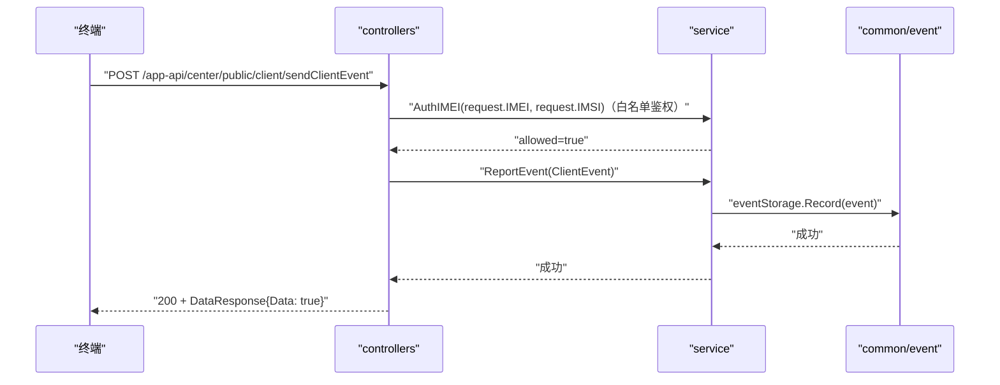

# 上报终端事件（SendClientEvent） 交互模型

> 生成时间：2026-08-11
> 流程入口：`POST /app-api/center/public/client/sendClientEvent` → controllers.EventController.SendClientEvent（外部与内部服务均注册）

## 概述

终端上报客户端事件（厂商/机型/应用类型/事件类型等），controllers 组装 Client 类型事件后由 service 写入本地事件审计文件。

## 主链路时序图

## 参与方说明

| 参与方 | 类型 | 代码位置 | 本流程中的职责 |
| --- | --- | --- | --- |
| 终端 | 外部触发者 | -（仓外） | 上报客户端事件 |
| controllers | 模块 | src/controllers/event_controller.go | 解析 ClientEventRequest，组装 events.Info |
| service | 模块 | src/service/event_service.go、src/service/auth_service.go | 终端白名单联合鉴权、经 event.Storage 记录事件 |
| common/event | 模块 | src/common/event（本地事件文件存储） | 事件落本地审计文件（localAuditComponent） |

## 补充说明

上报前新增终端白名单联合鉴权环节（AuthService.AuthIMEI），鉴权拒绝返回 retcode.AuthFailed(401)，主链路为鉴权通过路径。事件存储为本地文件（conf.Instance().Logger.EventFile），EventService 经 sync.Once 初始化本地存储工厂。本流程无 DB 写入。

分支与异常逻辑：归业务规则资产承载（docs/biz/rules/，待补）。
