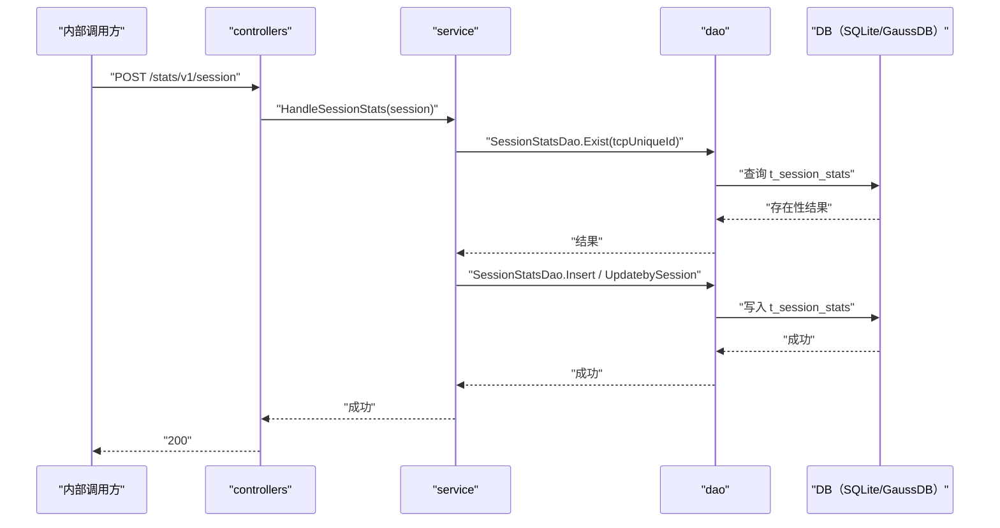

# 会话统计上报（SessionStats） 交互模型

> 生成时间：2026-08-11
> 流程入口：`POST /stats/v1/session` → controllers.TrafficStatsController.SessionStats（内部 HTTP 服务）

## 概述

内部调用方（浏览器侧）上报会话统计数据，service 按 TcpUniqueId 判断记录存在性，不存在则插入、存在则更新会话统计表。

## 主链路时序图

## 参与方说明

| 参与方 | 类型 | 代码位置 | 本流程中的职责 |
| --- | --- | --- | --- |
| 内部调用方 | 外部触发者 | -（仓外） | 上报会话统计 |
| controllers | 模块 | src/controllers/traffic_stats_controller.go | 解析 SessionStats 请求体，回写响应 |
| service | 模块 | src/service/traffic_stats_service.go | 存在性判断后插入或更新 |
| dao | 模块 | src/dao/traffic_stats_dao.go | t_session_stats 读写 |
| DB（SQLite/GaussDB） | 中间件 | src/dao/db_local_sqlite.go、src/dao/db_init.go | 会话统计持久化 |

## 补充说明

关键实体状态变更：t_session_stats 按 TcpUniqueId 幂等写入（新会话插入、已有会话更新结束时间等字段）。

分支与异常逻辑：归业务规则资产承载（docs/biz/rules/，待补）。
