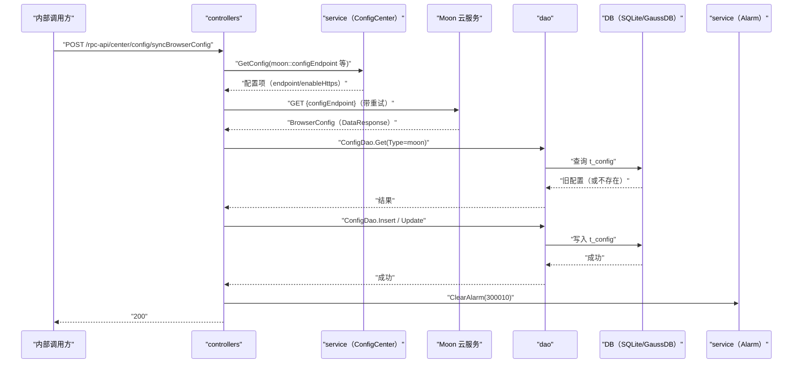

# 同步浏览器配置（SyncBrowserConfig） 交互模型

> 生成时间：2026-08-11
> 流程入口：`POST /rpc-api/center/config/syncBrowserConfig` → controllers.ManagementController.SyncBrowserConfig（内部 HTTP 服务）

## 概述

内部调用方触发从 Moon 云服务拉取浏览器配置（路由应用配置/Chrome 配置/URL 配置），controllers 经 HTTP 客户端拉取成功后写入本地配置表，并按结果上报/恢复告警。

## 主链路时序图

## 参与方说明

| 参与方 | 类型 | 代码位置 | 本流程中的职责 |
| --- | --- | --- | --- |
| 内部调用方 | 外部触发者 | -（仓外） | 触发浏览器配置同步 |
| controllers | 模块 | src/controllers/management_controller.go | 编排拉取、解析、落库与告警上报/恢复 |
| service（ConfigCenter） | 模块 | src/service/config_center_service.go | 提供 Moon endpoint 等配置项缓存读取 |
| Moon 云服务 | 下游服务 | 调用点：src/controllers/management_controller.go | 提供浏览器配置数据 |
| dao | 模块 | src/dao/browser_config.go | t_config 读写 |
| DB（SQLite/GaussDB） | 中间件 | src/dao/db_local_sqlite.go、src/dao/db_init.go | 配置持久化 |
| service（Alarm） | 模块 | src/service/alarm_service.go | 同步失败上报告警 300010、成功恢复告警（经 AlarmSDK 上报 FM） |

## 补充说明

拉取地址由配置中心缓存优先、Beego 配置兜底决定，enableHttps=true 时走 MuenInstance HTTPS 客户端。同步成功路径恢复告警，失败路径上报告警并返回 500（分支不画入图）。关键实体状态变更：t_config 中 Type=moon 记录 Content 与 UpdatedAt 被更新（或新建）。无出站调用文档，待核实（docs/tech/comm-guidelines/ 为空）。

分支与异常逻辑：归业务规则资产承载（docs/biz/rules/，待补）。
