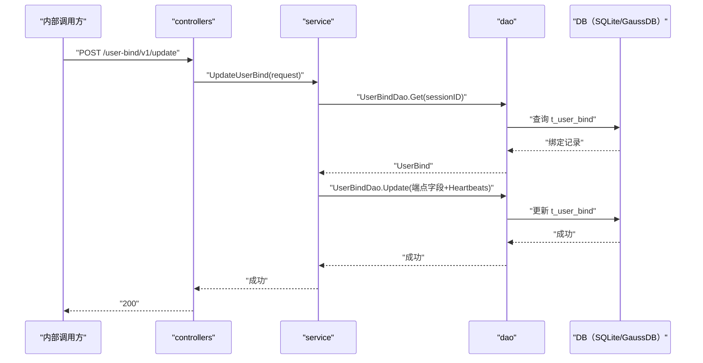

# 更新用户绑定（UpdateUserBind） 交互模型

> 生成时间：2026-08-11
> 流程入口：`POST /user-bind/v1/update` → controllers.LoginController.UpdateUserBind（内部 HTTP 服务）

## 概述

内部调用方（浏览器实例侧）上报会话各端点信息，controllers 经 service 到 dao 非空字段增量更新 t_user_bind 并刷新心跳时间。

## 主链路时序图

## 参与方说明

| 参与方 | 类型 | 代码位置 | 本流程中的职责 |
| --- | --- | --- | --- |
| 内部调用方 | 外部触发者 | -（仓外） | 上报会话端点与心跳信息 |
| controllers | 模块 | src/controllers/login_controller.go | 解析 UpdateUserBindRequest，回写响应 |
| service | 模块 | src/service/user_service.go | 非空字段增量合并并更新绑定记录 |
| dao | 模块 | src/dao/user.go | t_user_bind 读写 |
| DB（SQLite/GaussDB） | 中间件 | src/dao/db_local_sqlite.go、src/dao/db_init.go | 持久化绑定数据 |

## 补充说明

关键实体状态变更：t_user_bind 的 BrowserInstance、InnerBrowserEndpoint、InnerMediaEndpoint、Control/Media(Tls)Endpoint 等非空字段被覆盖，Heartbeats 刷新为当前时间——该接口同时承担心跳保活语义。

分支与异常逻辑：归业务规则资产承载（docs/biz/rules/，待补）。
