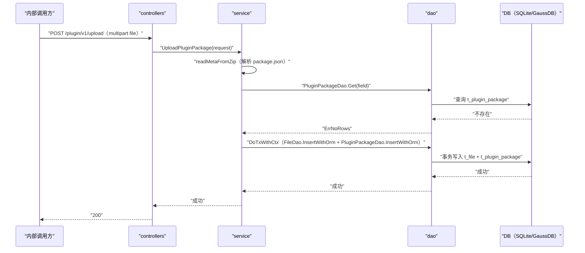

# 上传插件包（UploadPluginPackage） 交互模型

> 生成时间：2026-08-11
> 流程入口：`POST /plugin/v1/upload` → controllers.PluginController.UploadPluginPackage（内部 HTTP 服务）

## 概述

内部调用方上传 Chrome 扩展插件 zip 包，service 解析包内 package.json 元数据校验后，在事务中将包文件写入文件存储表、元数据写入插件包表。

## 主链路时序图

## 参与方说明

| 参与方 | 类型 | 代码位置 | 本流程中的职责 |
| --- | --- | --- | --- |
| 内部调用方 | 外部触发者 | -（仓外） | 上传插件 zip 包 |
| controllers | 模块 | src/controllers/plugin_controller.go | 解析 multipart 参数并校验，recover 兜底 panic |
| service | 模块 | src/service/plugin_service.go | 解析 zip 元数据、查重、事务写入文件与插件记录 |
| dao | 模块 | src/dao/plugin.go、src/dao/file.go | t_plugin_package / t_file 事务写入 |
| DB（SQLite/GaussDB） | 中间件 | src/dao/db_local_sqlite.go、src/dao/db_init.go | 插件包与文件持久化 |

## 补充说明

关键实体状态变更：新增 t_file（插件包文件）与 t_plugin_package（Status=NotStart、IfActive=false）两条记录，同一事务提交。同名同版本插件已存在时拒绝上传（分支不画入图）。

分支与异常逻辑：归业务规则资产承载（docs/biz/rules/，待补）。
