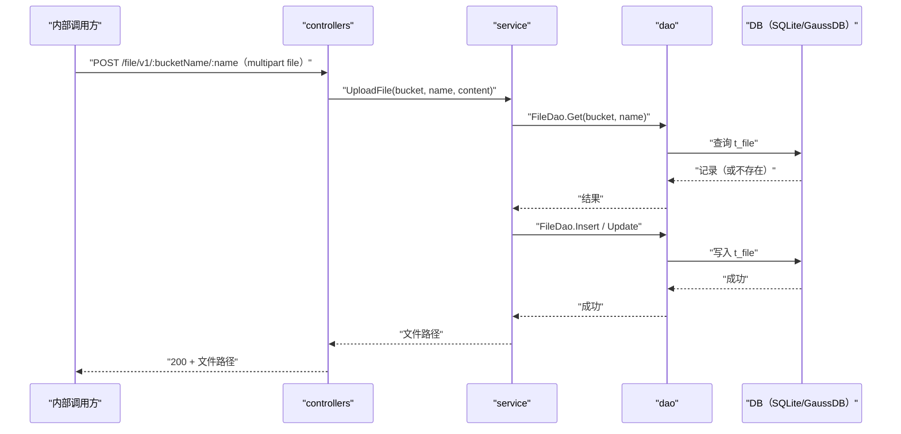

# 通用文件上传（Upload） 交互模型

> 生成时间：2026-08-11
> 流程入口：`POST /file/v1/:bucketName/:name` → controllers.FileController.Upload（内部 HTTP 服务）

## 概述

内部调用方以 multipart 表单向指定 bucket 上传命名文件，controllers 读取表单文件后由 service 幂等写入文件存储表，返回文件访问路径。

## 主链路时序图

## 参与方说明

| 参与方 | 类型 | 代码位置 | 本流程中的职责 |
| --- | --- | --- | --- |
| 内部调用方 | 外部触发者 | -（仓外） | multipart 上传文件到指定 bucket |
| controllers | 模块 | src/controllers/file_controller.go | 读取 FormFile，回写响应 |
| service | 模块 | src/service/file_service.go | 文件名清洗，insertOrUpdate 幂等写入 |
| dao | 模块 | src/dao/file.go | t_file 读写 |
| DB（SQLite/GaussDB） | 中间件 | src/dao/db_local_sqlite.go、src/dao/db_init.go | 文件内容持久化存储 |

## 补充说明

与 HandleUpload 的差异仅在传输方式（multipart 表单 vs 裸请求体）与 bucket 由路径指定。关键实体状态变更同 t_file 幂等覆盖。

分支与异常逻辑：归业务规则资产承载（docs/biz/rules/，待补）。
