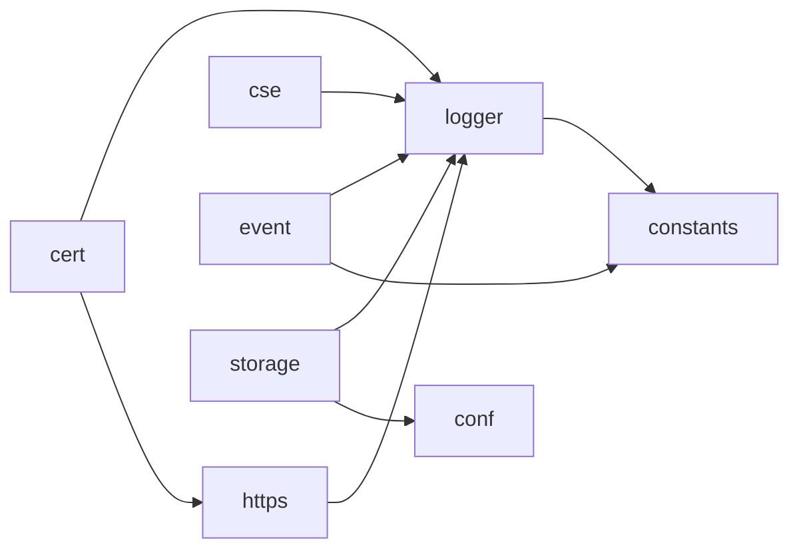

# common 模块结构文档

> 生成时间：2026-08-11
> 所属仓：AIAction（GIDS）
> 模块路径：src/common

## 模块职责

公共基础能力层，按子包提供证书（cert）、配置读取（conf）、常量与错误码（constants）、CSE 微服务注册发现（cse）、事件存储与查询（event）、HTTPS 客户端/服务端封装（https）、日志（logger）、存储抽象（storage，下含 redis 与 oss/minio 实现）。被仓内几乎所有其他模块依赖。

## 子模块关系图

## 子模块说明

| 子模块 | 路径 | 职责 | 主要依赖 | 被依赖 |
| --- | --- | --- | --- | --- |
| cert | src/common/cert | 证书加载与管理。证据：src/common/cert/cert.go | https, logger | - |
| conf | src/common/conf | 配置读取（Beego app.conf 等）。证据：src/common/storage/redis/redis.go 引用 | - | storage |
| constants | src/common/constants | 常量与 retcode 错误码定义。证据：src/common/event/local_storage.go 引用 | - | event, logger |
| cse | src/common/cse | CSE 微服务注册、发现与实例管理。证据：src/common/cse/cse.go | logger | - |
| event | src/common/event | 事件存储与查询（含本地存储实现）。证据：src/common/event/event_storage.go、src/common/event/local_storage.go | constants, logger | - |
| https | src/common/https | HTTPS 服务端实现与客户端请求 builder（含 TLS）。证据：src/common/https/https_server.go、src/common/https/client.go | logger | cert |
| logger | src/common/logger | 日志封装（含审计日志）。证据：src/common/logger/auditlog.go | constants | cert, cse, event, https, storage |
| storage | src/common/storage | 存储抽象 api，下含 redis 与 oss（minio）两个二级实现（更深层级依赖不计入本图）。证据：src/common/storage/storage.go、src/common/storage/redis/redis.go | conf, logger | - |
