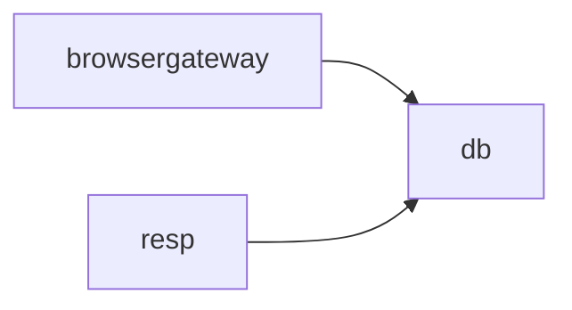

# models 模块结构文档

> 生成时间：2026-08-11
> 所属仓：AIAction（GIDS）
> 模块路径：src/models

## 模块职责

数据模型层：db 子包为 ORM 持久实体（orm 标签 + TableName + init 注册），req/resp 为接口请求/响应模型，events 为事件模型，browsergateway 为浏览器网关服务实例模型，monitor 为监控指标模型。被 controllers/service/dao/common/utils 广泛引用。

## 子模块关系图

## 子模块说明

| 子模块 | 路径 | 职责 | 主要依赖 | 被依赖 |
| --- | --- | --- | --- | --- |
| browsergateway | src/models/browsergateway | 浏览器网关服务实例模型。证据：src/models/browsergateway/service_instance.go | db | - |
| db | src/models/db | ORM 持久实体定义（含 27.0 新增 WhiteList）。证据：src/models/db/file.go、src/models/db/white_list.go | - | browsergateway, resp |
| events | src/models/events | 事件模型。证据：src/models/events/base.go | - | - |
| monitor | src/models/monitor | 监控指标模型。证据：src/models/monitor/metric.go | - | - |
| req | src/models/req | 接口请求模型（含 27.0 新增 AuthIMEIRequest）。证据：src/models/req/plugin_entity.go、src/models/req/auth_request.go | - | - |
| resp | src/models/resp | 接口响应模型。证据：src/models/resp/plugin_entity.go | db | - |
