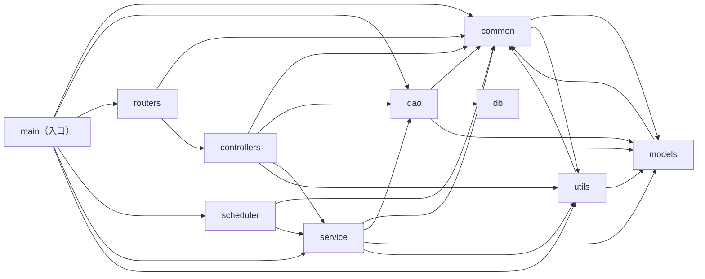

# AIAction（GIDS）结构模型总览

> 生成时间：2026-08-11
> 分析模式：仓库级
> 输入路径：/home/lele/project/work/csp-ysj/AIAction

## 概览

- 语言：Go
- 构建工具：Go Modules（src/go.mod，module 名 GIDS）
- 源码根：src/
- 模块数：9 个业务模块 + 1 个入口文件（src/main.go）
- 业务目录识别依据：仓库根下无构建文件，构建文件 go.mod 位于 src/ 下，故以 src/ 为源码根。src/ 第一层目录共 14 个，排除情况如下：`conf`（仅 app.conf/chassis.yaml 等配置文件，无 Go 代码）、`data`（LOCAL_MODE SQLite 数据目录，无代码）、`stubs`（go.mod replace 指向的第三方日志/监控 SDK 桩包，非本仓业务代码）、`test`（Go 单测辅助包 test/util，仅被 dao 的 _test.go 引用，属测试辅助目录按通用清单排除；该依赖见 dao 模块文档说明）。剩余 9 个业务目录：common、controllers、dao、db、models、routers、scheduler、service、utils；src/main.go 为入口文件，作为入口节点参与依赖图但不单独成模块文档。

## 模块关系图

## 模块说明

| 模块 | 路径 | 职责 | 主要依赖 | 被依赖 |
| --- | --- | --- | --- | --- |
| main（入口） | src/main.go | 进程入口：初始化证书、配置、CSE 注册、HTTPS 服务、ORM/数据库，注册路由并启动定时任务。证据：src/main.go | common, dao, routers, scheduler, service, utils | - |
| routers | src/routers | 定义 Beego 路由配置，把 URL 路径映射到各 Controller。证据：src/routers/beego_router.go | common, controllers | main |
| controllers | src/controllers | Beego Controller 层：接收 HTTP 请求、参数校验、调用 Service、组装响应，含登录/事件/插件/文件/缓存/配置中心/流量统计等接口。证据：src/controllers/login_controller.go、src/controllers/controller.go | common, dao, models, service, utils | routers |
| service | src/service | 业务 Service 层：浏览器实例交付、插件、文件、用户、事件、缓存、监控、告警、配置中心、流量统计等业务逻辑（接口 + 实现 + sync.Once 单例）。证据：src/service/browser_service.go、src/service/event_service.go | common, dao, models, utils | controllers, scheduler, main |
| dao | src/dao | 数据访问层：GaussDB 适配（Beego ORM）、LOCAL_MODE SQLite 初始化、各实体的 CRUD 与批量操作。证据：src/dao/base_dao.go、src/dao/db_init.go | common, db, models | controllers, service, main |
| db | src/db | 数据库驱动适配：driver 子包代理 openGauss driver 以适配 Beego ORM。证据：src/db/driver/driver.go | - | dao |
| models | src/models | 数据实体与请求/响应模型：db 实体（ORM 标签）、req/resp、events、browsergateway、monitor。证据：src/models/resp/plugin_entity.go、src/models/browsergateway/service_instance.go | common | common, controllers, service, dao, utils |
| common | src/common | 公共基础能力：cert、conf、constants、cse（服务注册发现）、event（事件存储）、https（客户端/服务端）、logger、storage（redis/oss）。证据：src/common/cse/cse.go、src/common/https/https_server.go | models, utils | main, routers, controllers, service, dao, scheduler, models, utils |
| scheduler | src/scheduler | 定时任务调度：周期性调用 Service 层执行后台任务。证据：src/scheduler/task_scheduler.go | common, service | main |
| utils | src/utils | 辅助工具：fileutil、flagutil、monitorutil、response（统一响应组装）。证据：src/utils/response/response_util.go、src/utils/fileutil/fileutil.go | common, models | main, controllers, service, common |

## 分层特征

依赖方向呈清晰的单向分层：入口 main → routers → controllers → service → dao → db，下层 models/common/utils 被各层横向复用；未发现跨层直达的反向回流（controllers 不直接被 service 依赖）。存在两处底层双向依赖：common ↔ models（common/cse、common/event 引用 models 的事件/实例模型，同时 models/req、models/db 引用 common 的 constants/logger）与 common ↔ utils（common/event 引用 utils/fileutil，utils 各包引用 common/logger 与 models/resp），均位于基础层内部，属底层设施间的相互复用而非业务层循环。
