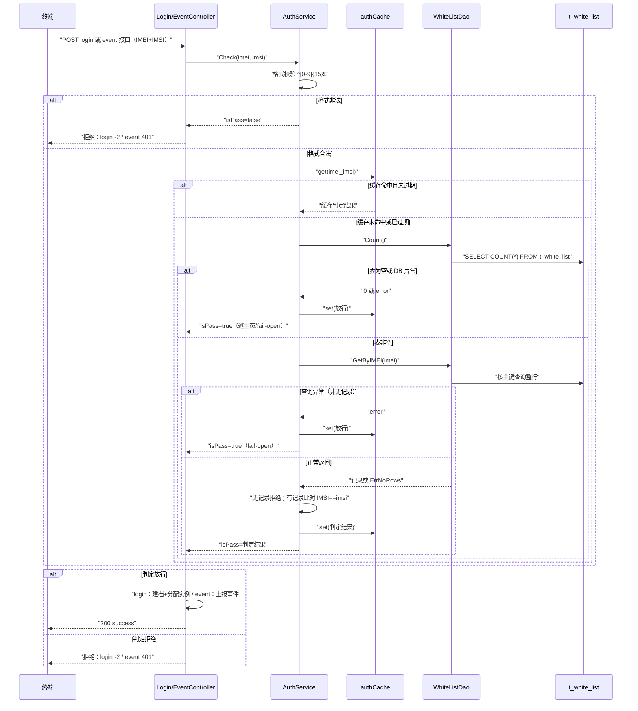

# 终端鉴权判定业务流程

> 最近更新：用户主动梳理（spec-business-flow-analyze），2026-08-07

## 1. 流程概述

终端携带 IMEI+IMSI 发起登录或事件上报，GIDS 对两要素做联合鉴权判定，放行合法终端、拒绝非法终端。判定逻辑由 login 链路与 event 链路共用，仅拒绝时的响应码不同。

## 2. 主流程

鉴权判定全程在服务进程内完成（authCache 内存缓存 + DB 查询 t_white_list），缓存 key 为 imei_imsi、TTL 30 分钟，命中且未过期直接返回缓存结果，超 1000 条时写后惰性清理最旧 500 条。白名单表为空（逃生态）或 Count/GetByIMEI DB 异常时 fail-open 放行；ErrNoRows 或 IMSI 不匹配则拒绝。拒绝时 login 链路统一返回 -2（ClientFailed）、event 链路统一返回 401（AuthFailed）；白名单导入成功会触发 ClearCache 全量失效使新名单立即生效。存储依赖 t_white_list 表——生产环境 GaussDB，LOCAL_MODE 本地 SQLite（src/data/gids.db）；无服务间调用，docs/technical/external-call/ 无本流程相关出站调用文档。
