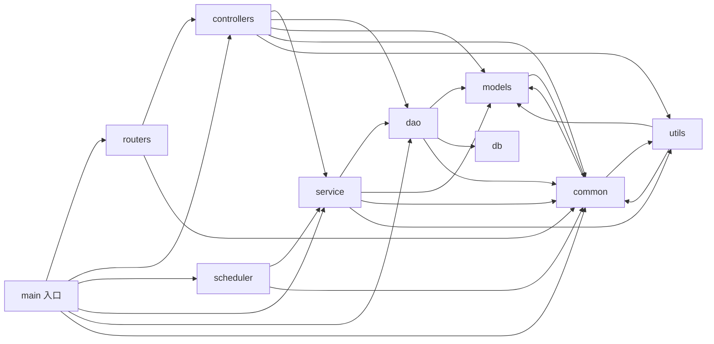

# AIAction 结构文档

> 生成时间：2026-07-30
> 分析模式：仓库级
> 输入路径：/home/lele/project/work/csp-ysj/AIAction

## 概览

- 语言：Go
- 构建工具：go module（`src/go.mod`，module 名 `GIDS`，Go 1.25；Web 框架 Beego v2）
- 源码根：src/
- 模块数：10（含入口 main）
- 业务目录识别依据：源码根 `src/` 下第一层目录中，`conf`（配置）、`test`（测试）按通用辅助目录清单排除；`stubs` 为第三方库（Go-chassis-extend lager）的本地空实现桩，属 third_party 性质，单独注明排除；`db` 虽名似脚本目录，但实际含 Go 包 `db/driver`（被 `dao` import），保留为业务模块。`src/main.go` 为入口文件，作为入口节点纳入。

## 模块关系图

## 模块说明

| 模块 | 路径 | 职责 | 主要依赖 | 被依赖 |
| --- | --- | --- | --- | --- |
| main | src/main.go | 服务启动入口。初始化配置、证书、CSE 服务发现、ORM（生产 GaussDB / LOCAL_MODE 嵌入式 SQLite）、注册路由、启动定时任务，拉起 Beego HTTP 服务（127.0.0.1:9090）。证据：src/main.go | routers, scheduler, service, dao, common, utils | - |
| routers | src/routers | Beego 路由注册层，将 URL 路径映射到各 Controller。证据：src/routers/beego_router.go | controllers, common | main |
| controllers | src/controllers | HTTP 接口层（Beego Controller）。覆盖 login/event/file/plugin/cache/配置中心/管理/流量统计等接口，含 filter 过滤器；做参数接收与校验后调用 service。证据：src/controllers/login_controller.go、src/controllers/event_controller.go、src/controllers/filter.go | service, dao, models, common, utils | routers, main |
| service | src/service | 业务逻辑层。接口 + 小写实现类 + 包级变量 + sync.Once 单例模式，编排 dao 与外部调用（remote_service 等）。证据：src/service/browser_service.go、src/service/user_service.go、src/service/remote_service.go | dao, models, common, utils | controllers, scheduler, main |
| dao | src/dao | 数据访问层。继承 BaseInterface 提供通用 CRUD，db_init.go 负责 ORM 注册与 LOCAL_MODE SQLite 初始化。证据：src/dao/base_dao.go、src/dao/db_init.go、src/dao/db_local_sqlite.go | models, db, common | controllers, service, main |
| models | src/models | 数据实体与传输对象。子包：db（ORM 实体）、req/resp（接口出入参）、events（鉴权事件）、monitor（监控）、browsergateway（浏览器网关）。证据：src/models/db/file.go、src/models/events/base.go | common | controllers, service, dao, common, utils, main |
| db | src/db | GaussDB driver 装饰适配层，代理 openGauss-connector-go-pq 以适配 Beego ORM。证据：src/db/driver/driver.go | - | dao |
| scheduler | src/scheduler | 定时任务层。DataCleanupScheduler 数据清理调度器，按周期调用 service。证据：src/scheduler/task_scheduler.go | service, common | main |
| common | src/common | 公共能力层。子包：logger（日志/审计）、constants/retcode（返回码）、https（HTTP 客户端 builder）、conf（配置读取）、cse（服务发现）、storage、event（事件本地存储）、cert（证书）。证据：src/common/logger/logger.go、src/common/cse/cse.go、src/common/event/event_storage.go | models, utils | main, routers, controllers, service, dao, models, utils, scheduler |
| utils | src/utils | 辅助工具层。子包：fileutil（文件操作）、flagutil、monitorutil、response（统一响应封装）。证据：src/utils/fileutil/fileutil.go、src/utils/response/response_util.go | common, models | controllers, service, common, main |
