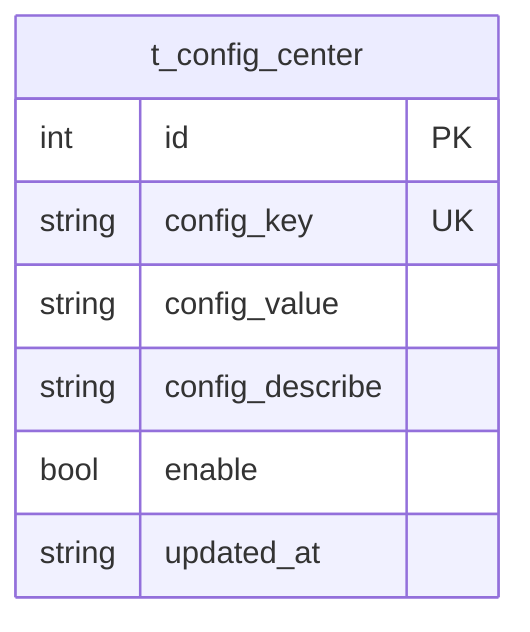

# 配置中心（ConfigCenter）数据模型

> 生成时间：2026-08-11
> 实体定义：`t_config_center` 表 → src/dao/db_local_sqlite.go（CREATE TABLE，LOCAL_MODE）+ src/dao/db_init.go（CREATE TABLE，GaussDB）+ src/models/db/config_center.go（entity `ConfigCenter`）

## 概述

ConfigCenter 存储服务级动态配置项（key-value 加描述与开关），持久化于表 t_config_center，由 service/config_center_service.go 读写，并以内存 map 缓存全量配置、5 分钟定时刷新。

## ER 图

本实体无直接关联实体。

## 字段表

| 字段 | 类型 | 含义 | 约束 |
| --- | --- | --- | --- |
| id | int | 主键，自增 | PRIMARY KEY AUTOINCREMENT；entity tag `orm:"auto;pk;column(id)"` |
| config_key | string / TEXT | 配置键 | NOT NULL；UNIQUE INDEX t_configs_key；entity 字段名为 Key，`column(config_key)` |
| config_value | string / TEXT | 配置值 | NOT NULL；entity 字段名为 Value |
| config_describe | string / TEXT | 配置描述 | DEFAULT ''；entity 字段名为 Describe |
| enable | bool / INTEGER | 是否启用 | DEFAULT 1 |
| updated_at | string / TEXT | 更新时间 | DEFAULT '' |

## 数据生命周期

### 创建

配置写入路径触发：service/config_center_service.go 的 InsertOrUpdateConfig 在事务内按 Key 查不到（orm.ErrNoRows）时 dao.Insert，updated_at 取当前时间（time.DateTime 格式）。

### 更新

同一路径：已存在时回填旧 id 后 dao.Update 覆盖 value/describe/enable 与 updated_at。

### 归档/删除

代码未体现删除路径。

## 缓存数据结构

| 结构名 | 用途 | TTL | 容量 | 清理策略 | 代码位置 |
| --- | --- | --- | --- | --- | --- |
| configCenterServiceImpl.configs | 全量配置内存缓存（map[string]string），GetConfig 只查缓存 | 5min（RefreshInterval 定时整体重建） | 未设上限（初始化容量 100） | 定时全量替换：StartRefreshConfigTask 每 5 分钟 List 全表重建 map；StopRefreshConfigTask 停止 | src/service/config_center_service.go |

## 补充说明

config_key 有唯一索引兜底，InsertOrUpdateConfig 的先查后写在并发下仍可能撞唯一键，由事务与 DB 约束兜底。缓存为整体替换式刷新，写库后最长 5 分钟内 GetConfig 读到旧值，时延敏感调用方可用 GetFromDB 直查。消费方见 service/remote_service.go（moon::titokEndpoint 等键）。
