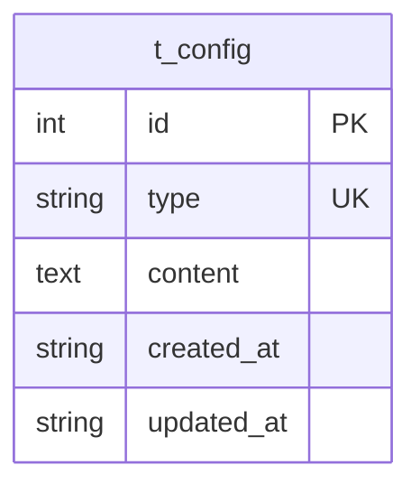

# 浏览器配置（Config）数据模型

> 生成时间：2026-08-11
> 实体定义：`t_config` 表 → src/dao/db_local_sqlite.go（CREATE TABLE，LOCAL_MODE）+ src/dao/db_init.go（CREATE TABLE，GaussDB）+ src/models/db/browser_config.go（entity `Config`）

## 概述

Config 存储按类型划分的浏览器侧配置内容（如 RouterAPPConfig / ChromeConfig / URLConfig 的 JSON 文本），持久化于表 t_config，由 controllers/management_controller.go 直接使用 dao.ConfigDao 读写，管理面接口触发。

## ER 图

本实体无直接关联实体，仅按 type 独立存取。

## 字段表

| 字段 | 类型 | 含义 | 约束 |
| --- | --- | --- | --- |
| id | int | 主键，自增 | PRIMARY KEY AUTOINCREMENT；entity tag `orm:"auto;pk;column(id)"` |
| type | string / TEXT | 配置类型标识 | NOT NULL；entity `column(type)`；按 type 做 Get/Update 的业务键（无 DB 唯一约束） |
| content | string / TEXT | 配置内容（JSON 文本，对应 RouterAPPConfig/ChromeConfig/URLConfig 结构） | NOT NULL；entity tag `type(text)` |
| created_at | string / TEXT | 创建时间 | DEFAULT '' |
| updated_at | string / TEXT | 更新时间 | DEFAULT '' |

## 数据生命周期

### 创建

管理面配置写入接口触发：controllers/management_controller.go 的 insertOrUpdate 按 type 调用 cd.Get 查不到旧记录时执行 cd.Insert，content 为请求携带的配置文本。

### 更新

同一接口路径：按 type 查到旧记录后 cd.Update 覆盖 content 与 updated_at。

### 归档/删除

代码未体现删除路径。

## 缓存数据结构

无。

## 补充说明

type 是业务唯一键但建表 SQL 未声明 UNIQUE，重复 type 依赖 insertOrUpdate 先查后写逻辑保证；content 的 JSON 结构（RouterAPPConfig / ChromeConfig / URLConfig）定义在 src/models/db/browser_config.go，不单独落表。
