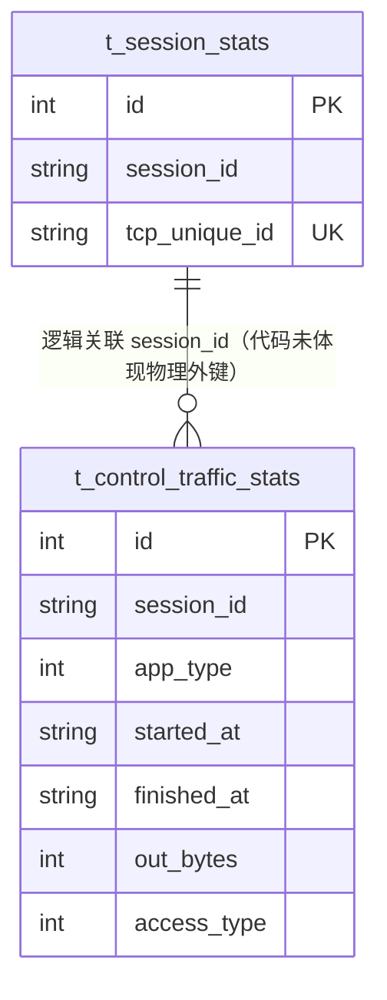

# 控制流量统计（ControlTrafficStats）数据模型

> 生成时间：2026-08-11
> 实体定义：`t_control_traffic_stats` 表 → src/dao/db_local_sqlite.go（CREATE TABLE，LOCAL_MODE）+ src/dao/db_init.go（CREATE TABLE，GaussDB）+ src/models/db/traffic_stats.go（entity `ControlTrafficStats`）

## 概述

ControlTrafficStats 记录控制通道按会话的流量统计，结构与媒体流量统计一致，持久化于表 t_control_traffic_stats，批量上报写入，定时任务按月清理。

## ER 图

## 字段表

| 字段 | 类型 | 含义 | 约束 |
| --- | --- | --- | --- |
| id | int | 主键，自增 | PRIMARY KEY AUTOINCREMENT；entity tag `orm:"auto;pk;column(id)"` |
| session_id | string / TEXT | 会话标识 | NOT NULL；索引 idx_ctraffic_session、复合索引 idx_ctraffic_session_app(session_id, app_type) |
| app_type | int / INTEGER | 应用类型 | NOT NULL；索引 idx_ctraffic_app |
| started_at | string / TEXT | 统计开始时间（RFC3339） | DEFAULT '' |
| finished_at | string / TEXT | 统计结束时间 | DEFAULT ''；entity json `omitempty` |
| out_bytes | int64 / INTEGER | 出方向字节数 | NOT NULL；entity json `omitempty` |
| access_type | int / INTEGER | 接入类型 | 无约束 |

## 数据生命周期

### 创建

流量统计批量上报接口触发：service/traffic_stats_service.go 的 BatchInsertStats（tag 为 control）→ batchInsertControlStats → 泛型 batchInsertStats，事务内分批 InsertMultiWithOrm 写入（批量 100，src/dao/base_dao.go）。

### 更新

代码未体现更新路径（只追加）。

### 归档/删除

定时清理：src/scheduler/task_scheduler.go 触发 service/traffic_stats_service.go 的 CleanOldStats → cleanControlStats，事务内删除 started_at 早于 cutoffTime 的记录。

## 缓存数据结构

无。

## 补充说明

与 t_media_traffic_stats 字段结构完全对称，仅通道语义不同；与 t_session_stats 为 session_id 逻辑关联（代码未体现物理外键）。关联实体见 [session_stats 数据模型](data-model-session-stats.md)、[media_traffic_stats 数据模型](data-model-media-traffic-stats.md)。
