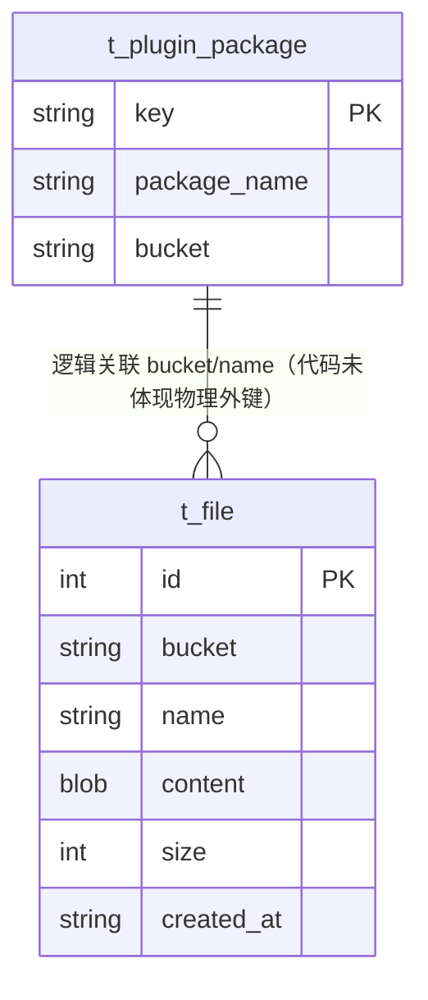

# 文件（File）数据模型

> 生成时间：2026-08-11
> 实体定义：`t_file` 表 → src/dao/db_local_sqlite.go（CREATE TABLE，LOCAL_MODE）+ src/dao/db_init.go（CREATE TABLE，GaussDB）+ src/models/db/file.go（entity `File`）

## 概述

File 存储上传文件（主要是插件安装包）的二进制内容，以 bucket + name 定位，持久化于表 t_file，由 dao 模块读写，service/plugin_service.go 与 service/file_service.go 在上传/下载/删除插件包时使用。

## ER 图

## 字段表

| 字段 | 类型 | 含义 | 约束 |
| --- | --- | --- | --- |
| id | int | 主键，自增 | PRIMARY KEY AUTOINCREMENT；entity tag `orm:"auto;pk;column(id)"` |
| bucket | string / TEXT | 存储桶名 | NOT NULL；与 name 共同做业务定位键（无 DB 唯一约束） |
| name | string / TEXT | 文件名 | NOT NULL |
| content | ByteArrayField / BLOB | 文件二进制内容 | entity tag `type(bytea)`，自定义类型 ByteArrayField（src/models/db/file.go）；SQLite 下为 BLOB |
| size | int64 / INTEGER | 文件大小（字节） | 无约束 |
| created_at | string / TEXT | 创建时间 | DEFAULT '' |

## 数据生命周期

### 创建

两条路径：① 插件包上传——service/plugin_service.go 在事务内经 fd.InsertWithOrm 写入文件记录并同时插入 t_plugin_package 记录；② 文件上传接口——service/file_service.go 的 insertOrUpdate 按 bucket+name 经 FileDao.Exist（src/dao/file.go）判断不存在时 fd.Insert。

### 更新

service/file_service.go 的 insertOrUpdate：文件已存在时 fd.Update 覆盖 content/size。

### 归档/删除

① service/file_service.go 的 DeleteFile 按 Bucket+Name 调用 fd.Delete；② service/plugin_service.go 的 DeletePluginPackage 在事务内删除插件包记录后同时 txOrm.Delete 对应文件记录。

## 缓存数据结构

无。

## 补充说明

t_file 与 t_plugin_package 通过 bucket/package_name 在代码层关联（插件删除时级联删文件），代码未体现物理外键，存在孤儿文件风险需依赖业务路径兜底。content 直接落库存二进制，文件体积大时库表膨胀风险代码未体现治理措施。关联实体见 [plugin_package 数据模型](data-model-plugin-package.md)。
