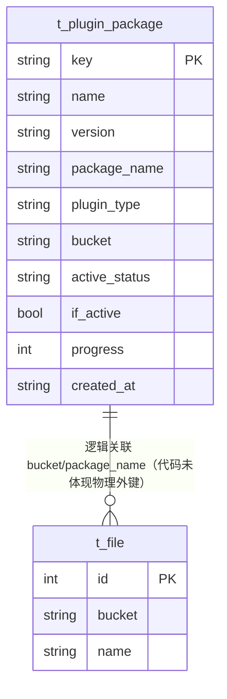

# 插件包（PluginPackage）数据模型

> 生成时间：2026-08-11
> 实体定义：`t_plugin_package` 表 → src/dao/db_local_sqlite.go（CREATE TABLE，LOCAL_MODE）+ src/dao/db_init.go（CREATE TABLE，GaussDB）+ src/models/db/plugin_info.go（entity `PluginPackage`）

## 概述

PluginPackage 记录插件安装包的元数据与激活状态，主键 key 由 `plugin_type:name:version` 拼成，持久化于表 t_plugin_package，由 service/plugin_service.go 管理上传、激活与删除。

## ER 图

## 字段表

| 字段 | 类型 | 含义 | 约束 |
| --- | --- | --- | --- |
| key | string / TEXT | 主键，格式 `{plugin_type}:{name}:{version}`（GetField 生成，src/models/db/plugin_info.go） | PRIMARY KEY；entity tag `orm:"pk;column(key)"`，结构体字段名为 Field |
| name | string / TEXT | 插件名 | NOT NULL |
| version | string / TEXT | 插件版本 | NOT NULL |
| package_name | string / TEXT | 包文件名（对应 t_file.name） | NOT NULL |
| plugin_type | string / TEXT | 插件类型 | NOT NULL；entity `column(plugin_type)`，结构体字段名为 Type |
| bucket | string / TEXT | 存储桶（对应 t_file.bucket） | NOT NULL |
| active_status | ActiveStatus / TEXT | 激活状态：Completed/Failed/Doing/NotStart（常量定义于 src/models/db/plugin_info.go） | NOT NULL |
| if_active | bool / INTEGER | 是否已激活 | NOT NULL DEFAULT 0 |
| progress | int / INTEGER | 激活进度（0-100） | NOT NULL |
| created_at | string / TEXT | 创建时间 | DEFAULT '' |

## 数据生命周期

### 创建

插件包上传接口触发：service/plugin_service.go 在事务内经 fd.InsertWithOrm 写文件、ppd.InsertWithOrm 插入本记录，key 由 GetField 按 type:name:version 生成，初始 active_status 为 NotStart。

### 更新

激活流程触发：service/plugin_service.go 经 ppd.UpdateWithOrm（事务内）与 ppd.Update 刷新 active_status、if_active、progress。

### 归档/删除

删除插件包接口触发：service/plugin_service.go 的 DeletePluginPackage 在事务内 txOrm.Delete 本记录并级联删除对应 t_file 记录。

## 缓存数据结构

| 结构名 | 用途 | TTL | 容量 | 清理策略 | 代码位置 |
| --- | --- | --- | --- | --- | --- |
| PluginActive | 插件激活状态传输结构（实现 MarshalBinary/UnmarshalBinary，具备缓存序列化形态） | 未识别 | 未识别 | 未识别 | src/models/db/plugin_info.go |

PluginActive 是否实际写入 Redis/本地缓存代码未体现，待确认。

## 补充说明

key 主键为业务拼接串，天然幂等去重；active_status 为字符串枚举，DB 层无 CHECK 约束，非法值靠代码层兜底。与 t_file 为逻辑关联（代码未体现物理外键），关联实体见 [file 数据模型](data-model-file.md)。
